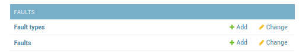
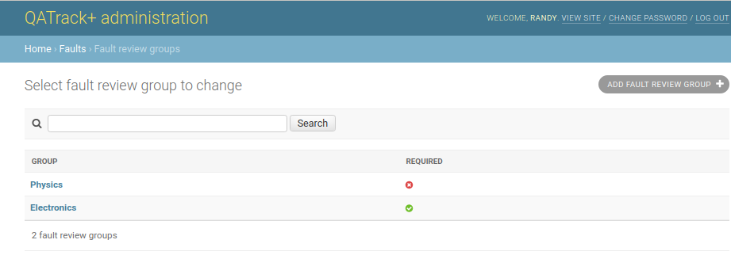
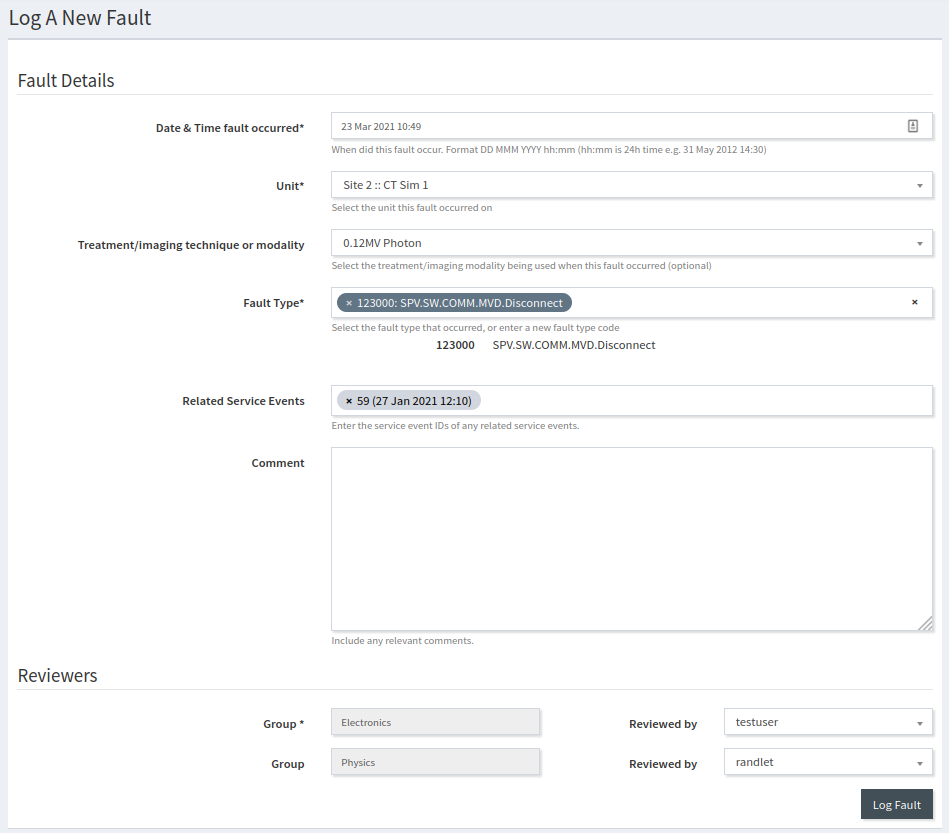

.. _fault_log_admin:

Fault Log Administration
========================

The Fault Log app is used for tracking faults that occur on your units.  There
is no initial configuration required for the fault log app.  

.. _fault_type:

Fault Types
-----------

Fault types can be created on the fly as users log new faults so it is not
necessary to configure fault types.  However, if you want to manually add
fault types, or add a description to existing fault types it can be done
in the **Fault types** section of the admin.

   Faults admin section

On the **Fault types** listing page, you can add a new fault type by clicking
the **Add Fault Type** button at the top right hand of the page, or edit an
existing fault type by clicking the link in the **Code** column of the table.

The Fault Type fields are as follows:

* **Code**  The fault type code or fault type number.
* **Description** A description that will be shown alongside the fault 
  type when viewing fault details.

.. _faults:

Faults
------

Typically you would edit faults using the :ref:`Fault Log application
<fault_log>`, however, you may also edit or delete faults from the admin
interface if you prefer.

.. _fault_review_groups:

Fault Review Groups
-------------------

By adding one or more `Fault Review Groups`, the person logging the
fault/interlock can select the people who were informed of the fault at the
time the fault is logged.  A fault logged with one or more reviewers selected
will be considered reviewed and will not appear in the unreviewed fault list.
Selecting a review user for a `Fault Review Group`\s can either be required or
optional.

For example if you add two `Fault Review Group`\s, one for an Electronics
group, and one for a Physics group:

   Fault Review Group Admin

then when a user is logging a new fault, the form will include a reviewers
section at the bottom:

   Logging a fault with reviewers

