.. _notifications:

Email Notifications
===================

QATrack+ comes with a number of built in email notification types that can be
triggered by actions taken on the site or scheduled to be delivered at a
specific time.  Currently the availble notification types are:

* :ref:`QC Completed Notices <notifications-qccompleted>`

* :ref:`QC Review Notices <notifications-qcreview>`

* :ref:`QC Scheduling Notices <notifications-qcscheduling>`

* :ref:`Service Event Notices <notifications-serviceevent>`

Configuring Notifications
-------------------------

Through the use of `Recipient Groups`, `Unit Groups`, and `Test List Groups`
notifications can be configured so that they are only apply to certain Units &
Test Lists and are only sent to specific users.  Configuring these notification
groups is done in the admin area under the Notifications header:

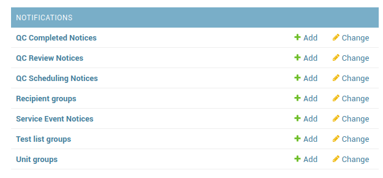

    The Notification admin section

These notifications groups can either be configured on the fly when
creating/editing new notifications, or defined ahead of time.

.. _notifications_recipients:

Recipient Groups
................

QATrack+ allows you to target notifications to specific users/email addresses
using `Recipient Groups`.  A `Recipient Group` is made up of
:ref:`auth_groups`, :ref:`auth_users`, or individual email addresses. To create
a new `Recipient Group` click through the `Recipient groups` link in the
Notifications section of the admin area and then on the next page click `Add
Recipient Group` and then fill out the fields:

Name (required)
    Give the recipient group a relavant name
Groups (optional)
    All users included in these Group will receive the notifications.
Users (optional)
    Include any individual Users you want to receive the notifications.
Extra recipient emails (optional)
    Include any emails which are not associated with a QATrack+ User

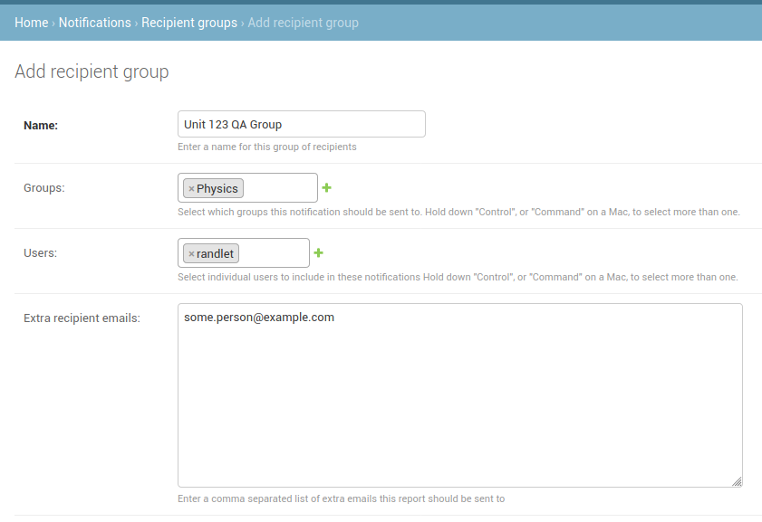

    Filling out the fields for a recipient group.

and finally click `Save`.  This `Recipient Group` can now be associated with
Notifications.

.. _notifications_units:

Unit Groups
...........

A `Unit Group` is made up of one or more :ref:`units_admin` and allows you to
target notifications to specific Units using `Unit Groups`.  To create a new
`Unit Group` click through the `Unit Group` section of the admin and then on
the next page click `Add Unit Group` and then fill out the fields:

Name (required)
    Give the Units Group a relevant name
Units (required)
    Select the Units to include in this group.

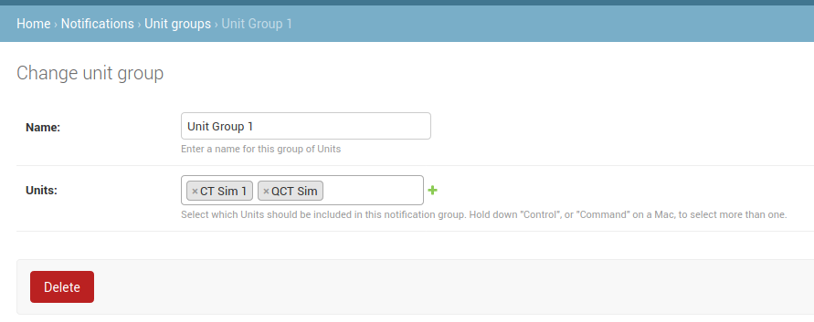

    Filling out the fields for a Unit group.

and finally click `Save`.  This `Unit Group` can now be associated with
Notifications.

.. _notifications_test_lists:

Test List Groups
................

A `Test List Group` is made up of one or more :ref:`Test Lists <qa_test_lists>`
and allows you to target notifications to specific Test Lists using `Test List
Groups`.  To create a new `Test List Group` click through the `Test List Group`
section of the admin and then on the next page click `Add Test List Group` and
then fill out the fields:

Name (required)
    Give the Test List Group a relevant name
Test Lists (required)
    Select the Test Lists to include in this group.

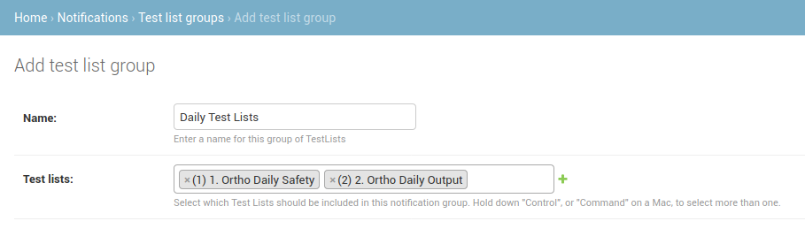

    Filling out the fields for a Test List group.

and finally click `Save`.  This `Test List Group` can now be associated with
Notifications.

.. _notifications-qccompleted:

QC Completed Notices
--------------------

These notifications are triggered after a user submits a Test List.  There are
4 subtypes of QC Completed Notices:

    * *Notify when Test List Completed*:  This type of notice is triggered any
      time a user submits a completed Test List.

    * *Notify on Test at Tolerance or Action*: This type of notice is
      triggered when a user submits a Test List that has Test Instances which
      are at tolerance or action level.

    * *Notify on Test at Action level only*: This is the same type of notice
      as *Notify on Test at Tolerance or Action* but is only sent for Test
      Instances which are outside of Action level.

    * *Follow up notification*:  This notification type allows you to have
      an email notice sent a certain number of days after a Test List is
      submitted.

To create a new `QC Completed Notice` click through the `QC Completed Notices`
section of the Notification admin section and then on the next page click `Add
QC Completed Notice` and then fill out the fields:

Notification Type (required):
    Select the notification type you want to create

Follow up days (Follow up notifiation Only):
    Set the number of days after a test list being completed that you
    want a follow up email sent.

Recipients (required):
    Select the recipient group you want this notification sent to.

Unit Group filter (optional):
    If you want this notification to only pertain to specific units, select a
    Unit Group filter.

Test List Group filter (optional):
    If you want this notification to only pertain to specific units, select a
    Unit Group filter.

Click `Save` once you have configured the notification the way you want.

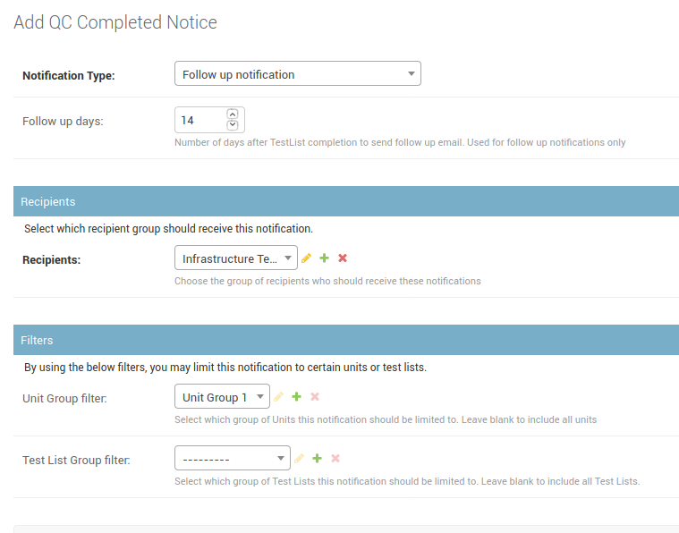

    Filling out the fields for a QC Completed notice.

.. _notifications-qcreview:

QC Review Notices
-----------------

There is currently only one subtype of QC Review Notice:

    * *Notify about test list instances awaiting review*:  This is a scheduled
      notification that can be sent to remind staff that there is completed QC
      awaiting review.

To create a new `QC Review Notice` click through the `QC Review Notices`
section of the Notification admin section and then on the next page click `Add
QC Review Notice` and then fill out the fields:

Notification Type (required):
    Select the notification type you want to create

Recurrences (required):
    Create a recurrence rule to define the days you want this notice sent.

Time of day (required):
    Select the time of day you want the notice sent.

Recipients (required):
    Select the recipient group you want this notification sent to.

Unit Group filter (optional):
    If you want this notification to only pertain to specific units, select a
    Unit Group filter.

Test List Group filter (optional):
    If you want this notification to only pertain to specific units, select a
    Unit Group filter.

Click `Save` once you have configured the notification the way you want.

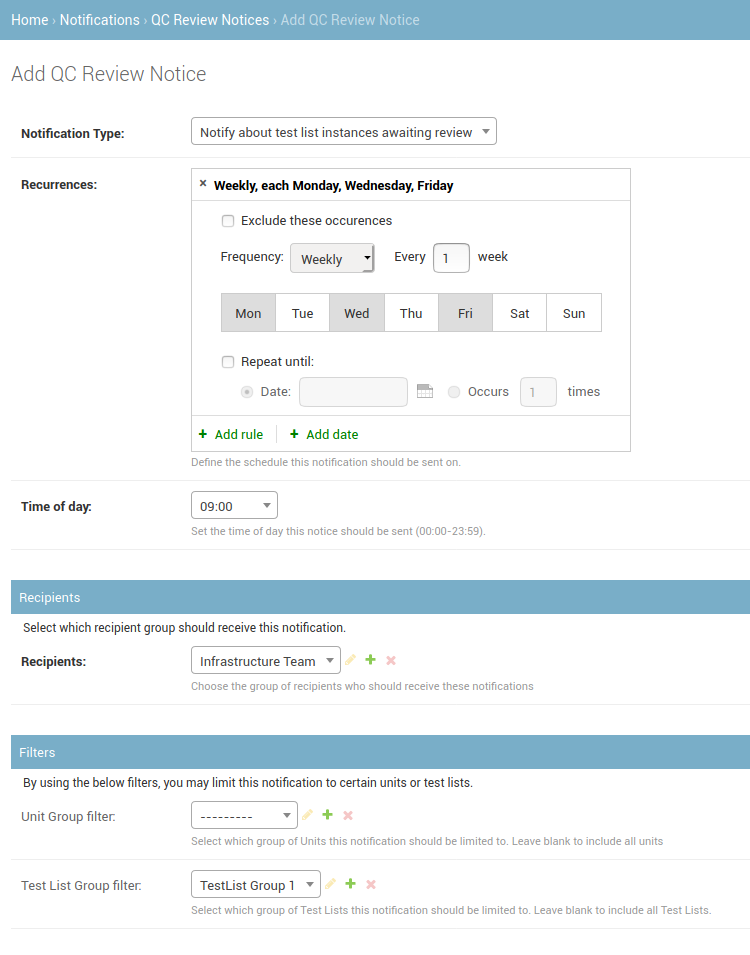

    Filling out the fields for a QC Review notice to be sent at 9am Mon Wed Fri.

.. _notifications-qcscheduling:

QC Scheduling Notices
----------------------

These scheduled notices are available to help you keep on top of what QC is due
and when. There are four sub types of notifications that can be configured:

    * *Notify about all Test Lists Due Dates*  This notification will send an
      email that contains all of the currently scheduled QC and when it is due.

    * *Notify about Test Lists currently Due & Overdue* This notification will
      send a notice about Test Lists that are currently Due or Overdue.

    * *Notify About Test Lists Currently Due & Overdue, and Upcoming Due Dates*
      This notification allows you to select a future time period (e.g. 7 days)
      and sends an email about which QC is currently Due, Overdue, or will
      become Due in that time period.

    * *Notify About Test Lists Upcoming Due Dates Only* This notification
      allows you to select a future time period (e.g. 7 days) and sends an
      email about which QC will become Due in that time period.

To create a new `QC Scheduling Notice` click through the `QC Scheduling Notices`
section of the Notification admin section and then on the next page click `Add
QC Scheduling Notice` and then fill out the fields:

Notification Type (required):
    Select the notification type you want to create

Recurrences (required):
    Create a recurrence rule to define the days you want this notice sent.

Time of day (required):
    Select the time of day you want the notice sent.

Future Days:
    Select the number of days for which you want to include upcoming due dates
    for QC.  For example, to get a notification containing QC coming due in the
    next week, set future days to 7.

Recipients (required):
    Select the recipient group you want this notification sent to.

Unit Group filter (optional):
    If you want this notification to only pertain to specific units, select a
    Unit Group filter.

Test List Group filter (optional):
    If you want this notification to only pertain to specific units, select a
    Unit Group filter.

Click `Save` once you have configured the notification the way you want.

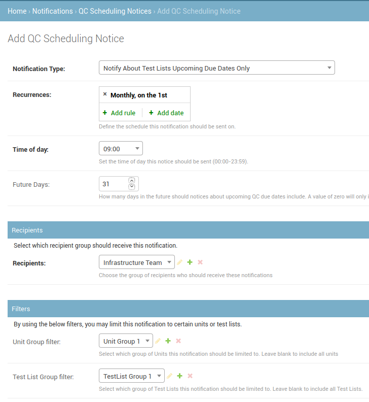

    Filling out the fields for a QC Scheduling notice to be sent on the first of the month.

.. _notifications-serviceevent:

Service Event Notices
---------------------

Service Event notices allows users to be alerted to Service Event creation &
modification. There is currently one Service Event Notification subtype:

    * *Notify when a Service Event is created or modified*  Use these alerts to
      get an email whenever a Service Event is created or modified (e.g. the
      status is updated).

To create a new `Service Event Notice` click through the `Service Event
Notices` section of the Notification admin section and then on the next page
click `Add Service Event Notice` and then fill out the fields:

Notification Type (required):
    Select the notification type you want to create

Recipients (required):
    Select the recipient group you want this notification sent to.

Unit Group filter (optional):
    If you want this notification to only pertain to specific units, select a
    Unit Group filter.

Click `Save` once you have configured the notification the way you want.

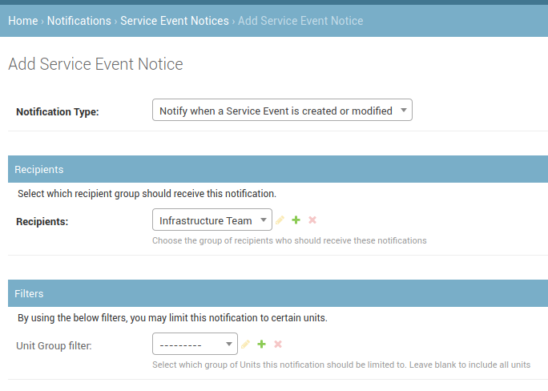

    Filling out the fields for a Service Event notice.

.. _notifications_edit:

Editing a Notification
======================

In order to edit any notification, locate it in the admin section:

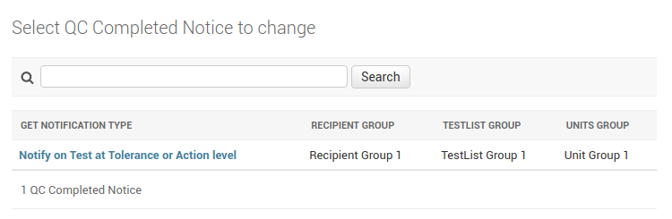

    Find the notification you want to edit.

click through the link, make the changes you want and then click `Save`

.. _notifications_delete:

Deleting a Notification
=======================

In order to delete any notification, locate it in the admin section (as shown above
in :ref:`notifications_edit`), click through the link, click `Delete`:

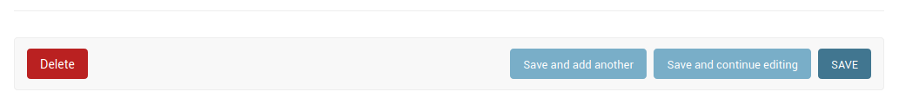

    Notification delete button

and then click `Yes, I'm Sure`:

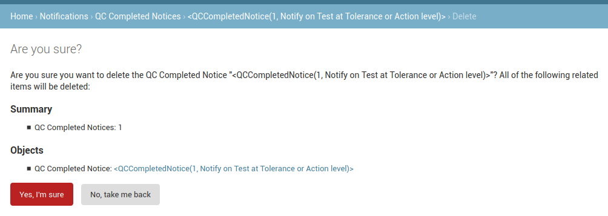

    Notification delete confirmation button
