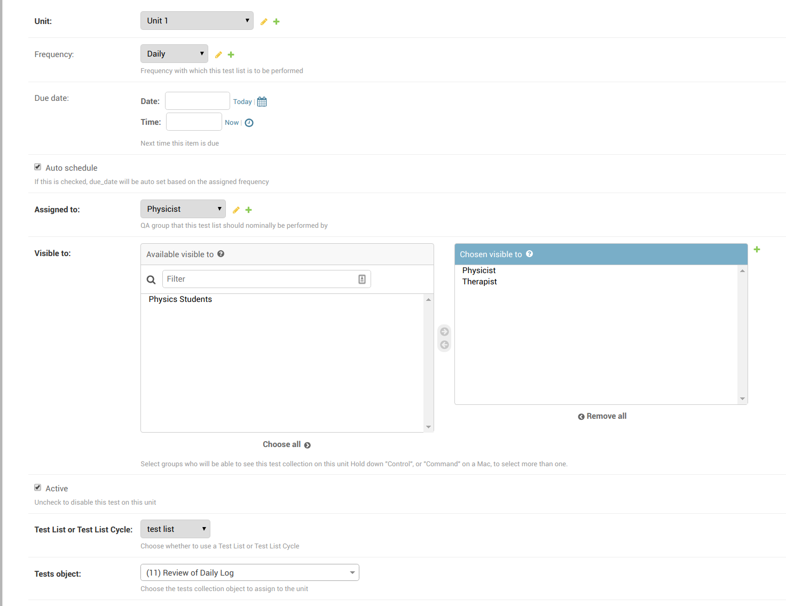
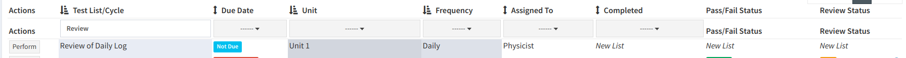

.. _qa_assign_to_unit:

Assigning A Test List Or Test List Cycle To A Unit
==================================================

Once you have created a :ref:`Unit <unit_creating>` and a :ref:`Test List
<qa_test_lists>` (or :ref:`Test List Cycle <qa_test_list_cycles>`) you need to
create an association between the two before the test list can actually be
performed. To do this click on the **Assign Test Lists to Units** link from the
main admin page and then click **Add unit test collection** button in the top
right hand corner.

The fields required for assigning a test list to a unit are described below.

Unit
----

The unit you want to assign the test list to.

Frequency
---------

The :ref:`Frequency <qa_frequencies>` with which you want the test list (cycle)
to be performed (e.g. Daily, Monthly, Yearly etc).

Optionally, you can leave the frequency blank and the test list will be
assigned to be performed on an *ad-hoc* basis.

Due Date & Auto Schedule
------------------------

Here you can manually set the initial due date/time for a test list on a unit.
You can also leave this blank if you like and the test list will show up as
being *Not Due*.

If you leave **Auto Schedule** checked, the due date will automatically be
updated according to the assigned frequency after the test list is completed on
a unit.

Assigned To
-----------

The group of users that is generally responsible for performing the lists.
Note that the **Assigned To** property is used for display only and users not
part of the **Assigned To** group will still be able to see and perform the
test list.

Visible To
----------

By default, all user groups will be able to see and perform a test list.  If
you want to restrict access/hide a test list from certain groups you can move
the groups from the **Chosen visible to** to the **Available visible to** box.

Active
------

If this checkbox is unchecked, the test list will not appear in any listings on
the main site. This should be used to disable test lists that are no longer
performed on a unit (deleting the unit test collection would cause a loss of
historical data).

Test List or Test List Cycle
----------------------------

Choose whether you are assigning a :ref:`Test List <qa_test_lists>` or a `Test
List Cycle <qa_test_list_cycles>` to this unit. After choosing the type of test
collection you are adding, the **Object id** dropdown will be populated with
the appropriate items.

Tests collection
----------------

Choose the test collection (test list or test list cycle) that you want to
assign to this unit.

An example
----------

The below screen shot shows a test list being assigned to a unit on a daily
basis.

   Assigning a test list to a unit

And this is the way it would look in a listing on the main site:

   Test list assigned to a unit on main site
