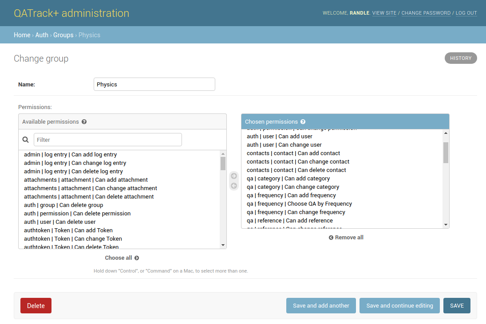
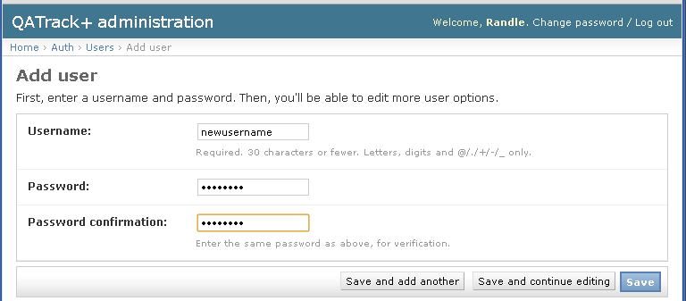
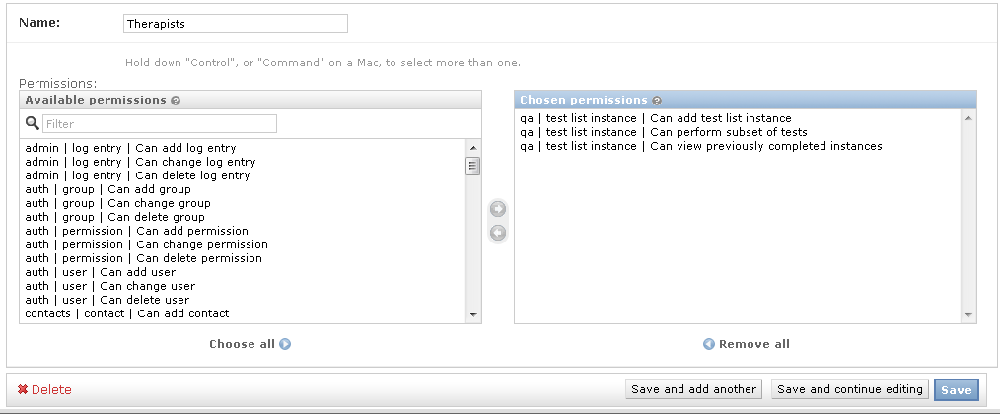
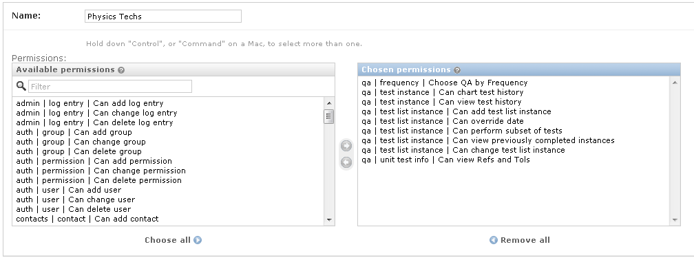

.. _qa_auth:

Managing Users and Groups
=========================

Access to various QATrack+ features for users is defined based on which
groups a user belongs to and which permissions have been assigned to
their groups, or them specifically.

.. _auth_groups:

User Groups
-----------

User groups are useful for managing the permissions of many users at
once. For example, you may have groups for Administrators, Physicists,
Physics Technologists and Therapists (A user may belong to one or more
groups) each with different permissions and different parts of QATrack+
accessible to them.

To define a new user group click on the *Groups* link from the main
admin page and then click **Add group** on the top right hand corner of
the next page. Give your group a name and then choose the permissions
available to that group (permissions are described in more detail
below). Once you are finished, click **Save**.

   Creating a new group

.. _auth_users:

Users
-----

If you are using :ref:`Active Directory <active_directory>` for user
authentication then new users will be automatically created the first time they
log in. Otherwise if you are using the built in authentication system you will
need to create users manually.

Creating a new user
~~~~~~~~~~~~~~~~~~~

From the main :ref:`admin page <access_admin_site>` click on the **Users** link
under the **Auth** section and then click **Add user**. On the next page fill
out the username and password fields. (The user will be able to change their
password to something different on their own later). Click **Save** when you
are finished.

   Creating a new user

On the next page you can fill out more details about the users including proper
names and which groups the user belongs to. You may also add permissions
specific to that person (i.e. that are not already covered by the groups they
are members of) although it is highly recommended that you stick to using
groups for managing all permissions.

.. figure:: images/create_user_2nd.png
   :alt: Creating a new user - selecting permissions

   Creating a new user and setting permissions

Any user that has **Admin Status** (formerly Staff Status) checked on their user profile page
will have access to the admin site.

A user with **Superuser status** checked will have all permissions
granted to them without needing to explicitly specified.

Permissions
-----------

.. _permissions_admin:

The easiest method of managing permissions is to grant specific
permissions to a group and then make users part of that group. The user
will inherit all the permissions of their groups and as such do not need
to have them explicitly granted to them on their user profile page (that
is, you can leave the **Chosen user permissions** box blank on most
users profile page).

You will likely want to tweak the set of permissions your user groups
are granted but example permission sets are given below to help you get
started.

The most important permissions are described here and typical permission
sets for groups are given below:.

-  **auth \| group \| Can change group** *Allows a user to
   change group membership and permissions.*
-  **qa \| test instance \| Can view test history** *Allows a user to
   view historical data alongside a test when performing a test list.*
-  **qa \| test instance \| Can view charts of test history** *Allows a
   user to plot charts of historical data*
-  **qa \| test instance \| Can run SQL Data Reports** *Allows a
   user to run previously defined SQL queries*
-  **qa \| test instance \| Can run SQL Data Reports** *Gives user the
   ability to create and run raw SQL queries on your data*
-  **qa \| test instance \| Can review tests** *Allow a user to perform
   review & approval functions*
-  **qa \| test instance \| Can review & approve self-performed tests**
   *Allow a user to review their own test results (requires review
   permission as well)*
-  **qa \| test instance \| Can review non visible test list instances**
   *Allow a user to review test list instances that are not visible to
   any of their groups*
-  **qa \| test instance \| Can skip without comment** *Allows a user to
   skip tests without adding a comment*
-  **qa \| test list instance \| Can add test list instance** *Required
   for all users who will be performing QC*
-  **qa \| test list instance \| Can perform subset of tests** *Allows a
   user to perform only a subset of test categories when performing a
   test list*
-  **qa \| test list instance \| Can save in progress** *Allows a
   user to save test lists with the "In Progress" flag set*
-  **qa \| test list instance \| Can view previously completed
   instances** *Allows a user to view (but not edit) previously
   completed test lists*
-  **qa \| test list instance \| Can change test list instance** *Allows
   a user to edit previously completed test results*
-  **qa \| frequency \| Choose QC by Frequency** *Allows a user to
   access different frequencies of QC to perform*
-  **qa \| test list instance \| Can override date** *Enables a user to
   override the default date and time for a test list instance*
-  **qa \| unit test info \| Can view Refs and Tols** *Enables the
   display of reference and tolerance values when a user is performing a
   test list*
-  **qa \| unit test collection \| Can view program overview** *Allows a
   user to view the program overview page*
-  **qa \| unit test collection \| Can view TLI and UTC not visible to
   user's groups** *Allows a user to view all Test Lists regardless of
   their groups*
-  **service_log \| hours \| Can have hours** *Allow tracking of users hours when involved with a Service Event*
-  **service_log \| return to service qa \| Can perform return to service qa** *Allow user to perform qa linked to service events*
-  **service_log \| return to service qa \| Can view existing return to service qa** *Allow user to view qa linked to service events*
-  **service_log \| service event \| Can create service events** *Allows user to create new service events*
-  **service_log \| service event \| Can view service events** *Allows user to view existing service events*
-  **service_log \| service event \| Can review service events** *Allows user to change status of service events to statuses with \'is review required = false\'.*
-  **parts \| part \| Can add part** *Allows a user to enter new parts*
-  **parts \| part \| Can view parts** *Allows a user to view existing parts*

Minimal set of permissions
~~~~~~~~~~~~~~~~~~~~~~~~~~

A fairly minimal set of permissions for performing QC (e.g. for a
therapist) is:

-  qa \| test list instance \| Can add test list instance
-  qa \| test list instance \| Can perform subset of tests (optional)
-  qa \| test list instance \| Can view previously completed instances
   (optional)

   Minimal set of permissions

This set of permissions will allow a user to access and perform daily &
weekly QC and optionally view previously comleted test lists.

Permissions for performing and viewing test history
~~~~~~~~~~~~~~~~~~~~~~~~~~~~~~~~~~~~~~~~~~~~~~~~~~~

For users who will be performing lots of QC but will not be reviewing
and approving data or configuring new tests and test lists (e.g. a
Physics Technologist), the list of permissions might look like the
following:

-  qa \| frequency \| Choose QC by Frequency
-  qa \| test instance \| Can chart test history
-  qa \| test instance \| Can view test history
-  qa \| test list instance \| Can add test list instance
-  qa \| test list instance \| Can override date
-  qa \| test list instance \| Can perform subset of tests
-  qa \| test list instance \| Can view previously completed instances
-  qa \| test list instance \| Can change test list instance
-  qa \| unit test info \| Can view Refs and Tols

   Physics Techs Permissions

Fairly complete set of permissions
~~~~~~~~~~~~~~~~~~~~~~~~~~~~~~~~~~

For a user who will be performing QC, reviewing and approving data and
configuring new tests and test lists and groups (e.g. a Physicist), a
typical permission set might look like the following:

-  auth \| group \| Can add group
-  auth \| group \| Can change group
-  auth \| permission \| Can add permission
-  auth \| permission \| Can change permission
-  auth \| user \| Can add user
-  auth \| user \| Can change user
-  contacts \| contact \| Can add contact
-  contacts \| contact \| Can change contact
-  contacts \| contact \| Can delete contact
-  qa \| category \| Can add category
-  qa \| category \| Can change category
-  qa \| frequency \| Can add frequency
-  qa \| frequency \| Choose QC by Frequency
-  qa \| frequency \| Can change frequency
-  qa \| reference \| Can add reference
-  qa \| reference \| Can change reference
-  qa \| test \| Can add test
-  qa \| test \| Can change test
-  qa \| test instance \| Can add test instance
-  qa \| test instance \| Can review tests
-  qa \| test instance \| Can chart test history
-  qa \| test instance \| Can Run SQL Reports
-  qa \| test instance \| Can Create SQL Reports
-  qa \| test instance \| Can view test history
-  qa \| test instance \| Can change test instance
-  qa \| test instance \| Can delete test instance
-  qa \| test instance \| Can skip without comment
-  qa \| test instance status \| Can add test instance status
-  qa \| test instance status \| Can change test instance status
-  qa \| test list \| Can add test list
-  qa \| test list \| Can change test list
-  qa \| test list cycle \| Can add test list cycle
-  qa \| test list cycle \| Can change test list cycle
-  qa \| test list cycle membership \| Can add test list cycle
   membership
-  qa \| test list cycle membership \| Can change test list cycle
   membership
-  qa \| test list cycle membership \| Can delete test list cycle
   membership
-  qa \| test list instance \| Can add test list instance
-  qa \| test list instance \| Can override date
-  qa \| test list instance \| Can perform subset of tests
-  qa \| test list instance \| Can view previously completed instances
-  qa \| test list instance \| Can change test list instance
-  qa \| test list instance \| Can delete test list instance
-  qa \| test list membership \| Can add test list membership
-  qa \| test list membership \| Can change test list membership
-  qa \| test list membership \| Can delete test list membership
-  qa \| tolerance \| Can add tolerance
-  qa \| tolerance \| Can change tolerance
-  qa \| unit test collection \| Can add unit test collection
-  qa \| unit test collection \| Can change unit test collection
-  qa \| unit test info \| Can add unit test info
-  qa \| unit test info \| Can view Refs and Tols
-  qa \| unit test info \| Can change unit test info
-  service_log \| hours \| Can have hours
-  service_log \| return to service qa \| Can perform return to service qa
-  service_log \| return to service qa \| Can view existing return to service qa
-  service_log \| service event \| Can create service events
-  service_log \| service event \| Can view service events
-  service_log \| service event \| Can review service events
-  parts \| part \| Can add part
-  parts \| part \| Can view parts
