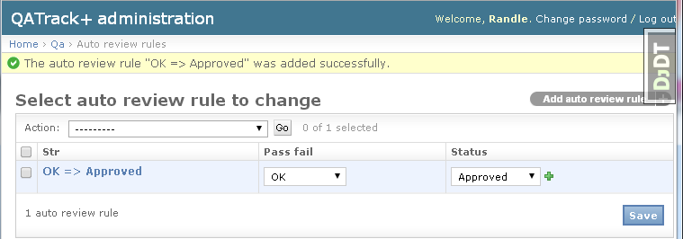

Auto Review
===========

To configure Auto Review rules visit the Admin section of your QATrack+
site and select the ``Auto review rules`` link under the QA section.

Auto review rules allow you to automatically assign a `Test
Status <../admin/statuses.md>`__ based on whether the test is passing,
at tolerance or failing (action). This can be useful if you only want to
require review for tests that are at tolerance or action.

For example, you may wish to set up an Auto Review rule to automatically
assign passing tests (OK) to an Approved status.

   Auto review rule

In order for a test to be Auto Reviewed, it must have the `"Allow auto
review of this test" <../admin/tests.md>`__ option set.

By default, Auto Review is disabled for new Test's. To change this
default have your site administrator set ``AUTO_REVIEW_DEFAULT = True``
in the `local settings <../deployment/settings.md>`__.
