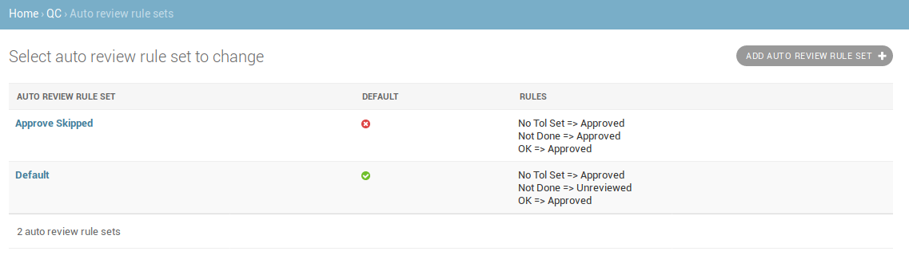
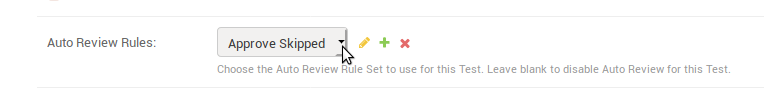

.. _qa_auto_review:

Auto Review
===========

To configure Auto Review rules visit the Admin section of your QATrack+
site and select the ``Auto review rules`` link under the QC section.

Auto review rules allow you to automatically assign a :ref:`Test Status
<qa_statuses>` based on whether the test is passing, at tolerance or failing
(action). This can be useful if you only want to require review for tests that
are at tolerance or action.

For example, you may wish to set up an Auto Review rule to automatically assign
passing tests (OK) to an Approved status.

.. figure:: images/auto_review_rule.png
   :alt: Auto review rule

   Auto review rule

In order for a test to be Auto Reviewed, it must have an :ref:`"Auto Review
Rules Set" <qa_tests>` option selected.

Auto Review Rule Sets
=====================

Auto Review Rule Sets allow you to apply different sets of Auto Review Rules to
different tests.

In the figure below two Auto Review Rule Sets are shown, a default rule set that
will set skipped tests to Unreviewed, and a second rule set that will set skipped
tests to "Approved".

   Auto review rule sets

To choose an Auto Review Rule Set for a Test, use the "Auto Review Rules" field on
the Test configuration page:

   Auto review rule set selection for a test
