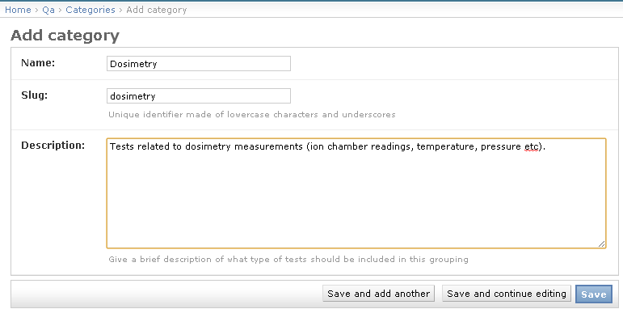

.. _qa_categories:

Test Categories
===============

It can be useful to separate tests into different categories. For example, if
you have a :term:`Test List` for morning QC on a machine that consists of both
dosimetry and safety tests, and occasionally wish to perform only the dosimetry
tests, having the tests in separate categories allows you to easily perform a
:ref:`subset of the tests from a test list <qa_perform_subset>`.

New categories are straightforward to define: from the :ref:`main admin page
<access_admin_site>`, click on the **Categories** link, then click **Add
category**, fill out the fields and **Save**.

   Creating a new test category
