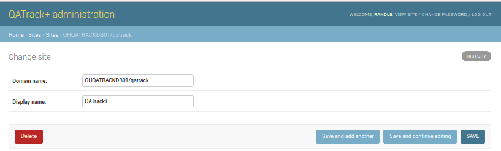

Changing The Site Name Displayed at the Top of Pages
====================================================

To change the name of your site from example.com:

#. Go to the :ref:`Admin area of the website <access_admin_site>`
#. In the Websites section click on the "Websites" or "Change" link.
#. Click on the example.com site
#. Set the Domain name field to your server domain and root of your QATrack installation (e.g. `yourcomputer/qatrack` or `123.456.1.1/qatrack`) and the Display name to what you want shown in the top left hand corner of your site.
#. Click Save

   Changing the default Site from example.com
