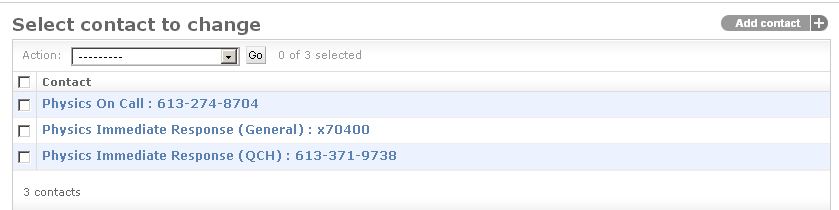
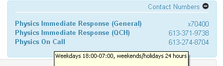

Adding Contacts
===============

When performing a test list, in the left hand sidebar menu there is a contact
numbers button that can be used to toggle a list of useful phone numbers in
case the person performing QA needs assistance. At The Ottawa Hospital Clinic
this feature would often be used by Therapists to call a Physicist for
assistance.

To create a new contact number click on the **Contacts** link on the main admin
page and then **Add contact** at the top right hand corner.

On the next page fill out the display name, phone number and a short
description of what this number is used for. The description will be displayed
when a users hovers the mouse over the number when performing QA.

Here are three defined contact numbers in the admin:

   Contact numbers in the admin

and the way they look on the main site:

   Contact numbers displayed on site
