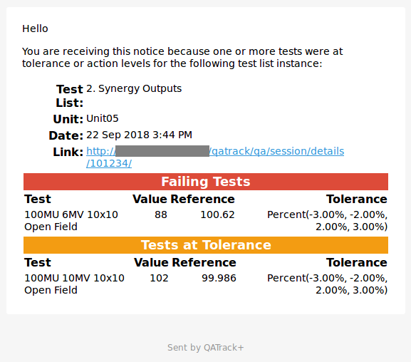
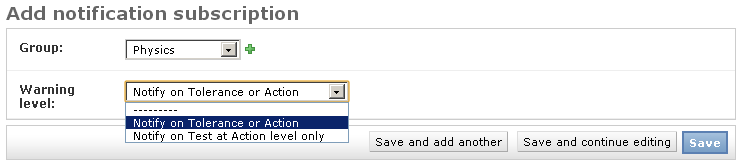

.. _qa_emails:

Email notifications
===================

QATrack+ can be configured so that when a test list is performed and has tests
which are at tolerance or failing an email can be sent to specific :ref:`groups
<auth_groups>`. This requires that your website administrator has configured
the :ref:`email settings <config_email>` correctly.

To create a new notification, choose the **Notification subscriptions** option
under the **Notifications** section on the main admin page and then click on
**Add notification subscription** in the top right hand corner of the page.

Choose the group who you want to receive emails and choose whether the emails
should be sent only when tests are failing or both when tests are at tolerance
or failing. Click **Save** when you are finished.

   Creating a new notification
