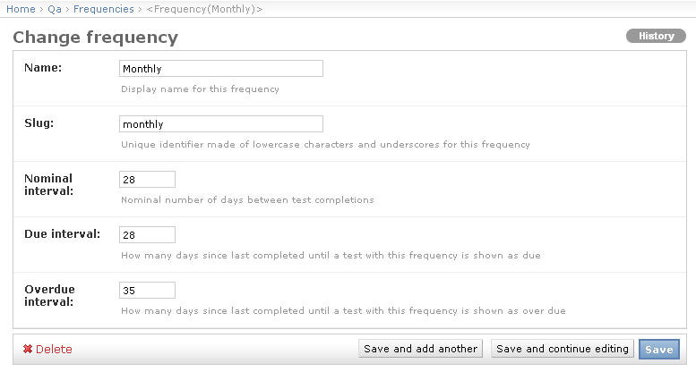

.. _qa_frequencies:

Test List Frequencies
=====================

When a :ref:`test list is assigned to a unit <qa_assign_to_unit>` you give it a
frequency with which it should be performed. This frequency determines when a
test list is show as being due/overdue on a unit.

Frequencies can be configured from the main admin page by clicking on
the **Frequencis** link in the **QA** section.

Example configurations are shown below for **Daily** and **Monthly**
frequencies.

.. figure:: images/freq_daily.png
   :alt: Daily Frequency Example

   Daily Frequency Example

   Monthly Frequency Example

QATrack+ currently uses an "offset" system for deciding whether a test list is
not due, due or overdue. If it has been less than *due interval* days since the
last time a test list was performed the due date will be shown in green.

.. figure:: images/not_due.png
   :alt: Test list that is not yet due

   Test list that is not yet due

When a test list reaches its due date it will be shown in yellow.

.. figure:: images/due.png
   :alt: Test list that is now due

   Test list that is now due

Finally if a test list has not been completed within the *overdue
interval* number of days it will be shown in red.

.. figure:: images/overdue.png
   :alt: Test list that is now over due

   Test list that is now over due
