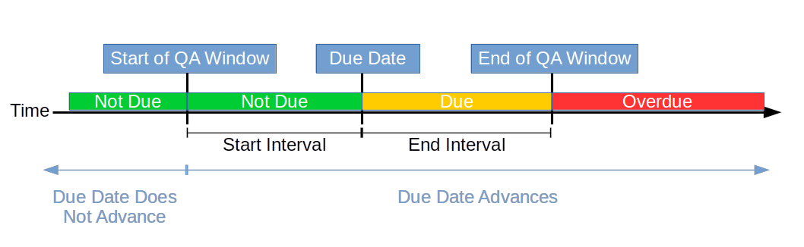
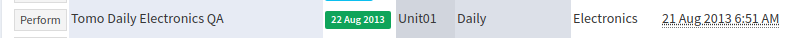
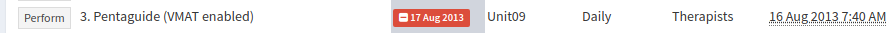
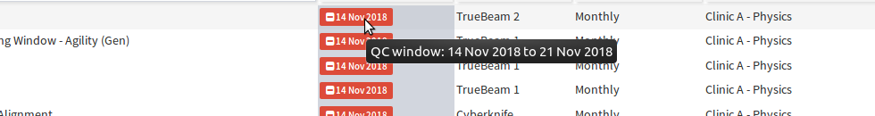
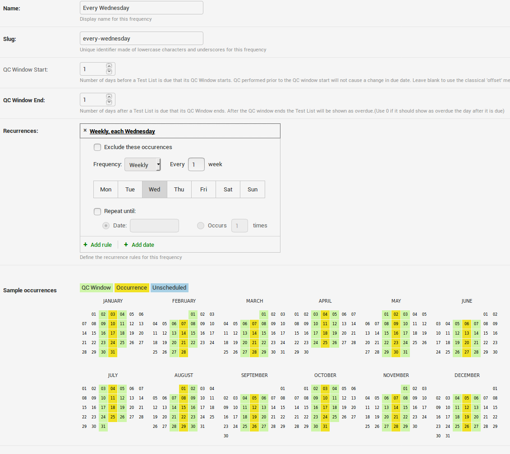
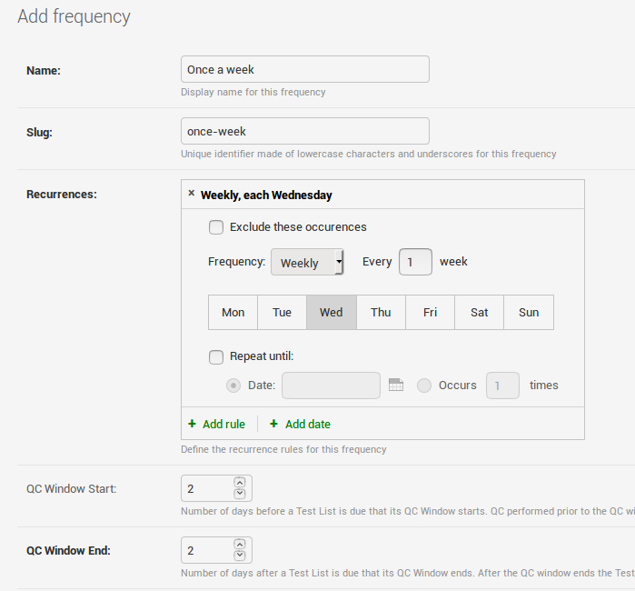
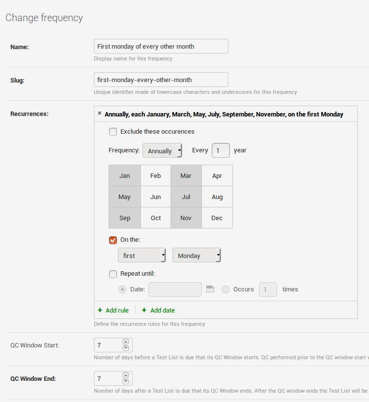

.. _qa_frequencies:

Frequencies & Scheduling
========================

When a :ref:`test list is assigned to a unit <qa_assign_to_unit>` you give it a
frequency or schedule with which it should be performed. This frequency
determines when a test list is show as being due/overdue on a unit.

Frequencies can be configured from the main admin page by clicking on the
**Frequencis** link in the **QC** section.

How Frequencies work
--------------------

Prior to version 0.3.1, QATrack+ used an "offset" system for deciding whether a
test list is not due, due or overdue. Anytime a test list was performed, its
due date was set a certain number of days (the `Due Interval`) from todays
date.  While this method of scheduling is still possible, v0.3.1 introduced a
more flexible scheduling system based on recurrence rules (RFC 5545) similar to
what you would find in other calendar applications. Recurrence rules allow you
to specify schedules like "Every Mon, Wed, Fri", "The First Monday of Every
Month", or like in prior versions “28 days after today”.

Since, QC data is not always collected on the exact day it is scheduled,
QATrack+ uses the concept of a "QC Window" where a QC Window is defined as some
number of days before the due date of a test list (the Start Interval), up
until the date when a test list should be marked as overdue (the End Interval).
If a Test List is performed within its QC Window (or indeed after the QC Window
expires) then the due date will be set forward until the next instance of the
recurrence rule.  If a Test List is performed prior to its QC Window, the due
date will *not* be moved forward (this is the primary difference between the
previous scheduling system).  The following diagram may be helpful in
understanding this system:

   QC window scheduling model of QATrack+

Lets look at a couple of examples to demonstrate this system:

#. A test list is scheduled with a recurrence rule of “The 1st of every month”
   with a Start Interval of 7 days and an End Interval also set to 7 days.  The
   due date is currently set to Dec 1st.  If the test list is performed any
   time before Nov 24th, the due date will stay as Dec 1st since the QC was
   performed prior to the QC window start.

#. Same schedule as above, except the test list is now performed on Nov 27th,
   prior to the due date, but within the QC Window.  In this case the due date
   will be set to Jan 1st since the QC was performed within the QC window.

#. Same schedule as above but the unit has an extended down time and the test
   list is not performed until Jan 10th over a month after its due date.  In
   this case, since the test list is past due, its due date will be set to the
   next occuring instance of the recurrance rule, Feb 1st.

#. A test list is scheduled with a recurrence rule of “Every 28 days” with a
   null Start Interval and an End Interval of 7 days.  The due date is
   currently set to Dec 1st.  A user performs the test list on Nov 14th.  In
   this case, since no Start Interval is defined, the due date will be set
   forward 28 days to to Dec 12th.  This is analogous to the offset system used
   in versions prior to v0.3.1.

Due Dates in the User Interface
-------------------------------

If a Test List has not reached its next due date, the due date will be shown in
green.

   Test list that is not yet due

When a test list reaches its due date it will be shown in yellow.

.. figure:: images/due.png
   :alt: Test list that is now due

   Test list that is now due

Finally if a test list has not been completed within the QC window
(`window_end` days after the due date) it will be shown in red.

   Test list that is now over due

Hovering over any due date will show the test lists current QC window:

   Hovering over a due date status to reveal the QC window

Example Frequencies
-------------------

A weekly every Wednesday frequency, which also demonstrates the viewing of
the recurrence rules on a calendar.

   Every Wednesday frequency configuration

A "classic" daily frequency that sets the due date to tomorrow, no matter what
day it is performed on:

.. figure:: images/freq_daily.png
   :alt: Daily frequency configuration

   Daily frequency configuration

A frequency for tests that must be performed at least once a week (Mon - Fri). Nominal due date
is set to Wed with a window of 2 days on either side. :

   Once a week frequency configuration

A frequency for tests that must be performed the first Monday of every other month.

   First monday of every other month configuration
