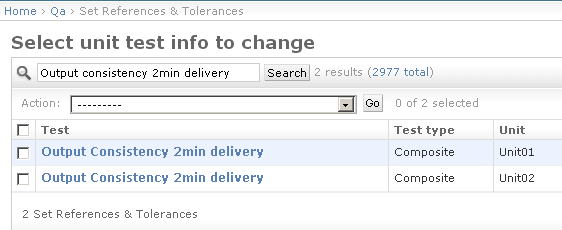
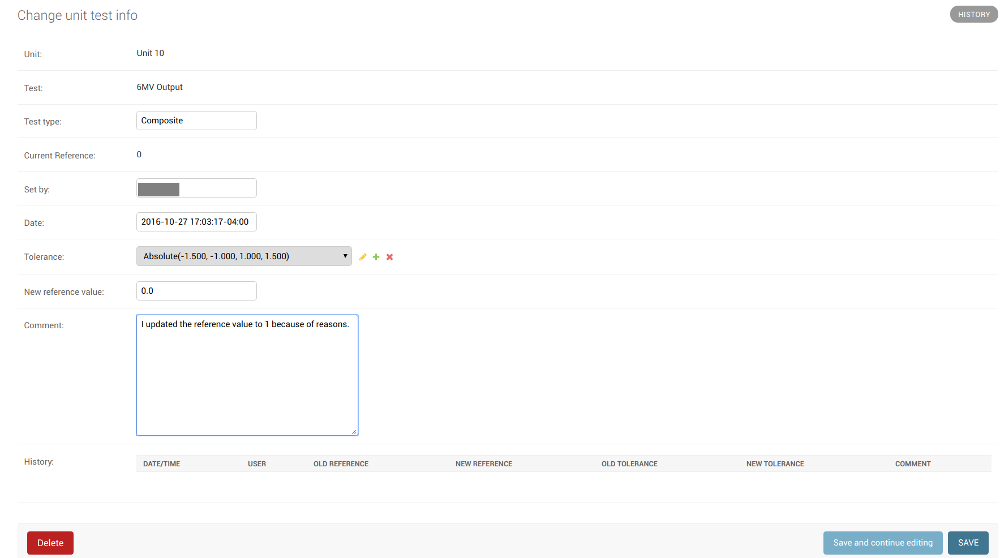
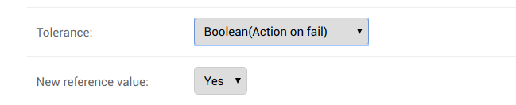
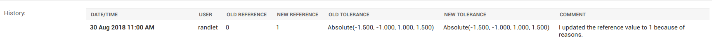
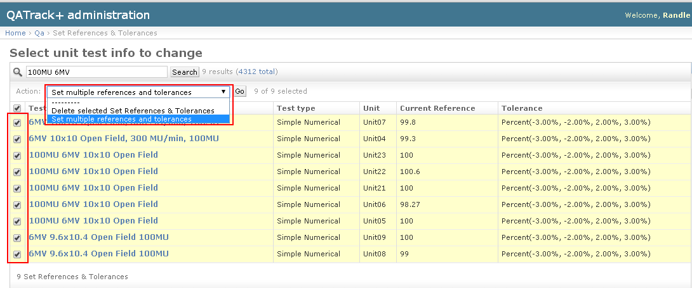
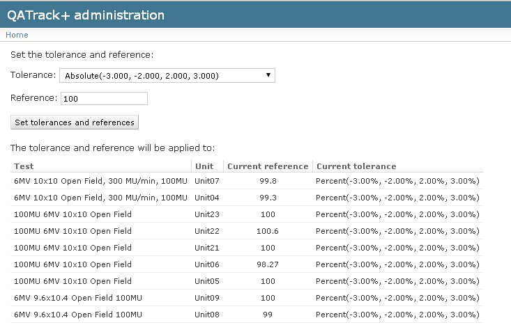
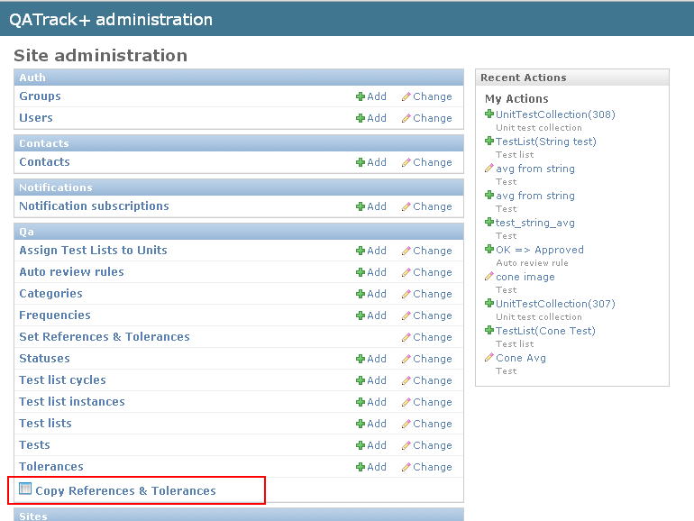
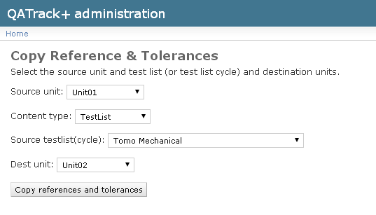
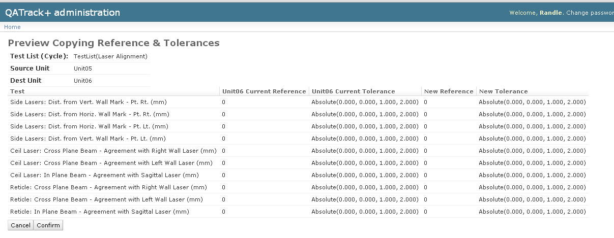

.. _qa_ref_tols:

Setting Reference & Tolerance Values
====================================

When you :ref:`assign a test list to a unit <qa_assign_to_unit>` each of the
tests from that list are assigned a record of the reference value and
tolerance/action levels on that unit. Reference values and tolerance/action
levels are unit specific so you must set these values for every unit a test is
assigned to. Initially the reference value and tolerance/action levels are set
to null so you will need to update them if you want to subject your tests to
pass/fail criteria when performing a test list.

To set the reference and tolerance values click on the **Set References and
Tolerances** link from the main admin page. From here you will see a list of
all the test/unit pairs for any test list which has been assigned to a unit. To
set the reference value for a given test on a unit you can either browse
through the list or use the search box at the top of the page to find the test
you are looking for. Note, you may also use the filters at the side of the page
to narrow your search. The image below shows a search for a test which has been
assigned to two units.

   Searching for a test on a unit

Once you have located the test/unit pair you want to set the reference for,
click on its name. From here you will see information about the current
reference value and tolerance/action levels including when these values were
last changed and who changed them.

   Reference and tolerance example

Numerical References & Tolerances
---------------------------------

If the test you are setting reference values for is numerical (e.g.
:ref:`simple numerical or composite test types <qa_tests>`) you can choose a
:ref:`tolerance/action level <qa_tolerances>` from the **Tolerances:** drop
down and set the reference value in the text box below that.

The tolerance/action levels of a test act as a window around the reference
value. For example if a certain test on a unit has reference value of 50 and a
tolerance/action level of +/- 2%/3% (i.e. lower action = -3%, lower tolerance =
-2 %, upper tolerance = 2%, upper action = 3%) then values between 49 and 51
will be considered within tolerance, values between 48.5 & 49 or 51 & 51.5 will
be considered at tolerance and values less than 48.5 or greater than 51.5 will
be considered failing.

Boolean References
------------------

For boolean tests you choose whether the reference value is Yes or No and whether
a mismatch between the reference value and the users selection should result in
a warning or a failure.

   Reference and tolerance example for boolean test

Multiple Choice References
--------------------------

Multiple choice tests have no reference value. For information about multiple
choice tolerances, please see the :ref:`tolerances page <qa_tolerances>`.

History
-------

As of version 0.3.0 users may add a comment when updating references and
tolerances and this comment will be shown with the history of changes for the
reference and tolerance.

   Reference and tolerance history

Setting multiple References & Tolerances at the same time
=========================================================

To set a group of tests to the same reference/tolerance value, go to the
``Set References & Tolerances`` page and select all the tests you want
to set:

   Setting multiple references & Tolerance

then select ``Set multiple references and tolerances`` from the
``Actions`` dropdown list at the top and click ``Go``.

On the next page set the desired reference & tolerance value then click
``Set tolerances and references``.

   Setting multiple references & Tolerance

Copying References & Tolerances between units
=============================================

It is possible to copy references and tolerances from one unit to
another. This is quite handy when you have the same test list assigned
to multiple units with the same reference values set.

From the main admin page click on the ``Copy References & Tolerances``
link in the QC section.

   Copy ref tols link

On the next page, choose the source unit and test list (cycle) and the
destination unit and click ``Copy references and tolerances``.

   Copy ref tols select

Finally, you will be asked to review and confirm before the new
references are set.

   Copy ref tols confirm
