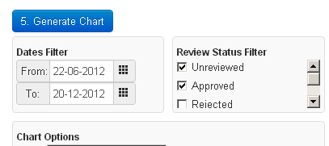

.. _qa_statuses:

Review Statuses
===============

Every test list instance that is created has a status assigned to it (and
hence there must be at least one status defined before doing QC).

These statuses allow you to flag tests for review, indicate whether a test
result is valid or not, and whether or not a test result should be included in
charts by default.

An example status definition is shown here with the various fields
explained below.

.. figure:: images/default_status.png
   :alt: Status overview

   Status overview

-  The status **Name** is what will be displayed on pages where this
   status is used, the **Slug** is a `url safe version of the
   name <http://en.wikipedia.org/wiki/Clean_URL#Slug>`__ and the
   **Description** should be a brief description of when a test list instance
   should be given this status.

-  If **Is default** is checked for a status then all new test list instances
   created when a user performs a test list will be given this status
   unless explicitly overridden by the user.

-  If a test list instance has a status with **Requires review** checked it
   will appear in the :ref:`**Unreviewed** queue <qa_review>`.

-  **Export by default** indicates whether test instances with this
   status should be included by default in data plots. In the figure
   below the *Rejected* status does not have **Export by default**
   checked and therefore must be specifically checked off if they want
   to include *Rejected* data in the plots.

   Export by default statuses

-  **Valid** indicates whether test list instances with this status are "good" data or
   not (i.e. if the test was carried out correctly).
