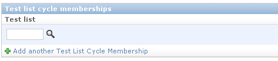
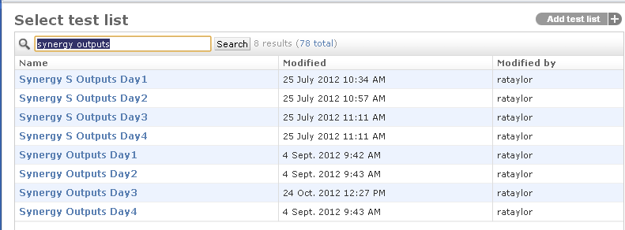
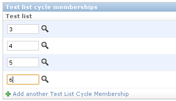
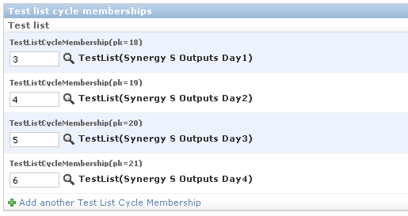
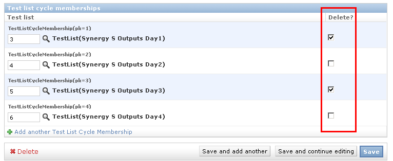

.. _qa_test_list_cycles:

Configuring Test List Cycles
============================

A **test list cycle** allows you to group multiple `test
lists <test_lists.md>`__ into a single repeating cycle that can be
assigned to a unit.

For example, at our clinic, on a number of units, the therapists daily
QA is on a repeating 2 or 4 day cycle where the actual tests they
perform vary slightly by day. A test list cycle allows us to handle this
situation without the therapists having to keep track of which day was
done last.

For a 4 day cycle, you would create 4 separate test lists (e.g. Morning
Outputs Day 1, Morning Outputs Day 2, Morning Outputs Day 3, Morning
Outputs Day 4) and then create a Test List Cycle made up of those 4 Test
Lists. You would then assign that Test List Cycle to the unit with a
daily frequency, rather than assigning each of the 4 test lists
individually.

When a user performs a Test List Cycle, it checks which test list in the
cycle was performed last and automatically presents them with the tests
in the next days test list. So if Day 2 was performed yesterday, they
will be presented with the Day 3 tests today. You can also manually
override which day you want to perform.

Defining a test list cycle is described below.

Creating a new Test List Cycle
------------------------------

From the main admin page select the **Test list cycles** page and click
the **Add test list cycle** button in the top right corner of the page.
The fields for defining a test list cycle are described below.

Name
----

A descriptive name that will be displayed in listings of test-lists.

Slug
----

A `slug is a URL friendly short
label <https://docs.djangoproject.com/en/dev/ref/models/fields/#slugfield>`__
for a test list. It should consist of only letters, numbers, underscores
and hyphens.

Description
-----------

*Optional*

A concise description of what this test list is for.

Drop Down Label
---------------

Set the text of the label of the drop down input used for choosing a one
of the test list members of this cycle. The default is "Choose Day".

Day Option Text
---------------

Choose whether to use the test list day number (i.e. Day 1, Day 2, ...)
or the test list name for display in the dropdown used for chossing one
of the test list members.

Test list cycle memberships
---------------------------

To add a test list to your cycle click the magnifying glass beside the
first text box uder the **Test list cycle memberships** section. (Note
prior to version 0.2.6 you first need to click the **Add another Test
List Cycle Membership** link to create a new row in the **Test list
cycle memberships** list.)

   Search for test list

This will bring up a dialogue box where you can search or navigate to
the test list that you want to add to your cycle.

   Test List Cycle Search Results

Clicking on the name of the test list you want to add will close the
dialogue and add the test list to your cycle. Repeat these steps until
you have added all the required test lists to your cycle.

   Test List Cycle ID's

Once you have added all your test lists, click the **Save and continue
editing** button and confirm all your test lists are present and in the
correct order.

   Test List Cycle after save

If you need to reorder the test lists you can do so by dragging and
dropping the test list rows into a different order and then saving the
changes.

Removing a list from a test list cycle
--------------------------------------

To remove a test list from a cycle, click the checkbox under the
**Delete** column of the **Test list cycle memberships** listing and
then save the cycle.

   Removing a test list from a cycle
