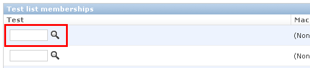
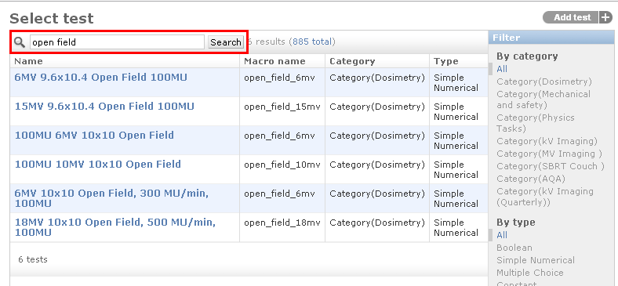
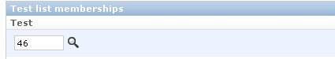
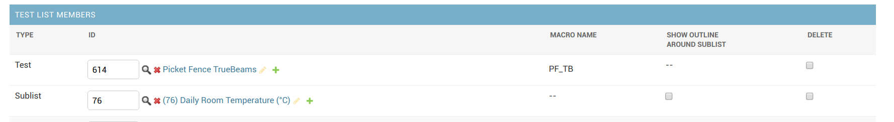

Configuring Test Lists
======================

To edit existing test lists or create new test lists click on the **Test
Lists** in the **QA** section on the main admin page.

Create a new test list by clicking the **Add Test List** link on the
**Test Lists** admin page. The fields for defining a new test list are
described below.

Name
----

A descriptive name that will be displayed in listings of test-lists.

Slug
----

A `slug is a URL friendly short
label <https://docs.djangoproject.com/en/dev/ref/models/fields/#slugfield>`__
for a test list. It should consist of only letters, numbers, underscores
and hyphens.

Description
-----------

*Optional*

A concise description of what this test list is for.

Sublists
--------

.. _sublists_admin:

*Optional*

Test lists can be composed of both individual `tests <tests.md>`__ as
well as including the tests from another test list. To include all the
tests from another test list simply move the test list who's test you
want want to include from the **Available sublists** to the **Chosen
sublists**.

Warning Message
---------------

Use this field to define the message shown when a test within this test
is at Action level. If the message is left blank The default is ("Do not
treat").

Test List memberships
---------------------

In order to add a test to your test list, click the magnifying glass
beside the first text box under the **Test** header.

   search for test

This will bring up a dialogue box that you can use to search for the
test you want to add (or create a new one).

   Search results

Once you've found the test you want to add, clicking on its name will
close the dialogue box and add the test to your test list.

   Test added to list

If you now click the **Save and continue editing** button at the bottom
of the page, you will see the name of your test next to its id number.

   Test added and saved

Continue to add tests in this fashion (you can add many tests without
saving in between) until you have added all the required tests.

When you are finished click \*\*Save and continue editing\* and confirm
that all your tests are present. See the section below for instructions
on how to reorder the tests if required.

Reordering Tests within a test list
~~~~~~~~~~~~~~~~~~~~~~~~~~~~~~~~~~~

Tests can easily be reordered by dragging and dropping a tests row into
a new position in the list. After you have finished reordering click
**Save and continue editing** and ensure all your tests are now in the
correct order.
