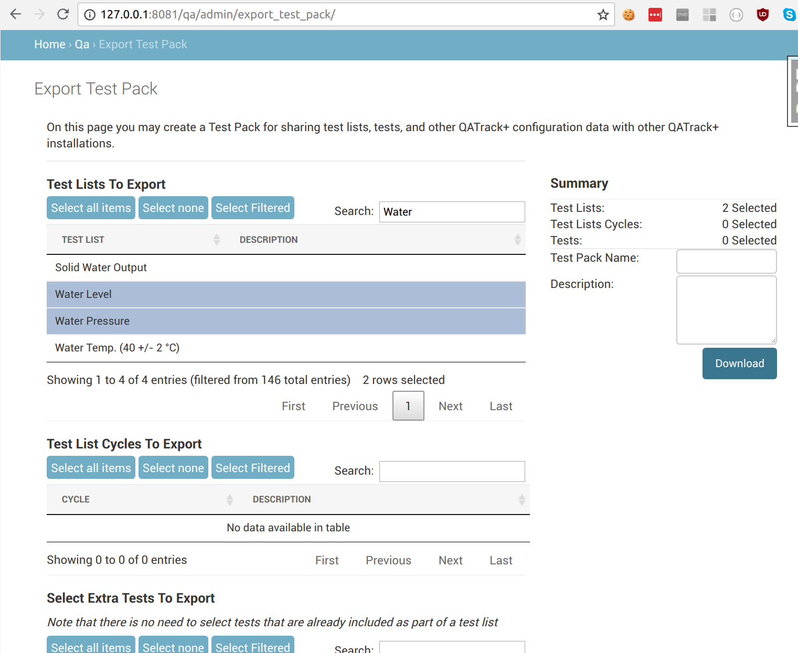
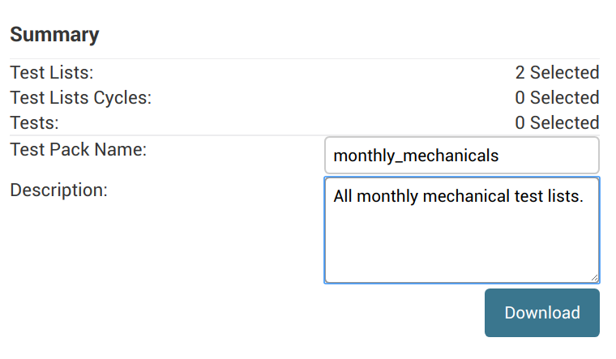
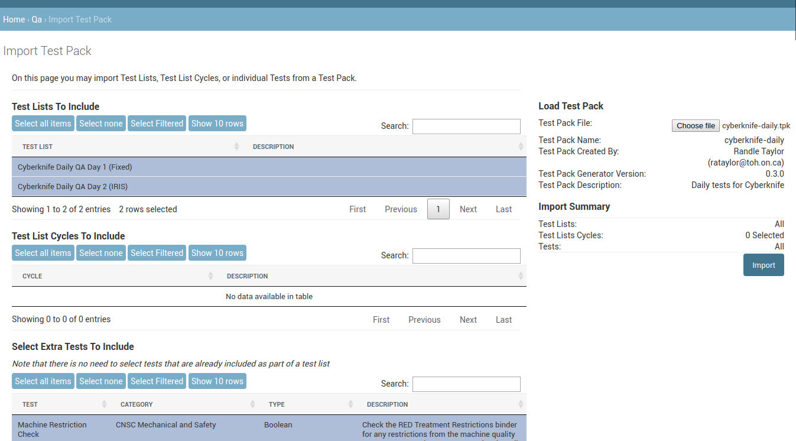

Test Packs
==========

.. _testpack_admin:

In order to facilitate the sharing of test lists between different QATrack+
installations (e.g. to allow separate clinics to share test list
configurations) QATrack+ allows users to export/import "Test Packs" which
include complete definitions of Tests, TestLists, and/or TestListCycles.

Exporting a test pack
---------------------

In order to export a test pack, go to the main admin site and click on `Export
Test Pack` (or visit `/qa/admin/export_testpack/` directly).

On the next screen, you can select all of the TestLists, TestListCycles, and
extra Tests that you want to include in your TestPack.  Note, selecting a
TestList will automatically include all the relevant Tests and SubLists
required for the TestList.

After you have selected the items you want to include, enter a name and brief description on the right hand side of
the page and click `Download`.

You can now share this TestPack file with colleagues.

Importing a test pack
---------------------

If you have a Test Pack file you want to import, go to the main admin site and
click on `Import Test Pack` (or visit `/qa/admin/import_testpack/` directly).

On the next screen, click the "Choose File..." button on the right hand side of
the page and select your Test Pack file.

