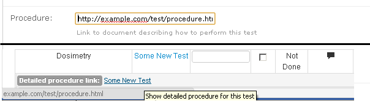
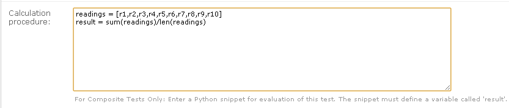
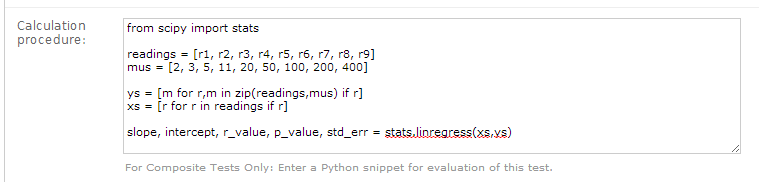
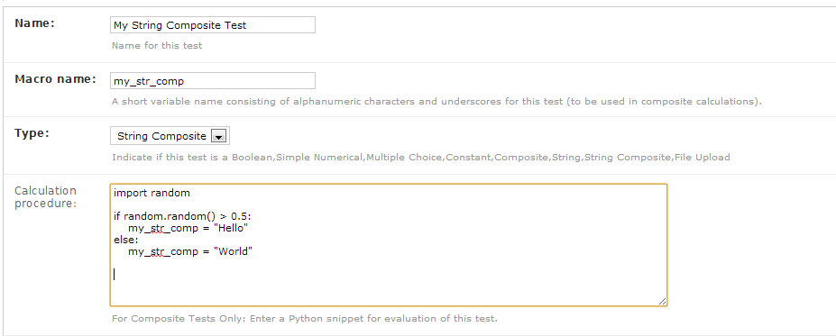
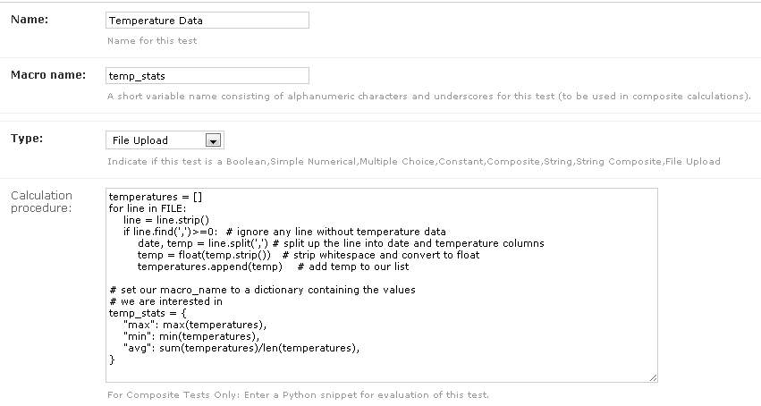
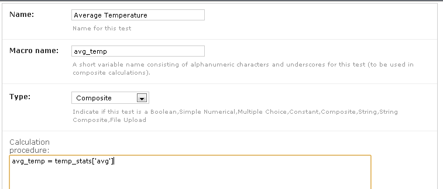
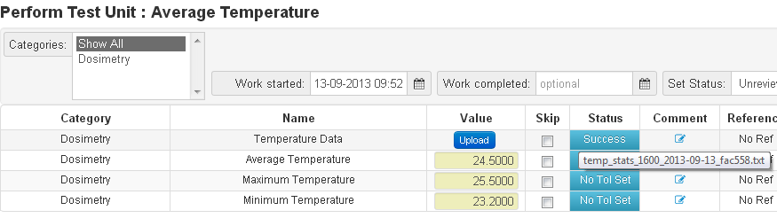

.. _qa_tests:

Tests
=====

To access existing tests or to configure a new test, click on the
**Tests** link in the **QC** section on the the main admin page.

Create a new test by clicking the **Add Test** link in the top right
hand page of the **Tests** admin page.  The individual fields for
configuring a tests are described below.

Name
....

A unique name that describes what the test is (e.g. something like *Temperature (deg C)* or *0 deg Gantry - Field Size 10.0x10.0cm - X1 (cm)*).

Display Name (Optional)
.......................

Text describing how a test should be displayed when performing or reviewing. Having a separate name & display name allows
you to create tests with descriptive names that are easy to find in the admin, but use a more succinct name when
performing a Test List. If left blank, the test name will be used.

Macro Name
..........

*Macro name tl;dr*: give your test a short variable name like
*ion\_chamber\_reading* or *temperature*.

Every test must be given a macro name which will be used to refer to
this test in composite tests.  The macro name must be a
[valid Python variable name](http://en.wikibooks.org/wiki/Think_Python/Variables,_expressions_and_statements#Variable_names_and_keywords)
(that is it must consist of only letters a-z, letters A-Z, numbers and
underscores) and must not be one of the following reserved words:

::

    False      await      else       import     pass
    None       break      except     in         raise
    True       class      finally    is         return
    and        continue   for        lambda     try
    as         def        from       nonlocal   while
    assert     del        global     not        with
    async      elif       if         or         yield

Python programmers generally use lower case only variable names with
words separated by underscores (\_).  That is to say a macro name like
*ion\_chamber\_reading* is preferable to *ionChamberReading*,
*IonChamberReading*, or *Ion\_Chamber\_Reading*.  Note that this is by
convention only and you are free to choose whichever names you like.

It is also highly advised that you use use a descriptive name like
*ion\_chamber\_reading* instead of something like *icr*.  That way
when other people are reading your code it is obvious what your
variable represents.

Description
~~~~~~~~~~~

The description field is the text that is shown when a user clicks on
the test name while performing QC.  This description can be made up of
plain text or html.  An example showing an html description is shown
below along with the way it looks when displayed on the test list
page.

.. figure:: images/test_description_html.png
   :alt: Test description definition

   Test description definition

.. figure:: images/test_description_html_shown.png
   :alt: Test description display

   Test description display

Procedure
~~~~~~~~~

The procedure allows you to insert a URL to a more detailed procedure
available elsewhere.  A link to that URL will be shown when the user
clicks on the test name while performing QC as shown below.

   Detailed procedure link

Category
~~~~~~~~

Choose the :ref:`Test Category <qa_categories>` that this test belongs to.

.. _qa_test_types:

Type
~~~~

QATrack+ currently supports 11 different test types as outlined below.

#. **Simple Numerical** A test with a single numerical result (e.g. *Temperature*)

#. **Wraparound** A test that accepts values in a predefined range (*Wrap low*
   to *Wrap high*) and has values that "wrap" from the high to low value and
   vice versa. This type of test is useful for example if you have a
   collimator/gantry readout test and want to consider 359.9 deg a 0.1 deg
   difference from a 0 deg reference.

   Only absolute tolerances with reference values between *Wrap low* and *Wrap
   high* are supported.

#. **Boolean** A test with a Yes or No answer (e.g. *Door Interlock Functional*)

#. **Constant** A non-user editablenumerical constant to be used in composite
   tests (e.g. an N\_DW calibration factor).  When you choose *Constant* for
   the *Type* field a *Constant Value* text box will appear for you to enter
   your numerical constant in.

#. **Multiple Choice** A test where the user selects from a predefined list of
   choices.  When you choose *Multiple Choice* for the *Type* field, a
   *Choices* text box will appear where you must enter a comma separated list
   of choices for the test.

    .. image:: images/mult_choice.png

#. **Composite** A value calculated based on other test values (e.g. a
   temperature pressure correction, or a calculated dose).  Composite tests are
   easy to define but allow users to do define complex calculations with the
   Python programming language.  Please see the :ref:`Composite Test section
   <composite_tests>` for more information on defining this type of test.

#. **String** Allows the user to enter a short piece of text (e.g. a user ID)

#. **String Composite/JSON** A *Composite* test that stores a string (text) rather
   than a numerical value. You may also use this type of field to store a JSON
   data structure. Please see the :ref:`Composite Test section
   <composite_tests>` for more information on defining this type of test.

#. **Date** Allows the user to use a date picker to select a calendar date.
   Test values will be coerced to Python datetime.date objects in compsite
   calculations contexts.

#. **Date & Time** Allow the user to use a date picker to select a calendar
   date and time Test values will be coerced to Python datetime.datetime
   objects in compsite calculations contexts.

#. **Upload** A test that allows you to upload an arbitrary file and process it
   with a Python snippet.  Please see the :ref:`Composite Test section
   <composite_tests>` for more information on defining this type of test.

Choices (multiple choice test type only)
~~~~~~~~~~~~~~~~~~~~~~~~~~~~~~~~~~~~~~~~

Field to enter a comma separated list of your test choices.

Constant Value (constant test type only)
~~~~~~~~~~~~~~~~~~~~~~~~~~~~~~~~~~~~~~~~

Field to enter the value your constant test.

Hidden (composite & constant test types only)
~~~~~~~~~~~~~~~~~~~~~~~~~~~~~~~~~~~~~~~~~~~~~

Check this option if you want to hide a composite or constant test from display
when performing a test list.

.. _qa_display_image:

Display image (upload test types only)
~~~~~~~~~~~~~~~~~~~~~~~~~~~~~~~~~~~~~~

Check this option if you want an image uploaded to QATrack+ to be displayed
on the test list page (supported images depend on browser version but generally
jpg, png & gif work well).

Test Item Visible In Charts
~~~~~~~~~~~~~~~~~~~~~~~~~~~

Uncheck this option to hide the test from the charting page.  This can
help keep your charting page clean and limited to the tests you
really care about.

Auto Review Rules
~~~~~~~~~~~~~~~~~

Indicate whether this test should be auto-reviewable.  Select the
AutoReviewRuleSet you would like to use for this, or leave blank, to disable
Auto Review for this test.  For more information about this option see the
:ref:`Auto Review page <qa_auto_review>`.

Skip Without Comment
~~~~~~~~~~~~~~~~~~~~

Check this option if you want users to be able to skip this test without being
forced to add a comment (regardless of their commenting permissions).

Require Comment
~~~~~~~~~~~~~~~

Check this option if you want users to be forced to enter a comment when
submitting this test.

Calculation Procedure
~~~~~~~~~~~~~~~~~~~~~

This field is used for calculating either test results (for composite, string
composite, & file upload test types) or default initial (user overrideable)
values for other test types (simple numerical, string, date/time, multiple
choice).

.. _qa_test_formatting:

Formatting
~~~~~~~~~~

Python style string format for displaying numerical results. Leave blank for
the QATrack+ default, select one of the predefined options, or enter your own
formatting string.  Use e.g. %.2F to display as fixed precision with 2 decimal
places, or %.3E to show as scientific format with 3 significant figures, or
%.4G to use 'general' formatting with up to 4 significant figures. (Note this
does not affect the way other values are calculated, only the way composite and
constant test values are *displayed*. For example a constant test with a value
of 1.2345 and a format of %.1f will be displayed as 1.2, but the full 1.2345
will be used for calculations).  Note you may also use "new style" Python
string formatting: see https://pyformat.info/ for examples.

To set a default value for numerical formatting see the
:ref:`DEFAULT_NUMBER_FORMAT <qatrack-config>` setting.

Attachments
~~~~~~~~~~~

You can attach arbitrary documents to your test which will be presented to the
user for viewing when performing tests lists.

    .. image:: images/test_attachment.png

Tests with Calculated Results
-----------------------------

There are currently three test types that allow you to calculate test
results using snippets of Python code. These tests include *Composite*,
*String Composite/JSON* & *Upload*.

Composite Tests
---------------

.. _composite_tests:

Composite tests allow you to do calculations to produce a numerical
test result based on other test values ( e.g. to calculate a dose based
on a raw electrometer reading and temperature & pressure ). When you
select *Composite* for the test *Type* field, a *Calculation Procedure*
box will be displayed.

In this box you must enter a snippet of Python code where you must set
the value of this tests macro name. Two examples are shown below, first,
a one liner to calculate a temperature-pressure correction factor:

*Note that in QATrack+ versions prior to 0.2.7 the last line of code had
to be a line that set a\ ``result`` variable to the final calculated
result. This is no longer the recommended way to use composite tests
although it is still supported for backwards compatability.*

.. figure:: images/ftp_procedure.png
   :alt: Temperature Pressure Correction Calculation

   Temperature Pressure Correction Calculation

and second a slightly more complicated multi-line snippet that collects
a group of readings and calculates the average value of them.

   Average Reading Procedure

Note that in both the previous examples the snippets depend on the
values of other tests. In the first, ``temp_solid_water``,
``raw_pressure`` and ``temp_corr`` are the **macro names** corresponding
to *Temperature*, *Pressure* and *Pressure Correction* tests. Likewise
in the second snippet, the average reading result depends on ten other
tests (Readings 1 through 10 with macro names ``r1, r2...r10``).

While the previous two examples are fairly simple, all the control
structures of the Python programming language are available including
loops, if-else statements, list comprehensions etc.

The composite calculation environment
-------------------------------------

When your script (calculation procedure) is executed, it has access to

#. the current value of all the tests in the current test list being performed

#. A number of Python modules including the `Python math
   module <http://docs.python.org/2/library/math.html>`__, along with
   `NumPy <http://www.numpy.org/>`__,
   `SciPy <http://www.scipy.org/>`__,
   `matplotlib <http://www.matplotlib.org/>`__ and,
   `pydicom <https://github.com/pydicom/pydicom>`__.

   *Note: Other Python modules can be imported the same as any other Python
   script*

#. REFS & TOLS variables which are dictionaries of reference and
   tolerance values for all of the tests.

    - REFS is a dictionary of form `{macro_name: ref_value'}` e.g.

    .. code-block:: python

        REFS = {
            'mytest': 100,
            'someothertest': 1.234,
        }

    - TOLS is a dictionary of form `{macro_name: tolerances}` where `tolerances` itself is a dictionary of form:

    .. code-block:: python

        {
            'act_low': act_low_val,
            'tol_low': tol_low_val,
            'tol_high': tol_high_val,
            'act_high': act_high_val,
            'mc_pass_choices': passing_vals,
            'mc_tol_choices': tolerance_vals,
            'type': tolerance_type
        }

    e.g.

    .. code-block:: python

        TOLS = {
            'mytest': {
                'type': "absolute" # or
                'act_low': -3,
                'tol_low': -2,
                'tol_high': 2,
                'act_high': 3,
            },
            'someothertest': {
                'type': "multchoice" # or
                'mc_pass_choices': "pass_val_1,pass_val_2",
                'mc_tol_choices': "tol_val_1,tol_val_2",
            },
        }

#. A META object which is a dictionary of some potentially useful
   information about the test list currently being performed including:

    -  test\_list\_id - ID of current test list

    -  test\_list\_name - Name of current test list

    -  unit\_test\_collection\_id - ID of current Unit Test Collection (Unit Test List/Cycle Assignment)

    -  unit\_number - Unit number

    -  cycle\_day - Current cycle day being performed (Always 1 for non-cycle test lists)

    -  work\_completed - Python datetime object with current work\_completed value

    -  work\_started - Python datetime object with current work\_started value

    -  username - Username of person performing test

#. A UTILS object which is a collection of utility methods currently consisting of:

    - **UTILS.get_comment(** *macro_name* **)** gets the user set comment for the input

    - **UTILS.set_comment(** "*your comment here*" **)** sets the comment for the current test

    - **UTILS.set_skip(** *macro_name* **, True|False )** set skip status of a
      test. Please note that if a user alters the skip state of the same test
      before the composite calculation is complete, their selection will be
      overridden by the results of the composite test.

    - **UTILS.get_skip(** *macro_name* **)** returns boolean indicating whether or not a given test is currently skipped.

    - **UTILS.write_file(file_name, object)** attaches a file to the current
      test (see below for an example). If you have :ref:`Display Image
      <qa_display_image>` checked for this test, and the object you pass to
      write file is "image like" (matplotlib axis, matplotlib figure, numpy
      array etc) then the object will be saved as an image file and displayed
      to the user.

    - **UTILS.previous_test_list_instance(include_in_progress=False)**
      retrieves the most recent :term:`Test List Instance` for the Test List
      currently being performed on this Unit.  If `include_in_progress=True`
      than Test List Instances which are marked as `In Progress` will be
      included, otherwise they will be excluded. If no previous Test Instance
      is found, `None` will be returned.

    - **UTILS.previous_test_instance(test, same_list_only=True,
      include_in_progress=False, exclude_skipped=True)** retrieves the most
      recent :term:`Test Instance` performed on this unit for the input `test`.
      If `same_list_only=True` then only Test Instances's which were created as
      part of the current Test List being performed will be included,
      otherwise, any Test Instance for this Test & Unit will be returned.  If
      `include_in_progress=True` than Test List Instances which are marked as
      `In Progress` will be included, otherwise they will be excluded. If
      `exclude_skipped=False`, then skipped results will be included, otherwise
      only non-skipped results will be searched. If no previous Test Instance
      is found, `None` will be returned.

    - **UTILS.get_figure()** will get you a `matplotlib Figure instance
      <https://matplotlib.org/api/_as_gen/matplotlib.figure.Figure.html>`__
      suitable for creating and displaying plots e.g.:

        ::

            fig = UTILS.get_figure()
            axes = fig.gca()
            axes.plot(range(10), range(10))
            UTILS.write_file("line.png", fig)

The snippet below shows a composite calculation which takes advantage of
the SciPy stats library to perform a linear regression and return the
intercept as the result.

   Example procedure using Scipy

NumPy and SciPy provide access to a huge number of robust and fast
mathematical functions and it is highly recommended you look through
their documentation to see what is available.

An example calculation procedure using the META variable:

::

    unit_number = META["unit_number"]
    user = META["username"]

    if user == 'bob' and unit_number == 42:
        do_something()

An example calculation using the REFS variable:

::

    diff = 100*(my_test_name - REFS["my_test_name"])/REFS["my_test_name"]

An example calculation using the TOLS variable:

::

    if diff > TOLS["my_test_macro"]["act_high"]:
        some_other_value = 1
    else:
        some_other_value = 2

An example setting the comment for the current test:

::

    foo = 1234*678
    comment = "The value is %s" % foo
    UTILS.set_comment(comment)

An example showing how to use `write_file` to create a matplotlib plot:

::

    import matplotlib.pyplot as plt

    xs = range(10)
    ys = range(10)
    plt.plot(xs, ys)
    figure = plt.gcf()
    UTILS.write_file("a_line.png", figure)

An example showing how to use `get_last_test_instance` to calculate the percent change
in a test value since the last time it was performed:

::

    last_ti = UTILS.previous_test_instance("some_test")

    if last_ti is None:
        diff = 0
    else:
        diff = 100*(some_test - last_ti.value) / last_ti.value

.. _dependency_resolution:

Composite tests made up of other composite tests
------------------------------------------------

QATrack+ has a primitive `dependency
resolution <http://en.wikipedia.org/wiki/Topological_sorting>`__ system
and it is therefore safe to create composite values that depend on other
composite values as they will be calculated in the correct order.

A note about division for people familiar with Python
-----------------------------------------------------

Since v0.3.0, QATrack+ uses Python 3.4+ which no longer uses integer division
by default.  The calculationn `a = 1/2` will result in `a = 0.5` rather than `a
= 0` like in Python 2.x. If you need integer division, make sure you use the
`//` operator like `a = 1//2 # a == 0`.

.. _qa_string_comp_json:

String Composite/JSON Tests
---------------------------

The String Composite test type are the same as the Composite test type
described above with the exception that the calculated value should be a
string rather than a number. An example Composite String test is shown
below.

As of v3.1.0 you may now also return a `JSON serializable Python dictionary
<https://pythontic.com/serialization/json/introduction>`__.  This allows you to
e.g. pre-calculate values for other composite tests, or store more complex
datatypes in the database.

   Example String Composite procedure

Upload Tests
------------

Upload test types allow the user to attach arbitrary files (text,
images, spreadsheets etc) which can then be analyzed with a Python
snippet similar to the composite tests above.

If the file you uploaded is a binary file type (image, dicom etc) then you can
access the uploaded file object (more information on file objects is available
`in the Python documentation
<http://docs.python.org/2/library/stdtypes.html#file-objects>`__) using the
`BIN_FILE` context variable.  Likewise, if you upload a file with a text format
you can access the file object through the `FILE` context variable.

.. note:
    This behaviour changed between v0.2.9 and v0.3.0 due to the differences in
    unicode handling between Python 2 & 3.  If you were using the `FILE` variable
    to analyze binary files with QATrack+ versions less than v0.3.0 you will need
    to update those calculation procedures to use `BIN_FILE` rather than `FILE`.

The upload test calculation procedure can return any JSON serializable object
(number, string, list, dict etc) and then (optionally) other composite tests
can make use of the returned results. An example of this is given below.

Example Text File Upload
~~~~~~~~~~~~~~~~~~~~~~~~

Imagine we have a text file with the following contents:

::

    01/01/2013, 25.1
    01/02/2013, 23.2
    01/03/2013, 25.2
    01/04/2013, 24.0
    01/05/2013, 24.0
    01/06/2013, 25.5

Where the first column is some dates and the second column is
temperature. For our test list we want to upload this file and calculate
and save the average (Average Temperature) , max (Maximum Temperature)
and min temperatures (Minimum Temperature).

First we define our upload test and procedure for analyzing the file. We
will call our Upload test ``Temperatures`` and give it a macro name of
``temp_stats``.

The calculation procedure we will use is:

::

    temperatures = []
    for line in FILE:
        line = line.strip()
        if line.find(',')>=0:            # ignore any line without temperature data
            date, temp = line.split(',') # split up the line into date and temperature columns
            temp = float(temp.strip())   # strip whitespace and convert to float
            temperatures.append(temp)    # add temp to our list

    # set our macro_name to a dictionary containing the values
    # we are interested in
    temp_stats = {
        "max": max(temperatures),
        "min": min(temperatures),
        "avg": sum(temperatures)/len(temperatures),
    }

   Example upload test type

We can then define three composite tests to store our calculated
results. The calculation procedure required for Average Temp is simply
``avg_temp = temp_stats['avg']`` and the complete test definition is
shown below:

   Average temperature test

An example test list made of these 4 tests is shown below as it is being
performed:

   Example upload test in action

Example Binary File Upload
~~~~~~~~~~~~~~~~~~~~~~~~~~

Here's how you would write a procedure to access some data from an uploaded
DICOM file:

::

    import pydicom
    f = pydicom.read_file(BIN_FILE)
    mean_value = f.pixel_array.mean()

.. _qa_default_values:

Setting Default Initial Values for Non-Calculated Tests
-------------------------------------------------------

.. warning::

    Defaults are currently only applied for Test Lists performed via the
    web user interface and not through the API.

Similar to calculated tests, as of version 3.1.0, you can now use the
calculation procedure field to set an initial default value for a test that can
be overridden by the user.

For example, to set an initial value for a Simple Numerical test you could use
a simple calculation procedure like:

::

    your_simple_test = 22

To set an initial value for a Multiple Choice test with choices "A,B,C" you
could use a simple calculation procedure like:

::

    your_mult_choice_test = "B"

To set an initial value for a Boolean (Yes/No) test you would use:

::

    your_bool_test = True  # or False

To set an initial value for a String test you would use:

::

    your_string_test = "Some string"

To set an initial value for a Date test you could use something like this:

::

    from django.utils import timezone
    your_date_test = timezone.now().date()  # or some other datetime.date instance

To set an initial value for a Datetime test you could use someting like this:

::

    from django.utils import timezone
    your_date_test = timezone.now()  # or some other datetime.datetime instance
