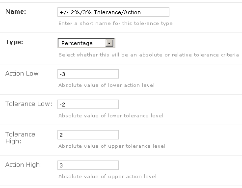
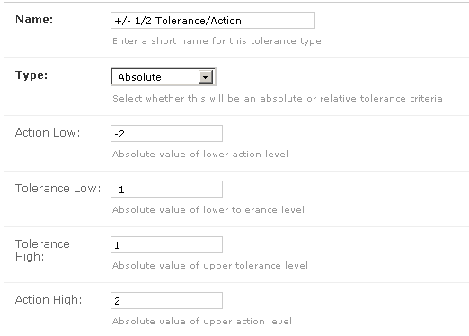
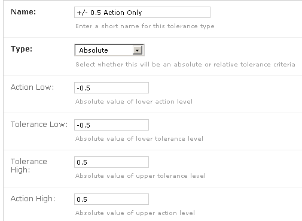
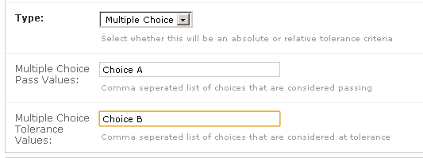
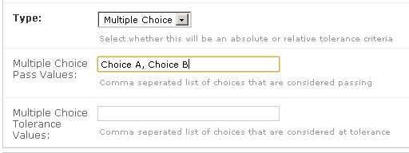

.. _qa_tolerances:

Test Tolerances
===============

Test tolerances (along with :ref:`Reference values <qa_ref_tols>` are used to
determine whether a test is passing, at tolerance or failing.  Configuring the
different kinds of tolerance values are described below while the procedure for
setting reference and tolerance values for a given test on a unit is described
:ref:`elsewhere <qa_ref_tols>`.

Creating a new tolerance
------------------------

To create a new tolerance click the **Tolerances** link under the **QA**
section on the main admin page and then click the **Add tolerance**
button at the top right hand corner. Choose the Tolerance type you want
to create and fill in the appropriate values (described below).

Editing a tolerance after it has been created
---------------------------------------------

.. danger::

    A tolerance object should *very rarely* need to be edited and should
    only be done if you understand the implications of doing so.

    When test values are stored, it keeps a reference to the tolerance that
    was set at the time the test was performed. If this tolerance object is
    later edited it will appear that the tolerance level for those test
    instances was different than it actually was at the time the test was
    performed.

Numerical Tolerances
--------------------

The tolerance/action levels of a test act as a window around the
reference value. For example if a certain test on a unit has reference
value of 50 and a tolerance/action level of +/- 2%/3% (i.e. lower action
= -3%, lower tolerance = -2%, upper tolerance = 2%, upper action = 3%)
then values between 49 and 51 will be considered within tolerance,
values between 48.5 & 49 or 51 & 51.5 will be considered at tolerance
and values less than 48.5 or greater than 51.5 will be considered
failing.

Note that you are free to leave one or more of the tolerance and action
levels empty. This allows you to create tolerances which are pass/fail
only (Tol Low & Tol High are both left blank), pass/tolerance only (Act
Low & Act High are both left blank) or one sided tolerances (e.g. Act
Low & Tol Low are left blank).

Numerical tolerances can either be specified as ``absolute`` or
``percentage``. An example of a percentage based tolerance is given in
the previous paragraph. Absolute tolerances differ from percentage
tolerances only in the way the window around the reference value is
calculated. For example if a certain test on a unit has reference value
of 80 and an absolute tolerance/action level of +/- 1/2 (i.e. lower
action = -2, lower tolerance = -1, upper tolerance = 1, upper action =
2) then values between 79 and 81 will be considered within tolerance,
values between 78 & 79 or 81 & 82 will be considered at tolerance and
values less than 78 or greater than 82 will be considered failing.

Multiple Choice Tolerances
--------------------------

:ref:`Multiple choice tests <qa_tests>` can be subjected to
pass/tolerance/fail criteria by using the **Multiple Choice** tolerance
type. First choose the **Multiple Choice** option for the **Type** field
and then enter a comma separated list of choices which are to be
considered passing and a comma separated list of choices which are to be
considered tolerance values.

For example if your multiple choice test had choices like below:

.. figure:: images/mult_choice.png
   :alt:

and you wanted ``Choice A`` to be passing, ``Choice B`` to be failing
and ``Choice C`` to be failing then you would set up your tolerance like
the following:

if you wanted ``Choice A`` and ``Choice B`` to be passing and
``Choice C`` to be failing then you would set up your tolerance like the
following (leaving the **tolerance values** field blank):

