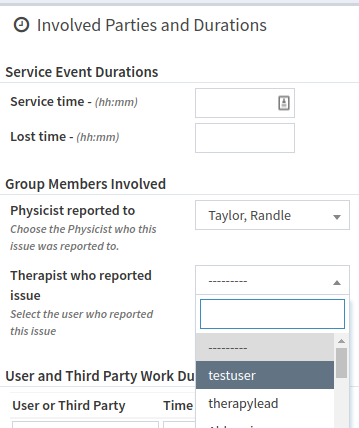
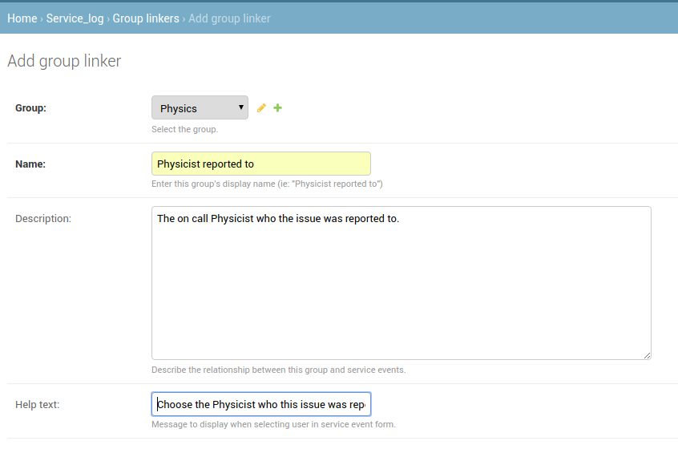

.. _sl_linkers:

Group Linkers
=============

When creating or editing a new :term:`Service Event` users have the opportunity
to list who is involved in the Service Event. This is accomplished via `Group
Linkers`.

For example, if therapists perform morning QA in your clinic and runs into an
issue where a Service Event is initiated, you may want to create Group linkers
for `Therapist who reported issue` and `Physicist reported to`. Then when
initiating a Service Event the user would be presented with dropdowns to choose
users from the Therapy & Physics groups who are involved:

   Group linkers showing during service event initiation

To add Group Linkers :ref:`go to the Admin section <access_admin_site>` and
click the `Group linkers` link in the `Service Log` section and then click the
`Add Group Linker` button.  Fill in the required fields and then click `Save`
to create your Group Linker.  Configurations for the two `Group Linkers`
discussed above are shown below:

   Physics group linker configuration

.. figure:: images/therapy_linker.png
   :alt: Therapist group linker configuration

   Therapist group linker configuration
