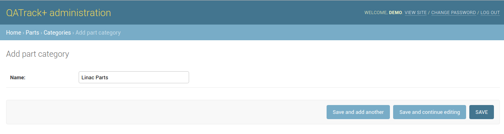
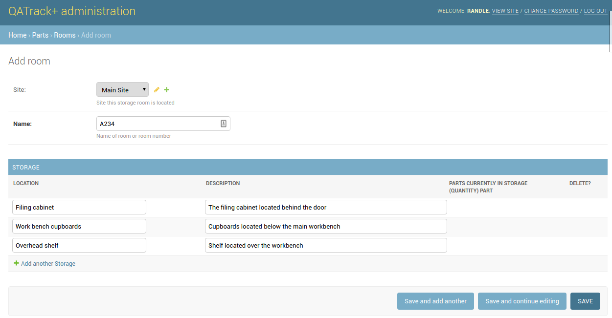
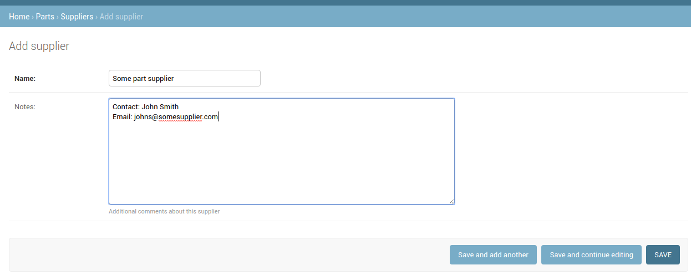

.. _parts:

Configuring the Parts App
=========================

As part of the :ref:`Service Log App <service_log>` app, QATrack+ has the
ability to track your inventory of spare parts and where they are located.
Before you can use the Part's app, you need to configure a few things.

.. _parts_categories:

Parts Categories
----------------

In order to categorize your spare parts, you need to create some Part
categories.  To create new `Part Categories` :ref:`go to the Admin section
<access_admin_site>` and click the `Part Categories` link in the `Parts`
section and then click the `Add Part Category` button.

Give the Part Category a name and then click Save.  Repeat for as many
different categories as you want.

   Parts categories

.. _parts_rooms:

Parts Rooms
-----------

The Parts app is the ability to track the location of where parts are located.
To do this, you need to create some storage Locations, which belong to `Rooms`.
To create new `Rooms` :ref:`go to the Admin section <access_admin_site>` and
click the `Rooms` link in the `Parts` section and then click the `Add Room`
button.

If you have configured :ref:`Sites <unit_site>` then select the `Site` that
this `Room` is located in.and then give the room a name (e.g. A234).  In the
`Storage` section add some locations and descriptions of places parts are
stored within the Room (e.g. Filing Cabinet, Shelf #1 etc). Repeat for as many
different Room`s as you want.

   Adding a new parts room

.. _parts_suppliers:

Parts Suppliers
---------------

Parts Suppliers allow you to keep track of one ore more vendors who can supply
individual parts.  To create new `Suppliers` :ref:`go to the Admin section
<access_admin_site>` and click the `Suppliers` link in the `Parts` section and
then click the `Add Supplier` button.

Set the name of the supplier and any relevant notes then click Save:

   Adding a new parts supplier

Adding new Parts
----------------

While it is possible to add Parts via the Admin section, it is recommended you
use :ref:`the main parts user interface <parts_user>` for managing parts and
inventory levels.
