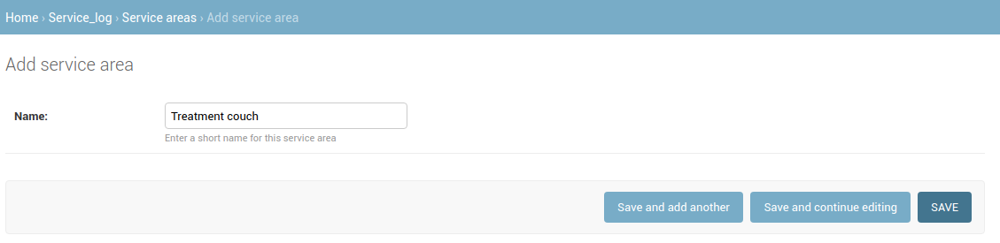

.. _sl_service_areas:

Service Areas
=============

Service Areas can be considered sub-systems within a single treatment "system"
made up of e.g. linac, treatment couch, lasers, TPS etc. You will be required
to select a Service Area when initiating a new :term:`Service Event`.

To create `Service Areas` :ref:`go to the Admin section <access_admin_site>`
and click the `Service Areas` link in the `Service Log` section and then click
the `Add Service Area` button.  Fill in the `Name` field and then click `Save`.

   Defining a new Service Area

Repeat to create as many Service Area's as you think you will need (you can
always create more at a later date!).

Associating Service Areas with Units
------------------------------------

Once you have some Service Area's defined, you need to associate :ref:`Units
<units_admin>` with their related `Service Areas`.  There are two possible ways
to accomplish this.

#. You can visit the Admin page for a given Unit and select the related Service Areas:

    .. figure:: images/unit_service_areas.png
        :alt: Adding Service Areas via the Unit admin

        Adding Service Areas via the Unit admin

#. You can use the `Unit Service Area Memberships` area of the admin (in the
   `Service Log` admin section) to create associations between Units and Service Areas. This method allows you
   to add notes about the Service Area association:

    .. figure:: images/new_unit_service_area.png
        :alt: Adding Service Areas via the Unit Service Area Membership admin

        Adding Service Areas via the Unit Service Area Membership admin
