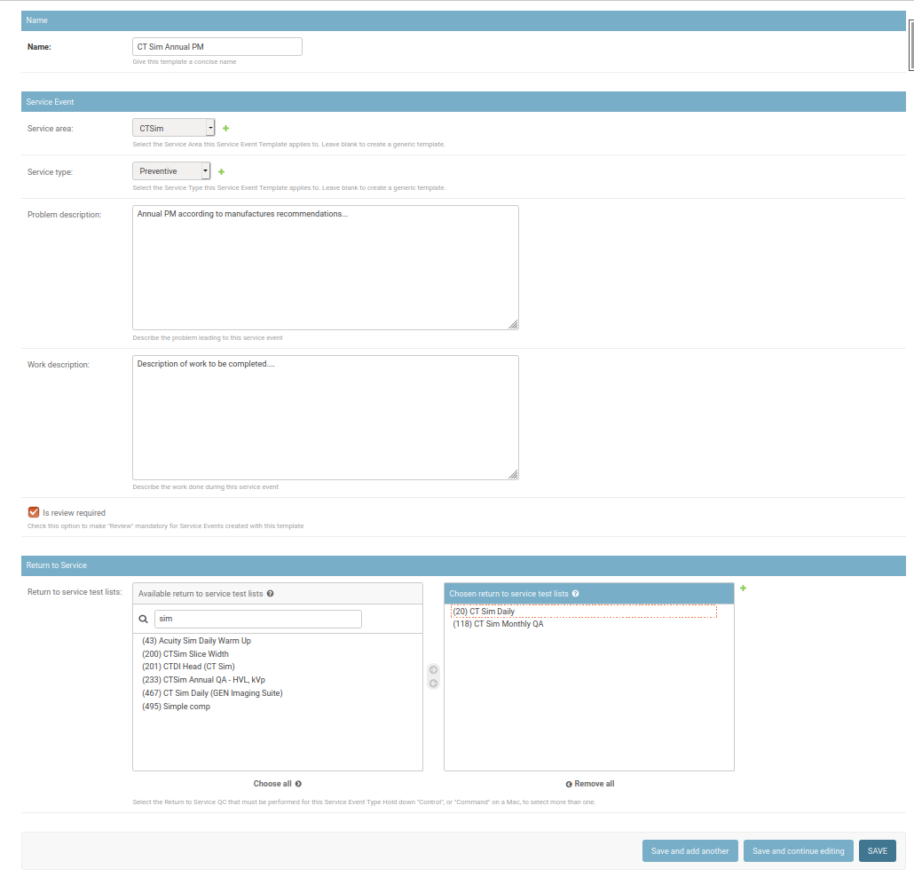

.. _sl_template_schedules:

Service Event Templates & Schedules
===================================

.. contents::
    :local:
    :depth: 1

Service Event Templates
-----------------------

In order to simplify the process of :ref:`creating Service Events
<service_log_user>`, QATrack+ allows you to define Service Event Templates that
can be used to autopopulate many of the fields in the Service Event form
including:

* Service Type
* Service Area
* Problem Description
* Work Description
* Is Review Required?
* Return To Service Tests / Test List Cycles

This allows you to create say a "Annual PM" service event template which
predefines the work done and return to service work required after the PM.

To create a new Service Event Template, go to the admin area and select the
`Service Event Templates` link in the `Service Log` section then click the `Add
Service Event Template` button.  

On the `Add service event template page` give your template a name (e.g. Annual
PM) and then fill out the fields below to indicate how the Service Event fields
should be populated when a user selects this template. 

All of the fields are optional, however special attention should be payed to
the `Service Area` and `Return to Service Test Lists (Cycles)` fields.  A
Service Event Template may only be applied to a unit when that unit has a
matching service area and the selected return to service test lists/cycles
assigned to it. If you need to create a more generic template that can be
applied to a variety of unit types you may want to leave those fields blank.

Once you have filled out the fields, click `Save`.

   Adding a new Service Event Template

For information on using a Service Event Template see the :ref:`Service Log
Users Guide <service_log_use_template>`.

Service Event Schedules
-----------------------

Similar to the concept of assigning Test Lists to Units, QATrack+ allows you to
assign Service Event Templates (described above) to Units to be performed with
a given :ref:`frequency <qa_frequencies>`.

To assign a Service Event Template to a Unit,  go to the admin area and select
the `Assign Service Event Templates to Units` link in the `Service Log` section then click the
`Add Service Event Schedule` button.  

On the `Add service event schedule` page, select the 
:ref:`Unit Service Area <sl_service_areas>` you want to assign your template to (this will autopopulate
the `Unit` field).

Unit Service Area
~~~~~~~~~~~~~~~~~

The :ref:`Unit Service Area <sl_service_areas>` that you want to assign the test list to.

Frequency
~~~~~~~~~

The :ref:`Frequency <qa_frequencies>` with which you want the template to be
performed (e.g. Daily, Monthly, Yearly etc).

Optionally, you can leave the frequency blank and the template will be assigned
to be performed on an *ad-hoc* basis.

Due Date & Auto Schedule
~~~~~~~~~~~~~~~~~~~~~~~~

Here you can manually set the initial due date/time for a test list on a unit.
You can also leave this blank if you like and the test list will show up as
being *Not Due*.

If you leave **Auto Schedule** checked, the due date will automatically be
updated according to the assigned frequency after the test list is completed on
a unit.

Assigned To
~~~~~~~~~~~

The group of users that is generally responsible for performing the service.
Note that the **Assigned To** property is used for display only and users not
part of the **Assigned To** group will still be able to see and perform the
template.

Visible To
~~~~~~~~~~

Select which user groups this service event template should be visible to by
moving groups from the **Chosen visible to** to the **Available visible to**
box.

Active
~~~~~~

If this checkbox is unchecked, the template will not appear in any listings on
the main site. This should be used to disable templates are no longer
performed on a unit.

.. figure:: images/create_service_event_schedule.png
   :alt: Adding a new Service Event Schedule

   Adding a new Service Event Schedule

For more information on performing Service Event Schedules, see the
:ref:`Service Log Users Guide <service_log_scheduled_template>`.
