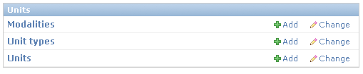
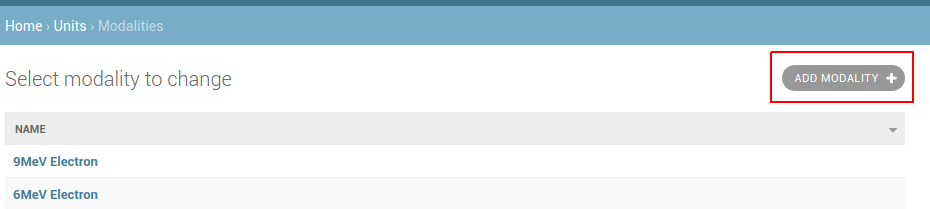
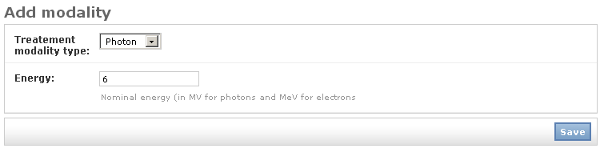
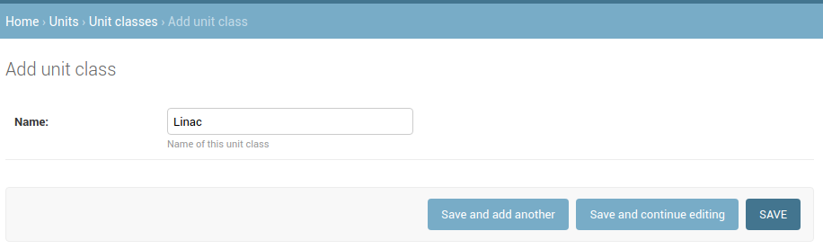
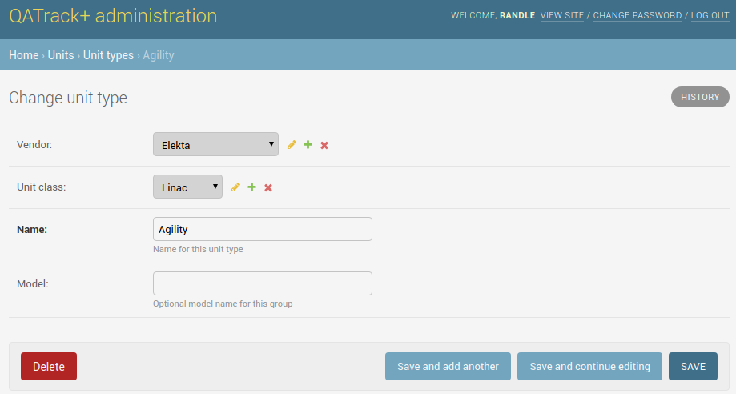
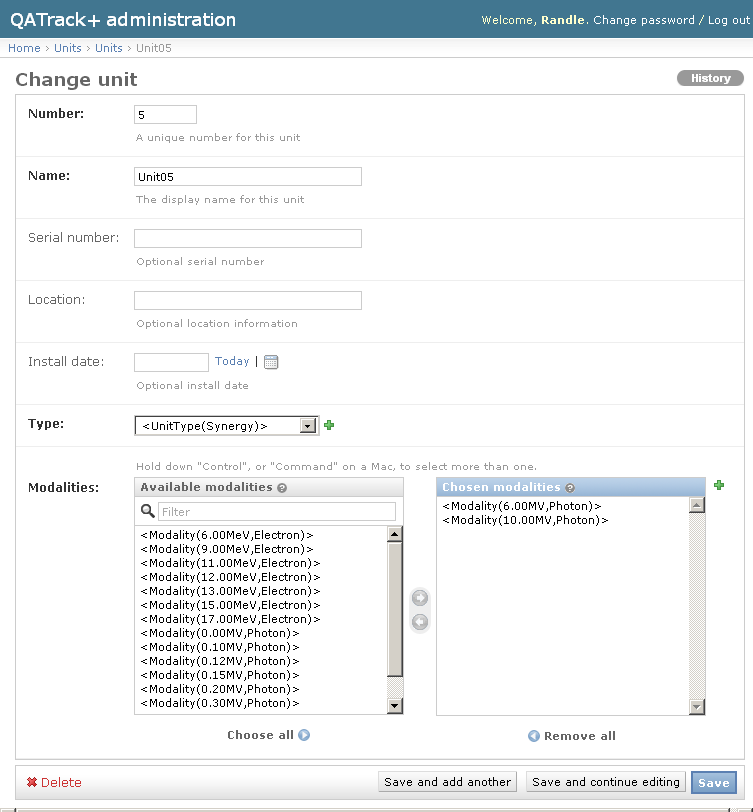
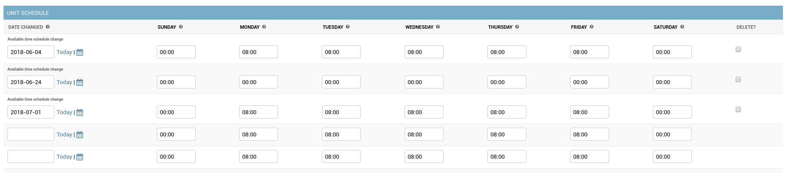

.. _units_admin:

Units
=====

.. _unit_creating:

Creating A New Unit
-------------------

Before you can create a new unit you have to define some modalities and unit
types. This can either be done beforehand or "inline" when defining a new unit.
The former is described below.

Defining a modality
-------------------

From the main administrators page click the **Modalities** link from the
**Units** section.

   Units admin section

This page lists all the existing (if any) modalities. To add a new
modality click the **Add modality** button at the top right.

   Add Modality

From here just enter the name of the modality type you want to define.  The
definition of a 6MV photon beam is illustrated below.

   Defining a 6MV Photon Modality

Click **Save** when you are finished.

Defining a new unit class
-------------------------

From the main administrators page click the **Unit classes** link from the
**Units** section and then on the next page click the **Add unit class**
link in the top right hand corner.

Add the name of the unit class (e.g. Linac, Tomotherapy, Cyberknife, CT, MRI
etc).

   Defining a new unit class

Defining a new unit type
------------------------

From the main administrators page click the **Unit Types** link from the
**Units** section and then on the next page click the **Add unit type**
link in the top right hand corner.

Fill in the **Name**, **Vendor**, and optionally **Unit class* and **Model**
fields and click **Save** when you are finished.

   Defining a new unit type

Defining a new unit
-------------------

From the main administrators page click the **Units** link from the
**Units** section and then on the next page click the **Add unit** link
in the top right hand corner.

On the Add Unit page you will need to fill in all the relevant fields, some
of which are described below:

* Number - *A uniquely identifying integer number for this unit.  The unit Number will effect the order that treatment units are displayed on certain pages.*
* Acceptance Date - *Date that the unit was approved for treatment*
* Active - *Uncheck this field when a unit is decomissioned. This will hide the unit from many parts of the user interface to reduce clutter and confusion*
* Unit Type - *Select the type of unit this is*
* Is serviceable - *Set to true to make this unit selectable in Service Events*
* Site - *If you have multiple sites configured, choose the site this unit is located at*
* Service Areas - *Select all the service areas available for this unit (e.g. Linac, kv Imaging, MV Imaging etc)*
* Available Time on date of acceptance - *The number of clinical hours that the unit is available on a day to day basis*
* Unit Schedule - *Set the number of hours this unit is available and the effective date. See below for an example*

Example input for an Elekta Synergy unit is shown below.

   Defining a new unit type

Example Unit Schedule showing a unit that is being restricted completely for a
week (from June 24-30th) for service, after which it returns to it's normal
schedule on July 1st:

   Defining a unit schedule

