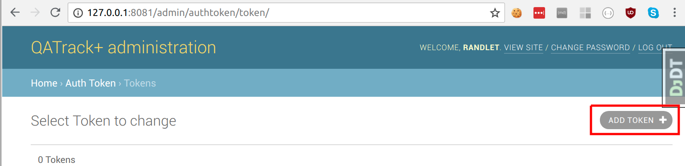
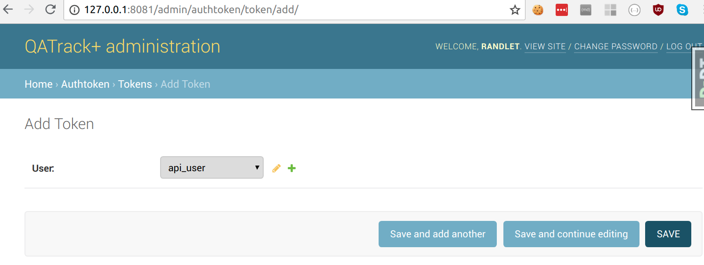
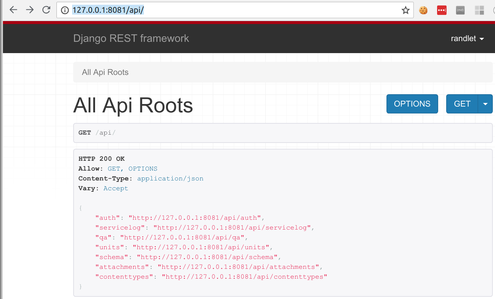

.. _qatrack_api:

Using the QATrack+ API
======================

As of version 0.3.0 QATrack+ now includes a JSON API for accessing or uploading
data using external scripts/programs.  The primary intent of this API is to
allow users to write their own applications for automating the completion of
test lists. For example, you may want to write a script that runs every day
(via a cron job or Windows Task Scheduler) which retrieves data from a hardware
device used for daily output measurements and then uploads that data to
QATrack+.

You are free to use any language which is capable of parsing/serializing JSON
and making requests via http(s) but the examples below will use Python 3.x and
the `requests library <http://docs.python-requests.org/en/master/>`_.

Getting an API Token
--------------------

Every application/script that accesses the API requires an authentication token
which is connected to a QATrack+ user.  You can either set up a new user in QATrack+
specifically for API access, or use an existing username/password.

To retrieve an API token you need to make a request similar to the following:

.. code-block:: python

    import requests

    root = "http://yourservernamehere/api"
    token_url = root + "/get-token/"
    resp = requests.post(token_url, {'username': 'user', 'password': 'password'})
    token = resp.json()['token']

Once you have retrieved the API token you must include it with every API
request as an HTTP `Authorization` header with the value `Token
your-token-here`. For example:

.. code-block:: python

    headers = {"Authorization": "Token %s" % token}
    resp = requests.get(api, headers=headers)

Note, you can also create an API token in the QATrack+ admin section by going
to `/admin/authtoken/token` and clicking `Add Token`:

and then selecting the user you want to create the token for and clicking `Save`:

Viewing the API online
----------------------

In addition to the JSON API, the QATrack+ is browsable via a web browser by
visiting `/api`:

The API schema including all endpoints is also available at the `/api/schema/` endpoint:

.. code-block:: python

    resp = requests.get(root + '/schema', headers=headers)
    print(resp.json())

Retrieving Data
---------------

In order to retrieve data from the API you need to make a request to the
relevant API endpoint which is demonstrated for a number of cases below:

Getting a list of available units
.................................

.. code-block:: python

    resp = requests.get(root + '/units/units', headers=headers)
    print(resp.json())
    # results in data like:
    {
        'count': 18,
        'next': None,
        'previous': None,
        'results': [
            {
                'active': True,
                'date_acceptance': '2018-01-01',
                'install_date': None,
                'is_serviceable': False,
                'location': '',
                'modalities': [
                    'http://127.0.0.1:8081/api/units/modalities/1/',
                    'http://127.0.0.1:8081/api/units/modalities/2/'
                ],
                'name': 'Unit 1',
                'number': 1,
                'restricted': False,
                'serial_number': '',
                'site': None,
                'type': 'http://127.0.0.1:8081/api/units/unittypes/7/',
                'url': 'http://127.0.0.1:8081/api/units/units/5/'
            },
            {...}
        ]
    }

Getting a specific units details
................................

.. code-block:: python

    resp = requests.get(root + '/units/units/1', headers=headers)
    print(resp.json())
    # results in data like:

    {
        'active': True,
        'date_acceptance': '2018-01-01',
        'install_date': None,
        'is_serviceable': False,
        'location': 'TBCC',
        'modalities': ['http://127.0.0.1:8081/api/units/modalities/1/'],
        'name': 'Unit 3',
        'number': 3,
        'restricted': False,
        'serial_number': '799',
        'site': None,
        'type': 'http://127.0.0.1:8081/api/units/unittypes/7/',
        'url': 'http://127.0.0.1:8081/api/units/units/1/'
    }

Getting a list of Test Lists
............................

.. code-block:: python

    resp = requests.get(root + '/qa/testlists', headers=headers)
    print(resp.json())
    # results in data like:

    {
        'count': 145,
        'next': 'http://127.0.0.1:8081/api/qa/testlists/?limit=100&offset=100',
        'previous': None,
        'results': [
            {
                'created': '2014-05-30T16:11:05-04:00',
                'created_by': 'http://127.0.0.1:8081/api/auth/users/9/',
                'description': '',
                'javascript': None,
                'modified': '2014-07-24T13:59:43-04:00',
                'modified_by': 'http://127.0.0.1:8081/api/auth/users/9/',
                'name': 'Accessory inspection',
                'slug': 'accessory-inspection',
                'tests': ['http://127.0.0.1:8081/api/qa/tests/104/',
                    'http://127.0.0.1:8081/api/qa/tests/105/'],
                'url': 'http://127.0.0.1:8081/api/qa/testlists/6/',
                'warning_message': 'Do not treat'
            },
            {...}
        ]
    }

Getting a specific test lists details
.....................................

.. code-block:: python

    resp = requests.get(root + '/qa/testlists/1', headers=headers)
    print(resp.json())
    # results in data like:
    {
        'created': '2014-05-30T16:11:05-04:00',
        'created_by': 'http://127.0.0.1:8081/api/auth/users/9/',
        'description': '',
        'javascript': None,
        'modified': '2014-07-24T13:59:43-04:00',
        'modified_by': 'http://127.0.0.1:8081/api/auth/users/9/',
        'name': 'Accessory inspection',
        'slug': 'accessory-inspection',
        'tests': ['http://127.0.0.1:8081/api/qa/tests/104/',
        'http://127.0.0.1:8081/api/qa/tests/105/'],
        'url': 'http://127.0.0.1:8081/api/qa/testlists/6/',
        'warning_message': 'Do not treat'
    }

Pagination of data
..................

When requesting data from the API, by default you will get up to 100 results
per request. You can change the page and page size by using the `limit/offset`
query parameters. For example to retrieve the first two pages of data with 10 results per page:

.. code-block:: python

    page1 = requests.get(root + '/qa/testlists/?limit=10&offset=0', headers=headers)
    page2 = requests.get(root + '/qa/testlists/?limit=10&offset=10', headers=headers)

    # or alternatively
    page2 = requests.get(page1.json()['next'], headers=headers)
    page3 = requests.get(page2.json()['next'], headers=headers)

To process results in a loop:

.. code-block:: python

    page = requests.get(root + '/qa/testlists/?limit=10&offset=0', headers=headers)
    while page.json()['next']:
        page = requests.get(page.json()['next'], headers=headers)
        # do something with page data

Filtering and Ordering data
...........................

Data retrieved from the API can also be filtered so that only a subset of
available results are included. For example, to retrieve all tests lists whose
name contains the phrase "Sim":

.. code-block:: python

    resp = requests.get(root + '/qa/testlists/?name__contains=Sim', headers=headers)

The filtering can also cross foreign key references. As an example, to find all
UnitTestCollections whose Unit name is "Unit 1":

.. code-block:: python

    resp = requests.get(root + '/qa/unittestcollections/?unit__name=Unit 1', headers=headers)

Here's an example of getting :term:`Test Instance` data for a specific Test and Unit:

.. code-block:: python

    url = root + '/qa/testinstances/'
    params = {
        "unit_test_info__unit__name": "Unit Name",
        "unit_test_info__test__name": "Test Name",
        "ordering": "-work_completed",
    }

    resp = requests.get(url, params, headers=headers)
    payload = resp.json()
    data = [(x['work_completed'], x['value']) for x in payload['results']]

Note the use of a dictionary of GET parameters here rather than placing them in
the url directly. Both methods are more or less equivalent. This example also
demonstrates how to order the data from your request using the `ordering` key.

QATrack+ uses Django-Rest-Framework-Filters for it's filtering so more information about the
filtering tools available an be found in  `DRFF's documentation <https://github.com/philipn/django-rest-framework-filters>`_.

Uploading Data
--------------

The real power of the API is the ability to complete TestLists programatically.
In order to demonstrate the API, we will submit data to complete a test list
that adds two numbers together shown here:

.. image:: testlist.png

A script that will find the above test list, and submit the data is shown here:

.. code-block:: python

    import requests
    root = "http://yourservernamehere/api"
    token_url = root + "/get-token/"
    resp = requests.post(token_url, {'username': 'user', 'password': 'password'})
    token = resp.json()['token']
    headers = {"Authorization": "Token %s" % token}

    # first find the UnitTestCollection we want to perform
    resp = requests.get(root + '/qa/unittestcollections/?unit__name=Unit 1&test_list__name=Simple API Example', headers=headers)
    utc_url = resp.json()['results'][0]['url']

    # prepare the data to submit to the API. Notice you don't need to submit a value for
    # sum_of_two since it is calculated from number_1 and number_2
    data = {
        'unit_test_collection': utc_url,
        'in_progress': False,  # optional, default is False
        'work_started': "2018-07-6 10:00",
        'work_completed': "2018-07-6 11:00",  # optional
        'comment': "test list comment",  # optional
        'tests': {
            'number_1': {'value': 1, 'comment': "hello number 1"}, # comment is optional
            'number_2': {'value': 2, 'skipped': False},  # value is mandatory, skipped is optional
        },
        'attachments': []  # optional
    }
    resp = requests.post(root + "/qa/testlistinstances/", json=data, headers=headers)

    print(resp.json())

    # data returned from the API
    {
        'all_reviewed': False,                                                                                                                                                [11/8824]
        'created_by': 'http://127.0.0.1:8081/api/auth/users/65/',
        'day': 0,
        'due_date': None,
        'in_progress': False,
        'reviewed': None,
        'reviewed_by': None,
        'site_url': 'http://127.0.0.1:8081/qa/session/details/2991/',
        'test_list': 'http://127.0.0.1:8081/api/qa/testlists/206/',
        'unit_test_collection': 'http://127.0.0.1:8081/api/qa/unittestcollections/327/',
        'url': 'http://127.0.0.1:8081/api/qa/testlistinstances/2991/',
        'work_completed': '2018-07-06T11:00:00-04:00',
        'work_started': '2018-07-06T10:00:00-04:00'
        'tests': {
            'number_1': {
                'attachments': [],
                'comment': 'hello number 1',
                'diff_display': '',
                'pass_fail': ['no_tol', 'No Tol Set'],
                'reference': None,
                'skipped': False,
                'status': '/api/qa/testinstancestatus/1/',
                'string_value': '',
                'tolerance': None,
                'url': '/api/qa/testinstances/19317/',
                'value': 1.0,
                'value_display': '1'
            },
            'number_2': {
                'attachments': [],
                'comment': '',
                'diff_display': '',
                'pass_fail': ['no_tol', 'No Tol Set'],
                'reference': None,
                'skipped': False,
                'status': '/api/qa/testinstancestatus/1/',
                'string_value': '',
                'tolerance': None,
                'url': '/api/qa/testinstances/19318/',
                'value': 2.0,
                'value_display': '2'
            },
            'sum_of_two': {
                'attachments': [],
                'comment': '',
                'diff_display': '',
                'pass_fail': ['no_tol', 'No Tol Set'],
                'reference': None,
                'skipped': False,
                'status': '/api/qa/testinstancestatus/1/',
                'string_value': '',
                'tolerance': None,
                'url': '/api/qa/testinstances/19319/',
                'value': 3.0,
                'value_display': '3'
            }
        },
    }

A few things to note:

* Some fields like `comment`, `in_progress`, and `attachments` are optional
* The `tests` key is a dictionary of the form (`skipped` and `comment` keys are optional):

  .. code-block:: python

    {
        'macro_name_1': {'value': <value>, 'skipped': True|False, 'comment': 'comment'},
        'macro_name_2': {...}
    }

* You don't need to submit data for `sum_of_two` since it is a composite test and calculated automatically.
* The `url` key contains the hyperlink where you can view the completed TestListInstance online.

Upload test types
.................

In order to perform a test list that includes a File Upload test type, your
test values should be a dictionary of the form `{'filename': 'some-file.name',
'value': 'file contents', 'encoding': 'text'|'base64'}`.  For example:

.. code-block:: python

    data = {
        ...
        'tests': {
            ...
            'upload_text_test': {
                'filename': 'test.txt',
                'value': 'hello text',  # or e.g. open("text_file.txt", "r").read()
                'encoding': 'text'
            },
            'upload_binary_test': {
                'filename': 'image.png',
                'value': base64.b64encode(open("path/to/image.png", 'rb').read()).decode(),
                'encoding': 'base64'
            },
        }
    }

Note that binary files must be base64 encoded!

Attachments
...........

Similar to File Upload test types, you can add arbitrary attachments to your TestListInstance in the following way:

.. code-block:: python

    data = {
        ...
        'tests': {
            ...
        }
        "attachments": [
            {
                'filename': 'some_report.pdf',
                'value': base64.b64encode(open("/path/to/some_report.pdf", 'rb').read()).decode(),
                'encoding': 'base64'
            },
        ],
    }

FAQ
---

- My site is using https and Apache and token authentication is not working:
  You need to add

  ::

        # this can go in either server config, virtual host, directory or .htaccess
        WSGIPassAuthorization On

  to your Apache config. See:
  http://www.django-rest-framework.org/api-guide/authentication/#apache-mod_wsgi-specific-configuration
  for more details.

- The API returned status 403 with {'detail'\: 'You do not have permission to
  perform this action'}: The user you are submitting your data with does not
  have permission to perform QA.  Add the user to a group with the required
  permissions.

- The API returned status 401 with {'detail'\: 'Authentication credentials not
  provided'}: You forgot to include the authorization token http header with
  your request.

- The API returned status 401 with {'detail'\: 'Invalid token'}: You included
  an invalid authorization token http header with your request. Check to ensure
  your auth token is set correctly.

API Tutorial Example
--------------------

There is a tutorial on uploading image data for analysis via pylinac available
here: :ref:`tutorial_pylinac_api`.
