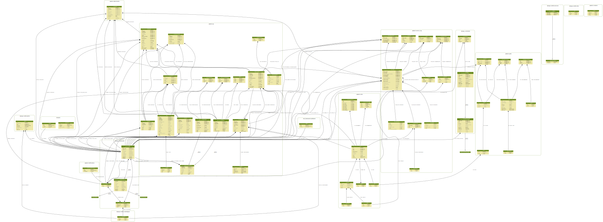

.. _dev_schema:

QATrack+ v0.3.0 Database Schema
===============================

Below you will find a database schema diagram for v0.3.0 of QATrack+.

   The QATrack+ v0.3.0 schema (click to view full size or right click and view
   in new tab to view full size)

Generating the schema diagram
-----------------------------

Ubuntu
~~~~~~

On Ubuntu (tested on 18.04) you need to install a few dependencies before
generating the schema diagram:

.. code-block:: sh

    sudo apt install python-dev graphviz libgraphviz-dev pkg-config
    pip install pygraphviz

and then you can generate your schema with:

.. code-block:: sh

    make schema

which will output the schema to docs/developer/images/qatrack_schema_$(VERSION).svg

Windows
~~~~~~~

It is also possible to generate a schema diagram on Windows using Sql Server
Management Studio. See
https://dataedo.com/kb/tools/ssms/create-database-diagram for instructions on
making a diagram with SSMS.

Schema for Older Versions
=========================

Database diagrams for older versions of QATrack+ are available on BitBucket:
`Schema diagrams
<https://bitbucket.org/tohccmedphys/qatrackplus/wiki/v/0.2.9/developers/schema.md>`__.
