.. _adfs_server_2012:

Configuring ADFS 2012 (ADFS 3.0)
================================

The following will give a step by step on how to configure QATrack+ as a client
application in Active Directory Federation Services 3.0 (AD FS 2016).

Adding an ADFS Relying Party Trust
----------------------------------

First, launch AD FS Management, which can be located in the Start Menu under
`Windows Administrative Tools`:

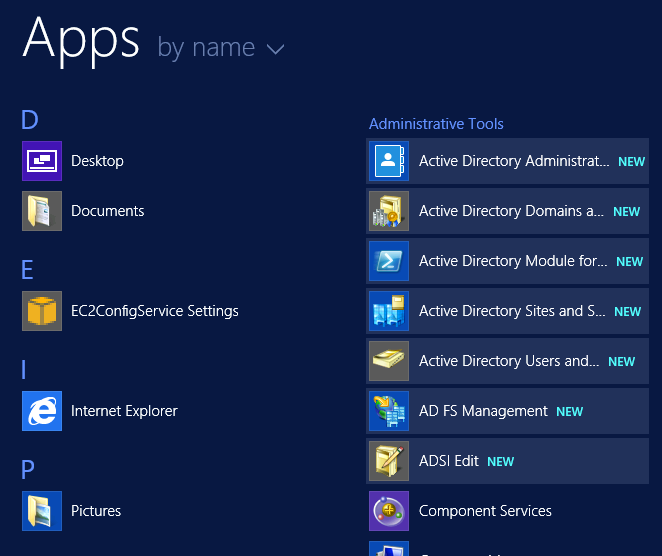

    AD FS Management Link in Start Menu

In the left hand panel expand the 'AD FS' folder and click on 'Trust
Relationships' then click on 'Add Relying Party Trust...'.

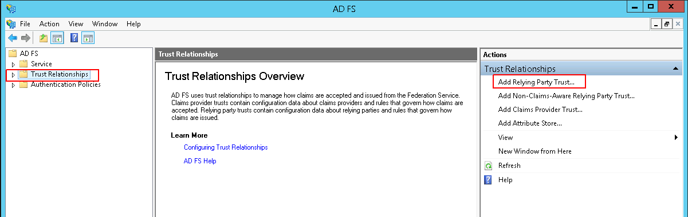

    Adding a Relying Party Trust

In the Add Relying Party Trust Wizard click 'Enter data about the relying party manually'
and then click `Next`

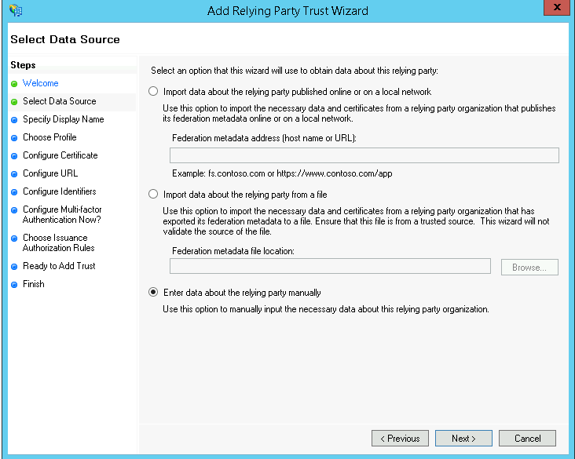

    Choose to enter the data about the reyling party manually

set the `Display Name` to QATrack+ and click `Next`.

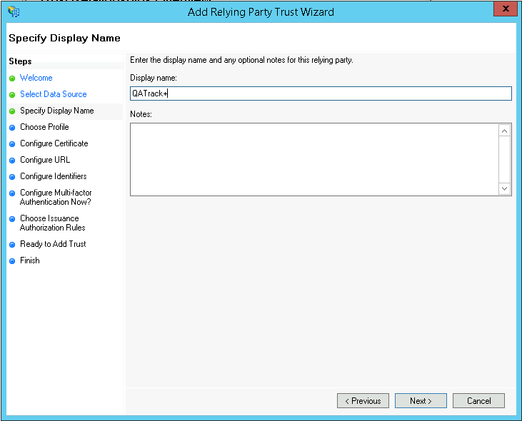

    Setting the display name

On the next page keep the Profile selection as `AD FS profile`

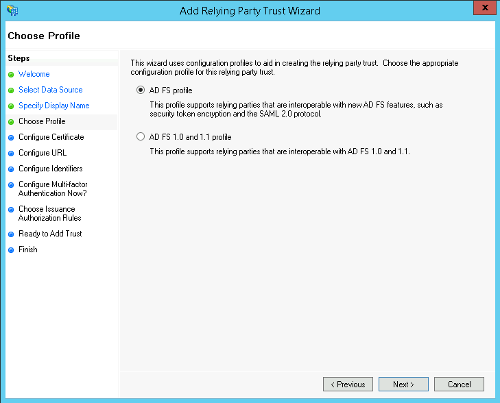

    Select the AD FS profile option

On the next page Leave the Certificate blank and click `Next`

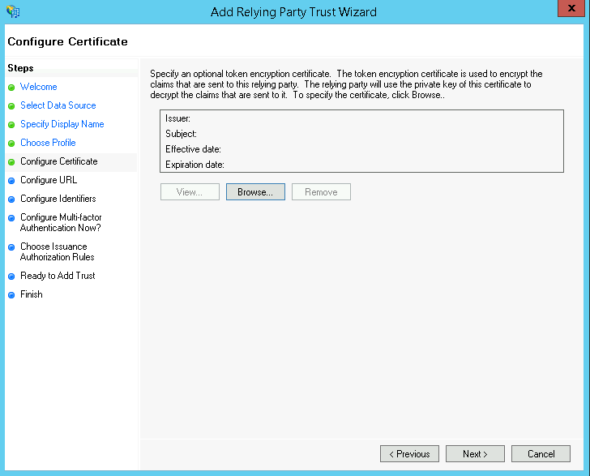

    Leave the certificate blank

Likewise on the Configure URL page leave both options unchecked and click `Next`

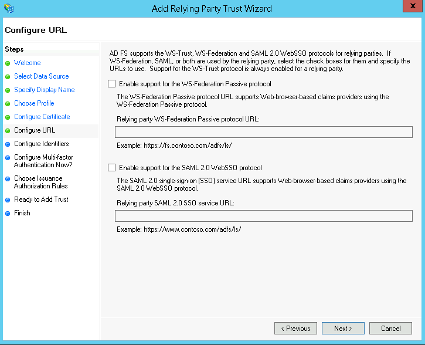

    WS-Federation Passive and SAML2.0 WebSSO protocols unchecked

On the `Configure Identifiers` page set the `Relying party trust identifier` to
`qatrackplus` (this is what you will set the `CLIENT_ID` field to in your
:ref:`AUTH_ADFS settings <auth_adfs_settings>`) and click `Add`.

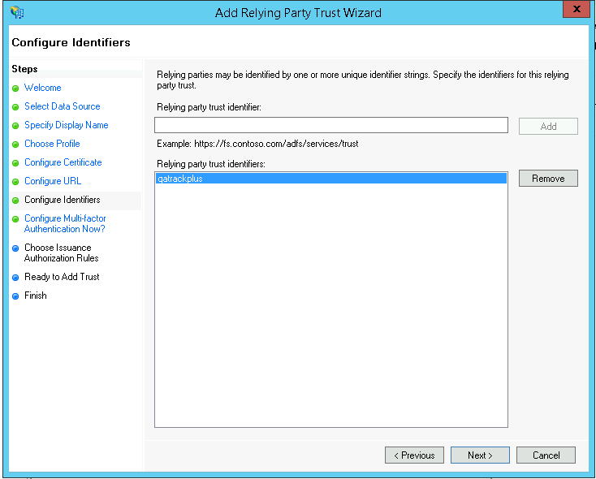

    Set the relying party trust identifier to `qatrackplus`

On the `Configure Multi-factor Authentication Now` page leave the `I do
not want to configure multi-factor authentication settings for this relying party trust
at this time` option selected and click `Next`.

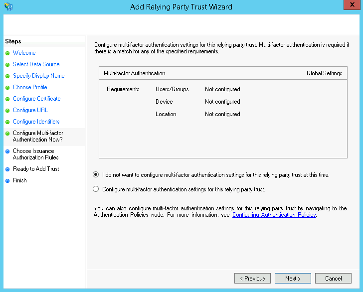

    Do not configure MFA at this time

On the `Choose Issuance Authorization Rules` page select `Permit all users to
access this relying party` and click `Next`.

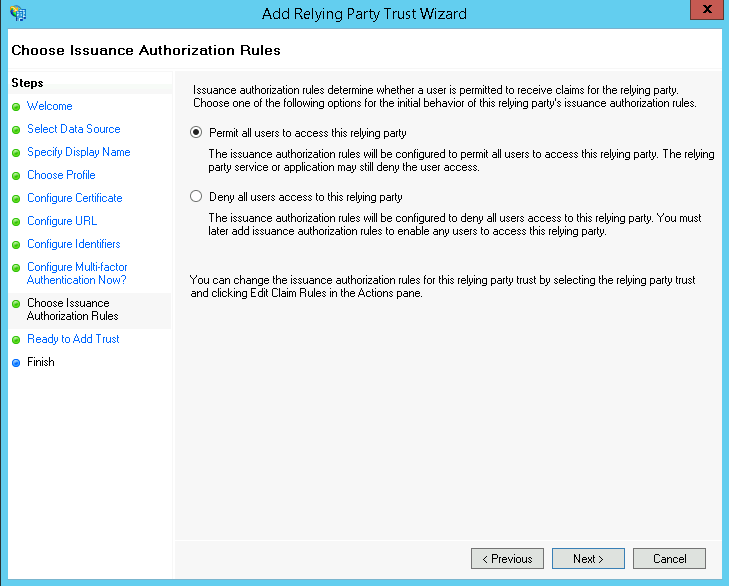

    Permit All Users

On the `Ready to Add Trust` page click `Next` and then on the final page select
`Open the Edit Claim Rules dialog for this relying party trust when the wizard close`
and click `Close`

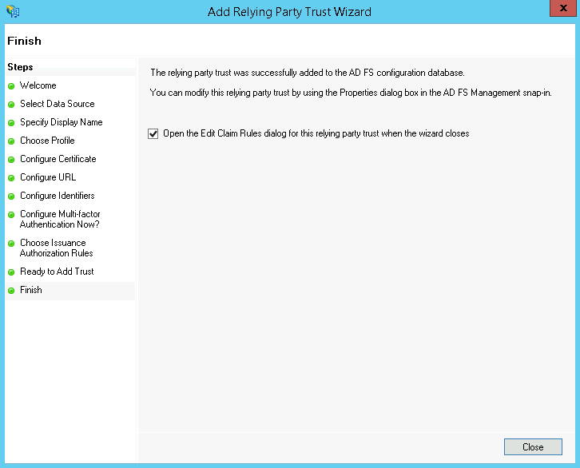

    Open claims rules

In the `Edit Claim Rules for QATrack+` dialog, on the `Issuance Transform
Rules` click `Add Rule`:

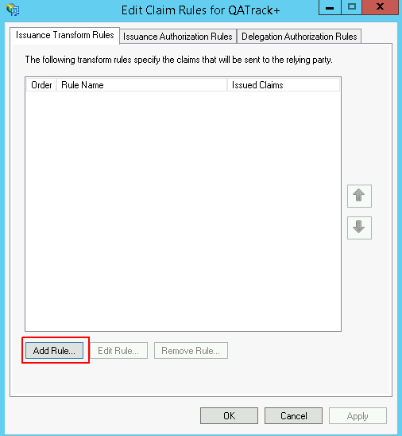

    Add a rule

Ensure `Send LDAP Attributes as Claims` is selected and click `Next`:

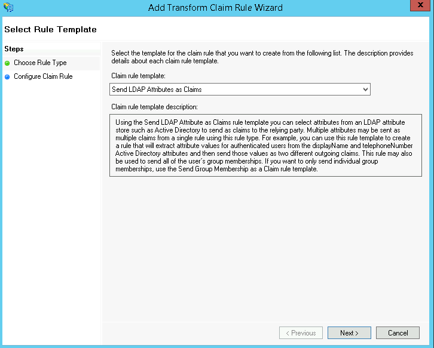

    Send LDAP Attributes as Claims

On the next page set the `Claim rule name` to `LDAP Attributes` and set the
`Attribute store` to `Active Directory`.  In the `Mapping of LDAP attributes to
outgoing claim types` field set the following attributes:

+----------------------------------+----------------------+
| LDAP Attribute                   | Outgoing Claim Type  |
+==================================+======================+
| E-Mail-Addresses                 | E-Mail Address       |
+----------------------------------+----------------------+
| Given-Name                       | Given Name           |
+----------------------------------+----------------------+
| Surname                          | Surname              |
+----------------------------------+----------------------+
| Token-Groups - Unqualified Names | Group                |
+----------------------------------+----------------------+
| SAM-Account-Name                 | Windows account name |
+----------------------------------+----------------------+

then click `Finish` and then `OK`:

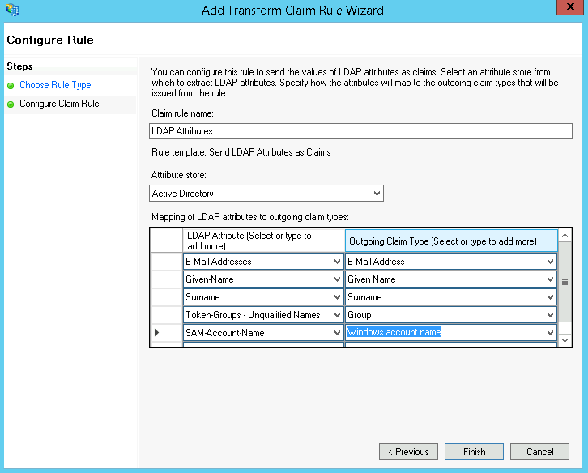

    LDAP Attributes Map

and then click `OK`.

Now open a PowerShell Window and enter the following command making sure to set
the `RedirectUri` to the url of your QATrack+ server with a path of
`accounts/oauth2/callback` (no trailing slash).  For example if your QATrack+
server is located at https://qatrack.yourhospital.com then you would set the
Redirect URI to `https://qatrack.yourhospital.com/accounts/oauth2/callback`.

.. code:: powershell

    Add-ADFSClient -Name "QATrack+ OAuth2 Client" `
                   -ClientId "qatrackplus" `
                   -RedirectUri "https://qatrack.yourhospital.com/accounts/oauth2/callback"

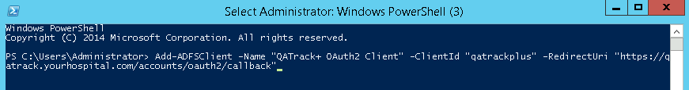

    Adding the QATrack+ client

You can now proceed to :ref:`configure your QATrack+ application to use AD FS
<auth_adfs_settings>`.  The settings you will need are:

* **SERVER**: The HostName of your ADFS server.  For example
  `adfs.yourhospital.com`.  You can retrieve this setting by opening a
  PowerShell window and entering: 
  
    .. code:: powershell

        Get-AdfsProperties | select HostName | Format-List

* **CLIENT_ID**: Use `qatrackplus` or whatever you set the `Client Identifier` to above.
  To double check this setting open a PowerShell window and enter:

    .. code:: powershell

        Get-ADFSClient -Name "QATrack+ OAuth2 Client"

* **RELYING_PARTY_ID**: Use the Relying Party Identifier you set
  above e.g.  `qatrackplus`.
  To double check this setting open a PowerShell window and enter:

    .. code:: powershell

        Get-AdfsRelyingPartyTrust -Name "QATrack+" | Select Identifier
  
* **AUDIENCE**: Use the **RELYING_PARTY_ID** setting but prefixed with
  `microsoft:identityserver:` e.g.  `microsoft:identityserver:qatrackplus` 

