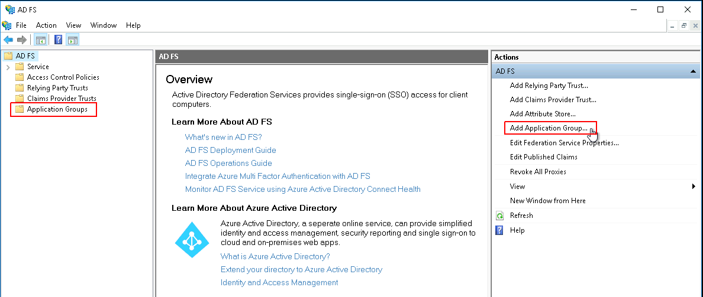
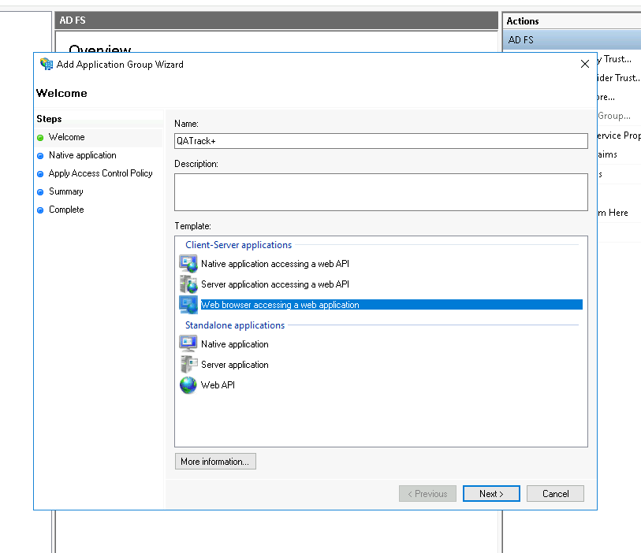
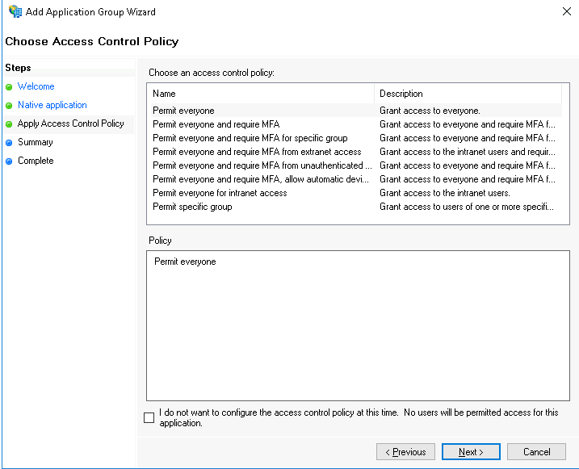
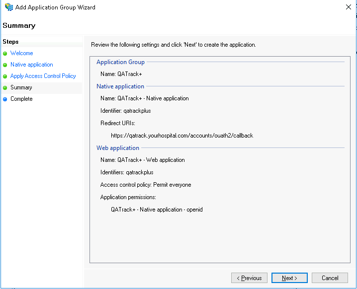
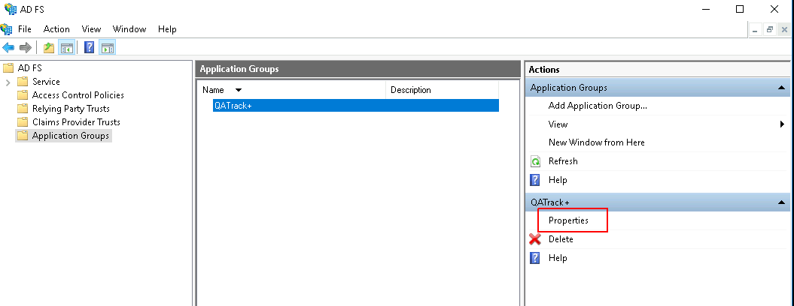
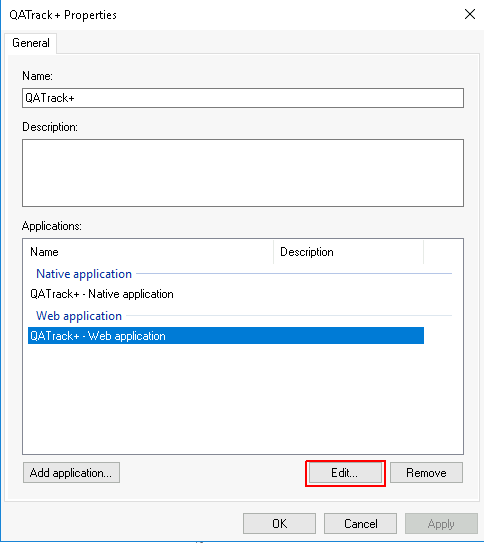
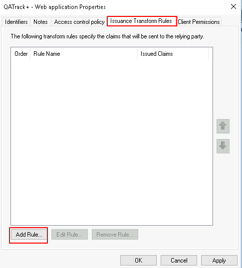
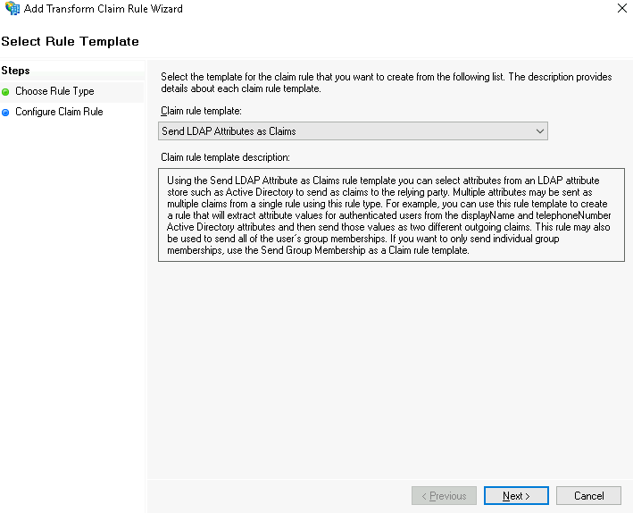
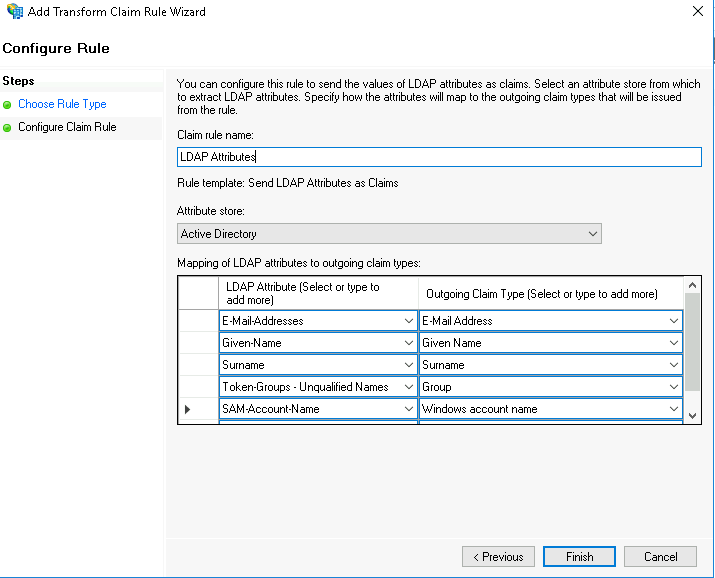
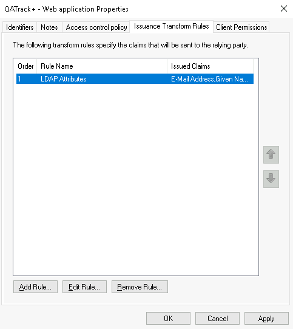

.. _adfs_server_2016:

Configuring ADFS 2016 (ADFS 4.0)
================================

The following will give a step by step on how to configure QATrack+ as a client
application in Active Directory Federation Services 2016 (AD FS 2016).

Adding an ADFS Application Group
--------------------------------

First, launch AD FS Management, which can be located in the Start Menu under
`Windows Administrative Tools`:

.. figure:: images/adfs_2016/adfs_management_start.png
    :alt: AD FS Management Link in Start Menu

    AD FS Management Link in Start Menu

In the left hand panel expand the 'AD FS' folder and click on 'Application
Groups' then click on 'Add Application Group...'.

    Adding an Application Group

In the Add Application Group Wizard set the `Name` to QATrack+ (or something
else if you prefer).  In the `Template` area select `Web browser accessing a
web application` and then click `Next >`.

    Add Application Group Wizard

On the next page set the `Client Identifier` to `qatrackplus`; this is what you
will set the `CLIENT_ID` field to in your :ref:`AUTH_ADFS settings
<auth_adfs_settings>`. Set the `Redirect URI` to the url of your QATrack+
server with a path of `accounts/oauth2/callback` (no trailing slash) and then
click `Add`. For example if your QATrack+ server is located at
https://qatrack.yourhospital.com then you would set the Redirect URI to
`https://qatrack.yourhospital.com/accounts/oauth2/callback`.

.. figure:: images/adfs_2016/native_application.png
    :alt: Native Application Page

    Native Application Page

On the next page leave the `Policy` as `Permit everyone` and click `Next`.

    Access Control settings

On the `Summary` page confirm your settings are correct and click `Next` then `Close`.

    Settings Summary

You will now have a `QATrack+` Application Group showing.  Select it and then
click `Properties` in the right hand pane.

    App group properties

In the QATrack+ Properties Dialog, select the `QATrack+ - Web application` item
in the `Web application` section and then click `Edit...`

    QATrack+ App group properties

Click on the `Issuance Transform Rules` tab at the top of the properties dialog
and click `Add Rule`

    Issuance Transform Rules

Set the `Claim rule template` to `Send LDAP Attributes as Claims` and click
`Next`.

    

    Select claim rule template

On the next page set the `Claim rule name` to `LDAP Attributes` and set the
`Attribute store` to `Active Directory`.  In the `Mapping of LDAP attributes to
outgoing claim types` field set the following attributes:

+----------------------------------+----------------------+
| LDAP Attribute                   | Outgoing Claim Type  |
+==================================+======================+
| E-Mail-Addresses                 | E-Mail Address       |
+----------------------------------+----------------------+
| Given-Name                       | Given Name           |
+----------------------------------+----------------------+
| Surname                          | Surname              |
+----------------------------------+----------------------+
| Token-Groups - Unqualified Names | Group                |
+----------------------------------+----------------------+
| SAM-Account-Name                 | Windows account name |
+----------------------------------+----------------------+

then click `Finish`:
    

    Setting up the claims

and `OK`:

    Issuance rules set

You can now proceed to :ref:`configure your QATrack+ application to use AD FS
<auth_adfs_settings>`.  The settings you will need are:

* **SERVER**: The HostName of your ADFS server.  For example
  `adfs.yourhospital.com`.  You can retrieve this setting by opening a
  PowerShell window and entering: 
  
    .. code:: powershell

        Get-AdfsProperties | select HostName | Format-List

* **CLIENT_ID**: Use `qatrackplus` or whatever you set the `Client Identifier` to above.

  To double check this setting open a PowerShell window and enter:

    .. code:: powershell

        Get-AdfsNativeClientApplication -Name "QATrack+ - Native application"

  and look for the `Identifier` field.

* **RELYING_PARTY_ID**: The Relying Party Identifier will be the same as the
  **CLIENT_ID** setting e.g. `qatrackplus` double check this setting open a
  PowerShell window and enter:

    .. code:: powershell

        Get-AdfsWebApiApplication | select Identifier | Format-List
  
* **AUDIENCE**: Use the **RELYING_PARTY_ID** setting but prefixed with
  `microsoft:identityserver:` e.g.  `microsoft:identityserver:qatrackplus` 
