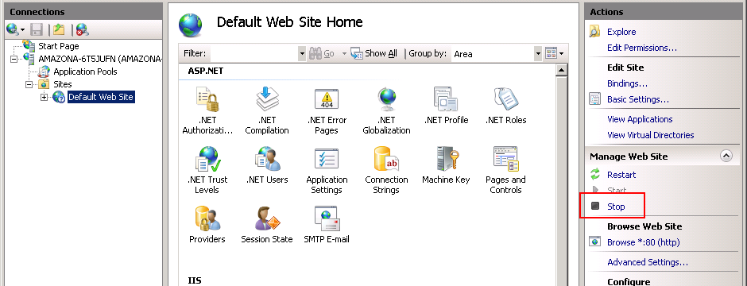
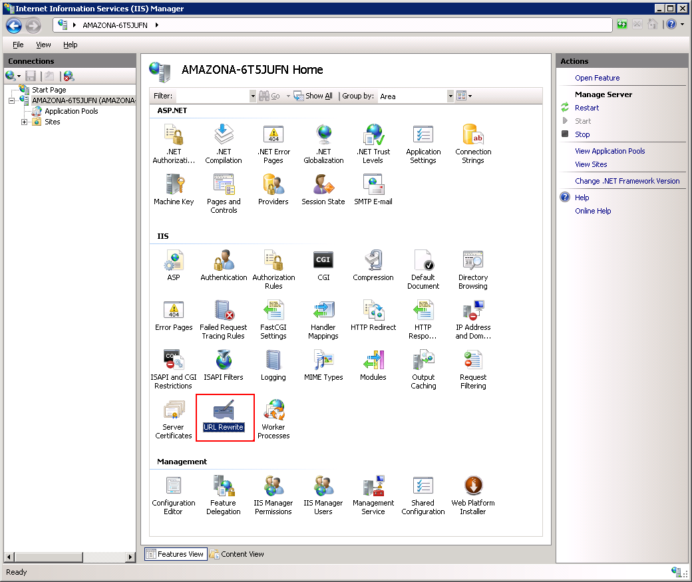
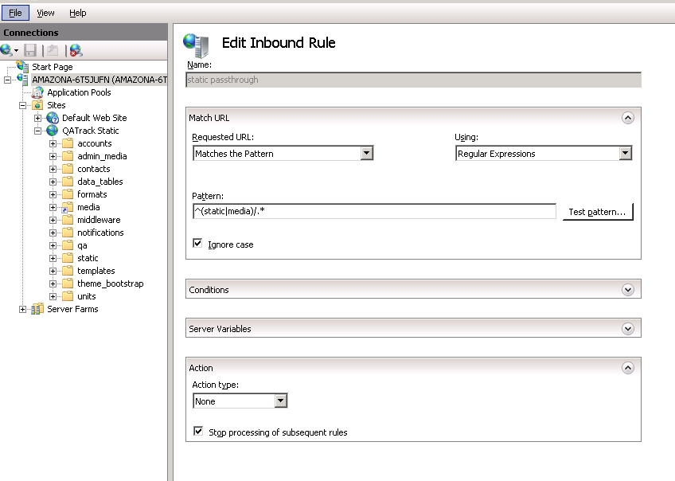
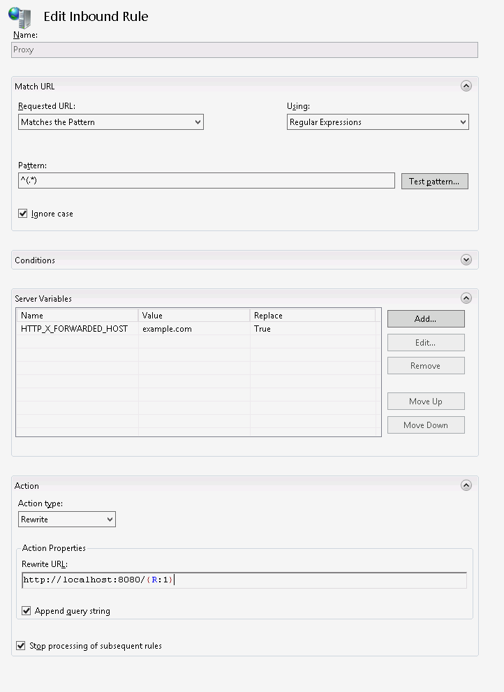
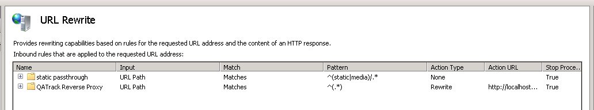

.. _win_install_031:

Installing and Deploying QATrack+ on Windows Server
===================================================

.. note::

    This guide assumes you have at least a basic level of familiarity with
    Windows Server, SQL Server Management Studio, and the command line.

New Installation
----------------

This guide is going to walk you through installing QATrack+ on a Windows Server
2019 server with IIS 10 serving static assets (images, javascript and
stylesheets) and acting as a reverse proxy for a CherryPy web server which
serves our Django application (QATrack+).  SQL Server 2019 will be used as the
database. If you are upgrading an existing installation, please see the sections
below on upgrading from v0.2.8 or v0.2.9.

.. note::

    This guide assumes you have SQL Server Management Studio (SSMS) and Internet
    Information Services (IIS) installed/enabled

The steps we will be undertaking are:

.. contents::
    :local:
    :depth: 1

Install Google Chrome
~~~~~~~~~~~~~~~~~~~~~

If you want to be able to generate or schedule PDF reports, you need to have
Google Chrome installed.  Download and install Chrome here: https://www.google.com/chrome/index.html

Installing git
~~~~~~~~~~~~~~

Go to http://git-scm.com and download the latest version of git (msysgit) for
Windows (Git-2.30.0 at the time of writing).  Run the installer.  I just leave
all the settings on the defaults but you are free to modify them if you like.

.. _install_py3_win:

Installing Python 3
~~~~~~~~~~~~~~~~~~~

Go to http://www.python.org/downloads/ and download the latest Python 3.9.X
(3.9.1 at the time of writing) 64 bit version (e.g. the "Windows installer
(64-bit)" link).  Run the installer and on the first page, make sure both
"Install launcher for all users" and "Add Python 3.9 to PATH" are checked and
then click the "Customize Installation" button.

On the second page of the installer, leave the defaults and click "Next".

On the third page, make sure you have "Install for all users" selected (this
is important!) before clicking "Install".

Checkout the latest release of QATrack+ source code from BitBucket
~~~~~~~~~~~~~~~~~~~~~~~~~~~~~~~~~~~~~~~~~~~~~~~~~~~~~~~~~~~~~~~~~~

Open a Windows PowerShell terminal and then create a directory for QATrack+ and
check out the source code, use the following commands:

.. code-block:: console

    mkdir C:\deploy
    cd C:\deploy
    git clone https://bitbucket.org/tohccmedphys/qatrackplus.git

Setting up our Python environment
~~~~~~~~~~~~~~~~~~~~~~~~~~~~~~~~~

Ensure you have python3 installed correctly and on your PATH by running:

.. code-block:: console

    python --version
    # should print e.g. Python 3.9.1 or similar

We're now ready to install all the libraries QATrack+ depends on.

.. code-block:: console

    mkdir venvs
    python -m pip install --upgrade pip
    python -m venv venvs\qatrack31
    .\venvs\qatrack31\Scripts\Activate.ps1
    python -m pip install --upgrade pip
    cd qatrackplus
    git checkout v0.3.1
    pip install -r requirements\win.txt
    python C:\deploy\venvs\qatrack31\Scripts\pywin32_postinstall.py -install
    python manage.py collectstatic

.. warning::

    If you are going to be using :ref:`Active Directory <active_directory>` for
    authenticating your users, you need to install pyldap.  There are binaries
    available on this page:
    https://www.lfd.uci.edu/~gohlke/pythonlibs/#python-ldap.  Download the
    binary relavant to your distribution (e.g.
    python_ldap‑3.3.1‑cp39‑cp39‑win_amd64.whl) and then pip install it:

    .. code-block:: console

        pip install C:\path\to\python_ldap‑3.3.1‑cp39‑cp39‑win_amd64.whl

Creating a database with SQL Server
~~~~~~~~~~~~~~~~~~~~~~~~~~~~~~~~~~~

Ensure ODBC Driver 13.1 is installed
....................................

In order for QATrack+ to connect to your database, you need to have the `ODBC
Driver 13.1` installed.  Visit
https://www.microsoft.com/en-us/download/details.aspx?id=53339 and download and
install the driver.

Ensure `SQL Server Authentication` is enabled
.............................................

Open SQL Server Management Studio and connect to 'localhost' or another
database server.

In the Object Explorer frame right click on the server you are connected to and
click `Properties`.  In the dialog that opens click on `Security`, ensure `SQL
Server and Windows Authentication mode` is selected and then click OK. Now
right click on your server again and click `Restart`.

Create a new database
.....................

In the Object Explorer frame, right click the Databases folder and select "New
Database...".

Enter 'qatrackplus031' as the database name and click OK.

Back in the Object Explorer frame, right click on the main Server Security
folder and click New Login...  Set the login name to 'qatrack', select SQL
Server Authentication. Enter 'qatrackpass' (or whatever you like) for the
password fields and uncheck Enforce Password Policy. Click OK.

Again in the Object Explorer frame, right click on the main Security folder and
click New Login...  Set the login name to 'qatrack_reports', select SQL Server
Authentication. Enter 'qatrackpass' (or whatever you like) for the password
fields and uncheck Enforce Password Policy. Click OK.

Back in the Object Explorer frame, expand the qatrackplus031 database, right
click on Security and select New->User.

Enter 'qatrack' as the User name and Login name and then in the Database Role
Membership region select 'db_ddladmin', 'db_datawriter',
'db_datareader' and 'db_owner'.  Click OK.

Now add the readonly database user for the query tool. In the Object Explorer
frame, expand the qatrackplus031 database, right click on Security and select
New->User.

Enter 'qatrack_reports' as the User name and Login name and then in the
Database Role Membership region select 'db_datareader'.  Click OK.

Configuring QATrack+ to use your new database
~~~~~~~~~~~~~~~~~~~~~~~~~~~~~~~~~~~~~~~~~~~~~

Copy the example local_settings file:

.. code-block:: console

    cp deploy\win\local_settings.py qatrack\local_settings.py

and then edit it so that the `NAME`, `USER`, and `PASSWORD` settings match the
way you set up your database above.

.. code-block:: python

    DEBUG = False

    DATABASES = {
        'default': {
            'ENGINE': 'sql_server.pyodbc',
            'NAME': 'qatrackplus031',
            'USER': 'qatrack',  # USER/PWD can usually be left blank if SQL server is running on the same server as QATrack+
            'PASSWORD': 'qatrackpass',
            'HOST': '', # leave blank unless using remote server or SQLExpress (use 127.0.0.1\\SQLExpress or COMPUTERNAME\\SQLExpress)
            'PORT': '', # Set to empty string for default. Not used with sqlite3.
            'OPTIONS': {
                'driver': 'ODBC Driver 13 for SQL Server'
            },
        },
        'readonly': {
            'ENGINE': 'sql_server.pyodbc',
            'NAME': 'qatrackplus031',
            'USER': 'qatrack_reports',
            'PASSWORD': 'qatrackpass',
            'HOST': '',
            'PORT': '',
            'OPTIONS': {
                'driver': 'ODBC Driver 13 for SQL Server'
            },
        }
    }

    ALLOWED_HOSTS = ['127.0.0.1', 'localhost']  # See local settings docs

Confirm you can connect to your database by running the `showmigrations` command:

.. code-block:: console

    python manage.py showmigrations accounts

which should show output like:

.. code-block:: bash

    accounts
        [ ] 0001_initial
        [ ] 0002_activedirectorygroupmap_defaultgroup
        [ ] 0003_auto_20210207_1027

We will now create the database tables and load some configuration data into
our new database from the command prompt:

.. code-block:: console

    python manage.py migrate
    python manage.py createsuperuser
    python manage.py createcachetable
    Get-ChildItem .\fixtures\defaults\*\*json | foreach {python manage.py loaddata $_.FullName}

Configuring CherryPy to Serve QATrack+
~~~~~~~~~~~~~~~~~~~~~~~~~~~~~~~~~~~~~~

In order to have QATack+ start when you reboot your server, or restart after a
crash, we will run QATrack+ with a CherryPy server installed as a Windows
service (running on port 8080, see note below if you need to change the port).

Open a new PowerShell window *with Administrator privileges* (right click on
PowerShell and click "Run as Administrator") and run the following commands:

.. code-block:: console

    cd C:\deploy
    .\venvs\qatrack31\Scripts\Activate.ps1
    cd qatrackplus
    cp deploy\win\QATrack3CherryPyService.py .
    python QATrack3CherryPyService.py --startup=auto install
    python QATrack3CherryPyService.py start

Open the Windows Services dialog and confirm the `QATrack 031 CherryPy Service`
is installed and has a status of `Running`.   Next open a browser on the server
and navigate to http://localhost:8080/ and ensure you see a plain login form
there (it won't look like this once we're finished!). If not, check the
`logs\cherry_py_err.log` file for any errors.

Your QATrack+ installation is now installed as a Windows Service running on
port 8080 (see note below).  You may also wish to configure the service to
email you in the event of a crash (see the Recovery tab of the
QATrackCherryPyService configuration dialogue).

.. note::

    If you need to run QATrack+ on a different port, edit
    C:\\deploy\\qatrackplus\\QATrack3CherryPyService.py and set the PORT
    variable to a different port (e.g. 8008)

Setting up IIS
~~~~~~~~~~~~~~

To start open up the Internet Information Services (IIS) application. We are
going to use IIS for two purposes: first, it is going to serve all of our
static media (css, js and images) and second it is going to act as a reverse
proxy to forward the QATrack+ specific requests to CherryPy.

Before starting please make sure you have both `URL Rewrite 2.1
<https://www.iis.net/downloads/microsoft/url-rewrite>`__ and `Application
Request Routing 3.0
<http://www.iis.net/downloads/microsoft/application-request-routing>`__ IIS
modules installed.  These can be installed by clicking on the "Get New Web
Platform Components" link in the right hand side bar of IIS (you may need to
install the Web Platform Installer first). 

After installing these modules, you will need to close & re-open IIS.

Enabling Proxy in Application Request Routing
.............................................

Application Request Routing needs to have the proxy setting enabled. To do
this, click on the top level server in the left side panel, and then double
click the `Application Request Routing` icon. In the `Actions` panel click the
`Server Proxy Settings` and then check `Enable proxy` at the top.  Leave all
the other settings the same and click `Apply` and then `Back to ARR Cache`.

Enabling Static Content Serving in IIS
......................................

IIS is not always set up to serve static content. To enable this, open the
Server Manager software, click Manage, then `Add Roles and Features` then
`Next`, `Next`.  In the `Roles` widget, select `Web Server(IIS)->Web
Server->Common HTTP Features` and make sure `Static Content` is selected. If it
isn't, enable that role.

Setting up the site and URL rewrite rules
~~~~~~~~~~~~~~~~~~~~~~~~~~~~~~~~~~~~~~~~~

Once you have Applicationn Request Routing installed and proxies enabled, in
the left panel of IIS under Sites, select the default Web Site and click Stop
on the right hand side.

    Stop default website

Now right click on Sites and click Add Web Site

    Add a new web site

Enter QATrack Static for the Site Name and "C:\\deploy\\qatrackplus\\qatrack\\" for
the Physical Path then click OK and answer Yes to the warning.

To test that setup worked correctly open a browser on your server and enter the
address http://localhost/static/qa/img/tux.png You should see a picture of the
Linux penguin.

Next, select the top level server in the Connections pane and then double click
URL Rewrite: 

    URL Rewrite

In the top right click Add Rule and select Blank Rule.

Give it a name of QATrack Static and enter `^(static|media)/.\*` for the
Pattern field, and select None for the Action type.
Make sure `Stop processing of subsequent rules` is checked.

    Static URL Rewrite Rule

When finished click Apply, then Back To Rules and then add another blank rule.
Give it a name of QATrack Reverse Proxy, enter `^(.\*)` for the Pattern and
`http://localhost:8080/{R:1}` for the Rewrite URL.  In the Server Variables
section add a new Server Variable with the `Name=HTTP_X_FORWARDED_HOST` and
the Value=yourservername.com (replace yourservername with whatever your domain
is!).  Finally, make sure both Append query string and Stop processing of
subsequent rules are checked.

    URL Rewrite Reverse Proxy

Your URL rewrites should look like the following (order is important!)

    URL Rewrite rules

You should now be able to visit http://localhost/ in a browser on your server
and see the QATrack+ login page.  Congratulations, you now have a functional
QATrack+ setup on your Windows Server!

If you see a "403.14 Forbidden" error, double check you added the URL rewrite
rules to the top level server, and not the QATrack Static site.

If you see a "502.3 Bad Gateway" error, double check that your QATrack CherryPy
service was installed correctly and is running.

.. note::

    There are many different ways to configure IIS.  The method I've used
    above is simple and works well when QATrack+ is the only web service
    running on a server.

What Next
~~~~~~~~~

* Check the :ref:`the settings page <qatrack-config>` for any available
  customizations you want to add to your QATrack+ installation (don't forget to
  restart your QATrack CherryPy Service after changing any settings!)

* Automate the :ref:`backup of your QATrack+ installation <qatrack_backup>`.

* Read the :ref:`Administration Guide <admin_guide>`, :ref:`User Guide
  <users_guide>`, and :ref:`Tutorials <tutorials>`.

Wrap Up
~~~~~~~

This guide shows only one of many possible method of deploying QATrack+ on
Windows.  It is very similar to what is used at The Ottawa Hospital Cancer
Centre and it has proven to be a very solid setup.  If you're stuck with a
Windows stack it will likely work for you too.  Please post on the
:mailinglist:`QATrack+ Google Group <>` if you get stuck!
