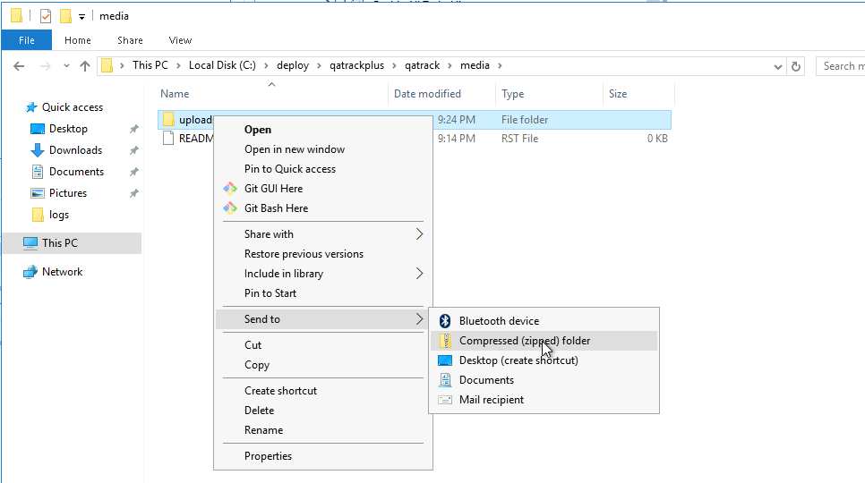
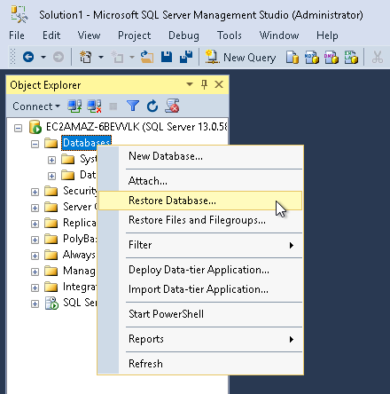
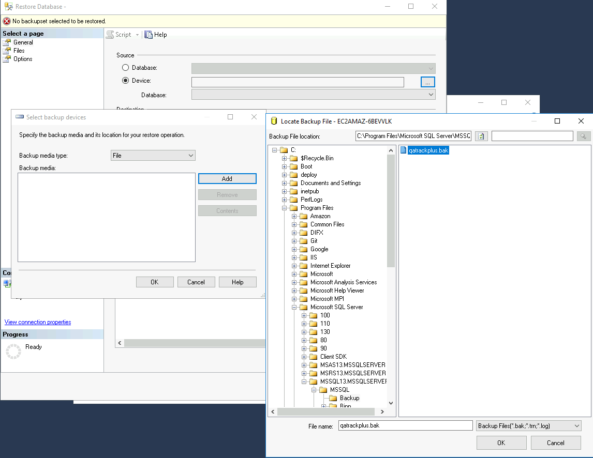
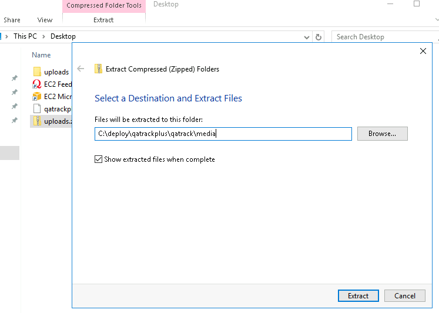

.. _win_upgrading_02X_to_31:

Upgrading an existing Windows v0.2.X installation to v3.1.1.3
=============================================================

This document will walk you through migrating an existing v0.2.X version of
QATrack+ to a new Windows server.  Although it may be possible, upgrading a
QATrack+ 0.2.x installation in place is not recommended. This guide assumes you
are moving to a new server.  If you need advice please get in touch on the
:mailinglist:`mailing list <>`.

On your old server
------------------

The first step to migrating your existing QATrack+ installation is to generate
the backup files to move everything to your new server.

Backup your QATrack+ install data
~~~~~~~~~~~~~~~~~~~~~~~~~~~~~~~~~

.. note::

    We will assume you are currently using a database named 'qatrackplus' but
    if not (check the DATABASE settings in qatrack/local_settings.py) replace
    'qatrackplus' in the instructions below with your database name (e.g.
    qatrackdb).

In order to generate a backup open SQL Server Management Studio (SSMS), right
click on your database then select `Tasks -> Back Up..`

.. figure:: images/win/backup_menu.png
    :alt: Backup Menu Item

    Backup Menu Item

Select `Copy-only backup` and make sure the `Backup component` is set to
`Database`. Take note of where the backup is being stored and then click `OK`:

.. figure:: images/win/backup_dialog.png
    :alt: Backup Dialog

    Backup Dialog

and create a zip archive of your uploads directory:

    Create zip archive of uploads

On your new server
------------------

Copy the qatrackplus.bak and uploads.zip to your new server, these will be
needed below.  The qatrackplus.bak file should go in your SQL Server backup
directory which is located at e.g. `C:\\Program Files\\Microsoft SQL
Server\\MSSQL13.MSSQLSERVER\\MSSQL\\Backup` (the `MSSQL13.MSSQLSERVER` might
have a different version number in it depending on what version of SQL Server
you are using).

Install Python 2.7 (Only required for QATrack+ 0.2.8 and below. Not required for 0.2.9)
~~~~~~~~~~~~~~~~~~~~~~~~~~~~~~~~~~~~~~~~~~~~~~~~~~~~~~~~~~~~~~~~~~~~~~~~~~~~~~~~~~~~~~~

Visit https://www.python.org/downloads/windows/ and download the latest (64
bit) Python 2.7 release. Select `Install for all users` but do not add
python.exe to Path when given the option.

Installing Python 3 (required for all)
--------------------------------------

Go to http://www.python.org/downloads/ and download the latest Python 3.9.X
(3.9.1 at the time of writing) 64 bit version (e.g. the "Windows installer
(64-bit)" link).  Run the installer and on the first page, make sure both
"Install launcher for all users" and "Add Python 3.9 to PATH" are checked and
then click the "Customize Installation" button.

On the second page of the installer, leave the defaults and click "Next".

On the third page, make sure you have "Install for all users" selected (this
is important!) before clicking "Install".

Ensure `SQL Server Authentication` is enabled
~~~~~~~~~~~~~~~~~~~~~~~~~~~~~~~~~~~~~~~~~~~~~

Open SQL Server Management Studio and connect to 'localhost' or another
database server.

In the Object Explorer frame right click on the server you are connected to and
click `Properties`.  In the dialog that opens click on `Security`, ensure `SQL
Server and Windows Authentication mode` is selected and then click OK. Now
right click on your server again and click `Restart`.

Restoring your previous database
~~~~~~~~~~~~~~~~~~~~~~~~~~~~~~~~

We can now restore your previous database.  On your new server, open SQL Server
Management Studio (SSMS) and in the `Object Explorer` panel, right click the
`Databases` item and select `Restore Database...`

    Restore database menu

In the `General` page, select `Device` and then click the `...` button, and
then the `Add` button.  Navigate to whereever you copied the SQL Server .bak
file from your old server, select it and click `OK` and then `OK` again. 

    Selecting the database restore file

Assuming you don't already have a database called `qatrackplus` on this server,
set the `Destination` database to `qatrackplus` and then click `OK`.

Back in the Object Explorer frame, right click on the main Server Security
folder and click New Login...  Set the login name to 'qatrack', select SQL
Server Authentication. Enter 'qatrackpass' (or whatever you like) for the
password fields and uncheck Enforce Password Policy. Click OK.

Back in the Object Explorer frame, expand the qatrackplus31 database, right
click on Security and select New->User.

Enter 'qatrack' as the User name and Login name and then in the Database Role
Membership region select 'db_ddladmin', 'db_datawriter',
'db_datareader' and 'db_owner'.  Click OK.

Assuming your database restoration was successful, you may now proceed with
upgrading the database to v0.3.0.

Installing git and checking out the QATrack+ Source Code
--------------------------------------------------------

Go to http://git-scm.com and download the latest version of git (msysgit) for
Windows (Git-2.30.0 at the time of writing).  Run the installer.  I just leave
all the settings on the defaults but you are free to modify them if you like.

Checkout the latest release of QATrack+ source code from GitHub
~~~~~~~~~~~~~~~~~~~~~~~~~~~~~~~~~~~~~~~~~~~~~~~~~~~~~~~~~~~~~~~

Open a Windows PowerShell terminal and then create a directory for QATrack+ and
check out the source code, use the following commands:

.. code-block:: console

    mkdir C:\deploy
    cd C:\deploy
    git clone https://github.com/qatrackplus/qatrackplus.git

Restore your upload files
.........................

Assuming you are on a new server and  have an uploads file that you want to
restore you should do so now. 

Open an Explorer window and navigate to where ever you copied your uploads.zip
file to.  Right click on it and select `Extract All...`.  In the window that
opens, set the destination for the files to `C:\\deploy\\qatrackplus\\qatrack\\media`
and then click `OK`:

    Extracting your uploads file

Setting up our Python environment (including virtualenv)
~~~~~~~~~~~~~~~~~~~~~~~~~~~~~~~~~~~~~~~~~~~~~~~~~~~~~~~~

If you have a v0.2.9 database, you will only need a Python 3 installation,
however if you have an older QATrack+ installation, you will also require
Python 2.7. If you have a v0.2.9 database, you can skip this next section.

Migrating 0.2.X (where X < 9) to v0.2.9
.......................................

Use your favourite text editor to create a local_settings.py file with the
following contents:

.. code-block:: python

    DATABASES = {
        'default': {
            'ENGINE': 'sqlserver_ado',  # use this for upgrading to 0.2.9
            'NAME': 'qatrackplus',
            'USER': 'qatrack',
            'PASSWORD': 'qatrackpass',
            'HOST': '',  # leave blank unless using remote server or SQLExpress (use 127.0.0.1\\SQLExpress or COMPUTERNAME\\SQLExpress)
            'PORT': '',  # Set to empty string for default. Not used with sqlite3.
            'OPTIONS': {
                'provider': 'SQLOLEDB'
            },
        },
    }

Open a new PowerShell Window and create and activate a new Python 2
environment:

.. code-block:: console

    cd C:\deploy
    mkdir venvs
    C:\Python27\python.exe -m pip install --upgrade pip
    C:\Python27\python.exe -m pip install virtualenv
    C:\Python27\Scripts\virtualenv.exe venvs\qatrack2
    .\venvs\qatrack2\Scripts\Activate.ps1

Now checkout v0.2.9 and install the required Python packages:

.. code-block:: bash

    cd C:\deploy\qatrackplus
    git checkout v0.2.9.2
    pip install -r requirements\base.txt
    pip install -r requirements\win.txt

Now migrate your database to v0.2.9

.. code-block:: bash

    python manage.py syncdb
    python manage.py migrate

and deactivate the virtualenv

.. code-block:: bash

    deactivate

Migrating 0.2.9 to 0.3.0
------------------------

Check out QATrack+ version 0.3.0
~~~~~~~~~~~~~~~~~~~~~~~~~~~~~~~~

In order to upgrade our 0.2.9 installation to 0.3.0, first we need to checkout
the QATrack+ v0.3.0 source code:

.. code-block:: bash

    cd ~/web/qatrackplus
    git checkout v0.3.0.20

Now use your favourite text editor to create a local_settings.py file (or edit
your existing one if you created one for updating to 0.2.9) with the following
contents:

.. code-block:: python

    DATABASES = {
        'default': {
            'ENGINE': 'sql_server.pyodbc', # use this for upgrading 0.2.9 to 0.3.0
            'NAME': 'qatrackplus',
            'USER': 'qatrack',
            'PASSWORD': 'qatrackpass',
            'HOST': '',  # leave blank unless using remote server or SQLExpress (use 127.0.0.1\\SQLExpress or COMPUTERNAME\\SQLExpress)
            'PORT': '',  # Set to empty string for default. Not used with sqlite3.
            'OPTIONS': {
                'driver': 'ODBC Driver 17 for SQL Server'
            },
        },
    }

Creating our virtual environment
~~~~~~~~~~~~~~~~~~~~~~~~~~~~~~~~

Ensure you have python3 installed correctly and on your PATH by running:

.. code-block:: console

    python --version
    # should print e.g. Python 3.9.1 or similar

Create and activate a new Python 3 virtual environment:

.. code-block:: console

    cd C:\deploy
    mkdir venvs  # only if you haven't already created it
    python -m venv venvs\qatrack3
    .\venvs\qatrack3\Scripts\Activate.ps1
    pip install --upgrade pip

We will now install all the libraries required for QATrack+:

.. code-block:: console

    cd C:\deploy\qatrackplus
    pip install -r requirements\win.txt

Migrating the 0.2.9 database to 0.3.0
~~~~~~~~~~~~~~~~~~~~~~~~~~~~~~~~~~~~~

We are now ready to migrate our 0.2.9 database to v0.3.0:

.. code-block:: console

    python manage.py migrate --fake-initial

Setting up IIS
--------------

Open up the Internet Information Services (IIS) application. We are going to
use IIS for two purposes: first, it is going to serve all of our static media
(css, js and images) and second it is going to act as a reverse proxy to
forward the QATrack+ specific requests to CherryPy.

Before starting please make sure you have both `URL Rewrite 2.1
<https://www.iis.net/downloads/microsoft/url-rewrite>`__ and `Application
Request Routing 3.0
<http://www.iis.net/downloads/microsoft/application-request-routing>`__ IIS
modules installed.  These can be installed by clicking on the "Get New Web
Platform Components" link in the right hand side bar of IIS (you may need to
install the Web Platform Installer first). 

After installing these modules, you will need to close & re-open IIS.

Enabling Proxy in Application Request Routing
~~~~~~~~~~~~~~~~~~~~~~~~~~~~~~~~~~~~~~~~~~~~~

Application Request Routing needs to have the proxy setting enabled. To do
this, click on the top level server in the left side panel, and then double
click the `Application Request Routing` icon. In the `Actions` panel click the
`Server Proxy Settings` and then check `Enable proxy` at the top.  Leave all
the other settings the same and click `Apply` and then `Back to ARR Cache`.

Enabling Static Content Serving in IIS
~~~~~~~~~~~~~~~~~~~~~~~~~~~~~~~~~~~~~~

IIS is not always set up to serve static content. To enable this, open the
Server Manager software, click Manage, then `Add Roles and Features` then
`Next`, `Next`.  In the `Roles` widget, select `Web Server(IIS)->Web
Server->Common HTTP Features` and make sure `Static Content` is selected. If it
isn't, enable that role.

Setting up the site and URL rewrite rules
~~~~~~~~~~~~~~~~~~~~~~~~~~~~~~~~~~~~~~~~~

Once you have Applicationn Request Routing installed and proxies enabled, in
the left panel of IIS under Sites, select the default Web Site and click Stop
on the right hand side.

.. figure:: images/stop_default.png
    :alt: Stop default website

    Stop default website

Now right click on Sites and click Add Web Site

.. figure:: images/stop_default.png
    :alt: Add a new web site

    Add a new web site

Enter QATrack Static for the Site Name and "C:\\deploy\\qatrackplus\\qatrack\\" for
the Physical Path then click OK and answer Yes to the warning.

To test that setup worked correctly open a browser on your server and enter the
address http://localhost/static/qa/img/tux.png You should see a picture of the
Linux penguin.

Next, select the top level server in the Connections pane and then double click
URL Rewrite: 

.. figure:: images/url_rewrite.png
    :alt: URL Rewrite

    URL Rewrite

In the top right click Add Rule and select Blank Rule.

Give it a name of QATrack Static and enter `^(static|media)/.\*` for the
Pattern field, and select None for the Action type.
Make sure `Stop processing of subsequent rules` is checked.

.. figure:: images/static_rule.png
    :alt: Static Rule

    Static URL Rewrite Rule

When finished click Apply, then Back To Rules and then add another blank rule.
Give it a name of QATrack Reverse Proxy, enter `^(.\*)` for the Pattern and
`http://localhost:8080/{R:1}` for the Rewrite URL.  In the Server Variables
section add a new Server Variable with the `Name=HTTP_X_FORWARDED_HOST` and
the Value=yourservername.com (replace yourservername with whatever your domain
is!).  Finally, make sure both Append query string and Stop processing of
subsequent rules are checked.

.. figure:: images/reverse_proxy.png
    :alt: URL Rewrite Reverse Proxy

    URL Rewrite Reverse Proxy

Your URL rewrites should look like the following (order is important!)

.. figure:: images/url_rules.png
    :alt: URL Rewrite rules

    URL Rewrite rules

Next Steps
----------

Now that you have upgraded to 0.3.0, you should proceed directly to
:ref:`upgrading to v3.1.1 from v0.3.0 <win_upgrading_030_to_31>`;
