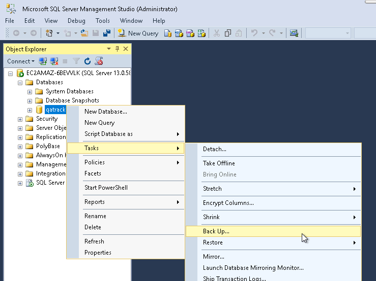
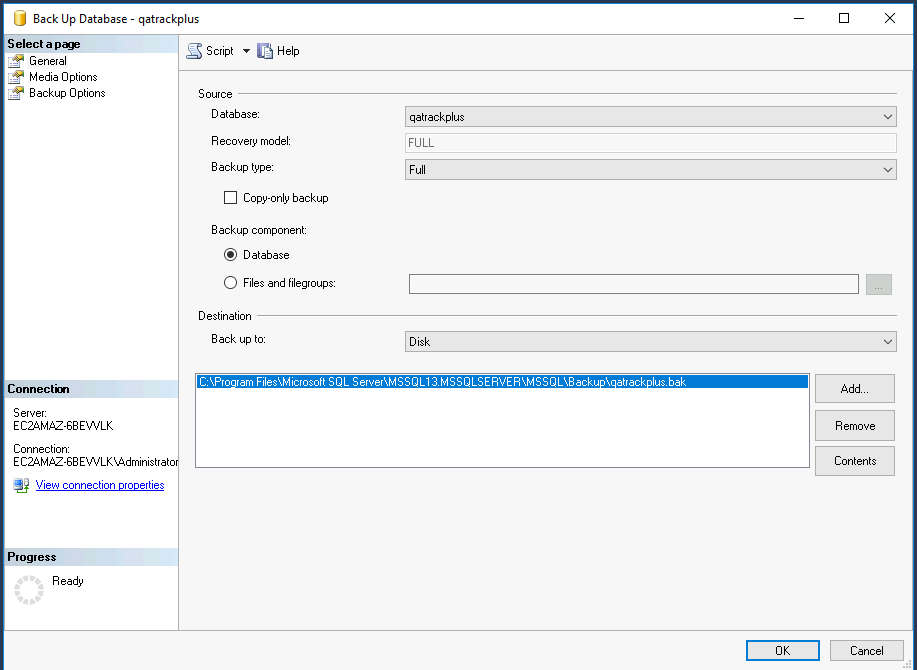
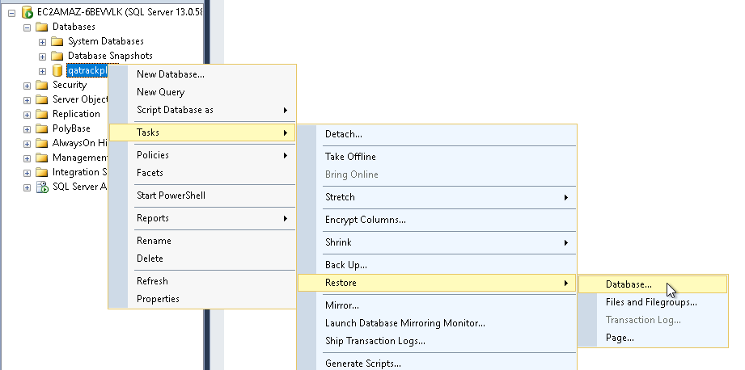
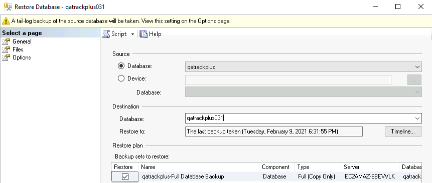
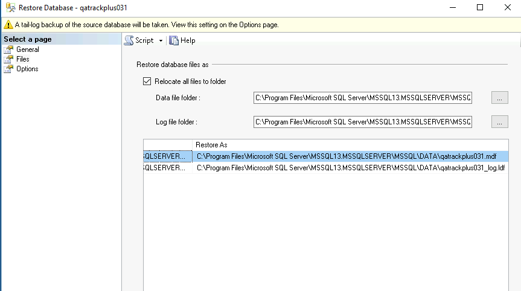
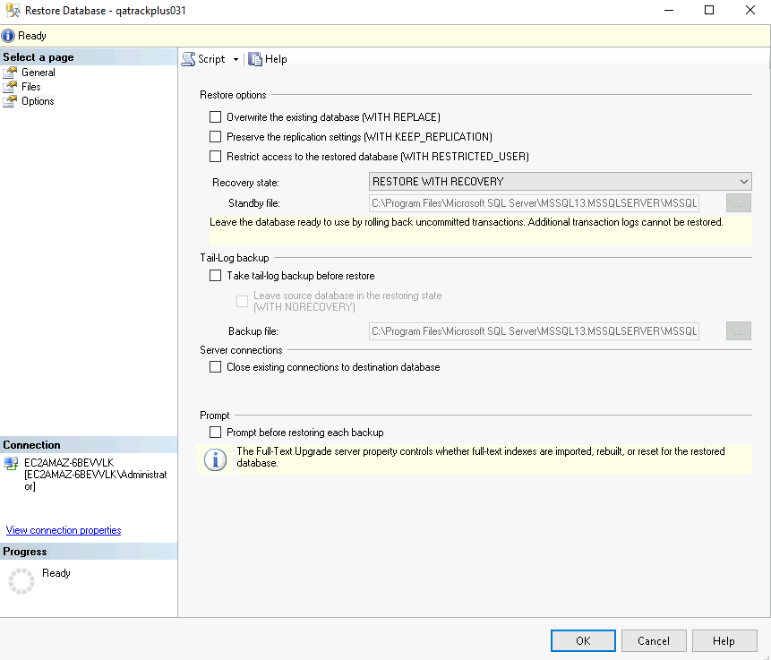
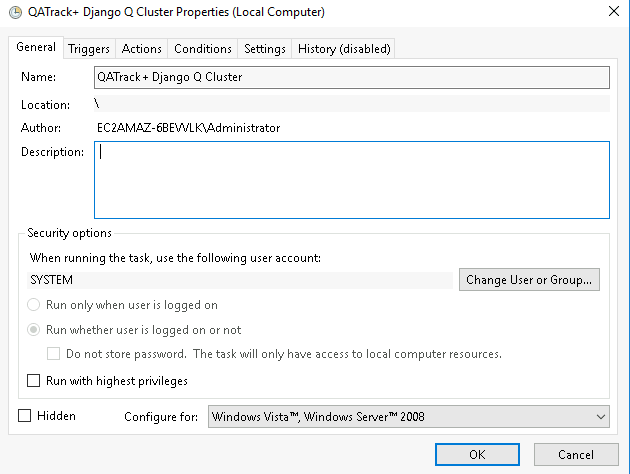
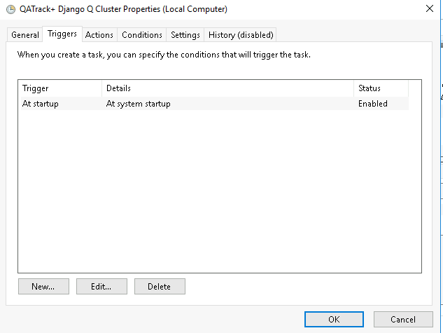
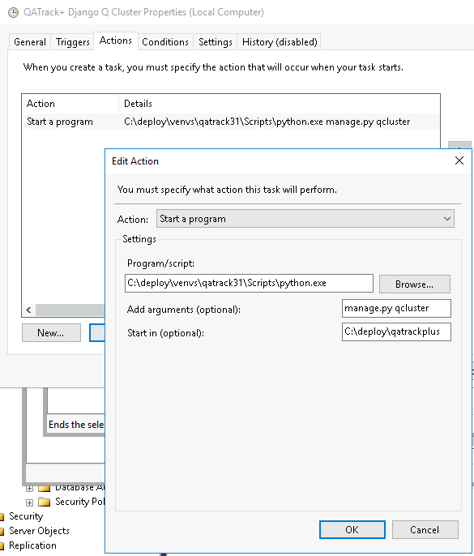

.. _win_upgrading_030_to_31:

Upgrading an existing Windows v0.3.0 installation to v3.1.1
===========================================================

This guide will walk you through upgrading your existing v0.3.0 installation to
v3.1.1.  If you currently have a 0.2.x version of QATrack+, you first need to
follow the :ref:`instructions to upgrade to 0.3.0 <win_upgrading_02x_to_31>`,
before carrying out these instructions.

These instructions assume you are using Windows Server 2016-2019 and SQL Server
2016-2019.  No testing is done on earlier versions of Windows or SQL Server and
it is recommended that if you are running on Windows Server < 2016 you migrate
your QATrack+ installation to a more recent database/OS version when you
upgrade QATrack+.

.. contents::
    :local:
    :depth: 2

Prerequisites
-------------

Take a snapshot
~~~~~~~~~~~~~~~

If your QATrack+ server exists on a virtual machine, now would be a great time
to take a snapshot of your VM in case you need to restore it later!  Consult
with your IT department on how to do this.

Ensure ODBC Driver 17 (or 13.1) is installed
~~~~~~~~~~~~~~~~~~~~~~~~~~~~~~~~~~~~~~~~~~~~

In order for QATrack+ to connect to your database, you need to have the `ODBC
Driver 17` installed.  Visit
https://www.microsoft.com/en-us/download/details.aspx?id=56567 and download and
install the driver (64 bit).

Install Google Chrome
---------------------

If you want to be able to generate or schedule PDF reports, you need to have
Google Chrome installed.  Download and install Chrome here: https://www.google.com/chrome/index.html

Stop your CherryPy Service to Serve QATrack+
----------------------------------------------

If you have an existing CherryPy service running for QATrack+, open the windows
services dialog, find the QATrack3CherryPyService, right click on it and select
`Stop`. Then right click on it again, select `Properties` and set the `Startup
type` to disbled before clicking `OK`.

Backing up your database
~~~~~~~~~~~~~~~~~~~~~~~~

It is **extremely** important you back up your database before attempting to
upgrade.  In order to generate a backup open SQL Server Management Studio
(SSMS), right click on your database then select `Tasks -> Back Up..`

    Backup Menu Item

Select `Copy-only backup` and make sure the `Backup component` is set to
`Database`. Take note of where the backup is being stored and then click `OK`:

    Backup Dialog

Copy your database
~~~~~~~~~~~~~~~~~~

In order to make reverting to your prior configuration simpler, it is
recommended to clone your existing database then perform the upgrade on it
instead.  

In the `Object Explorer` panel, right click on your database and select `Tasks->Restore
Database`

    Restore database menu

In the `Source` section leave your existing database as the source in the
`Database` section selected.

In the `Destination` section edit the `Database` field to `qatrackplus31`. This
will ensure you are not overwriting your old database.

    Set database destination

Next select the `Files` page from the left hand sidebar and select the
`Relocate all files to folder` option:

    relocate data files

Lastly select the `Options` page from the left hand sidebar and deselect
the `Take tail-log backup before restore`.

    Disable tail log

Then click `OK`.  Be patient while the database restores.

Add A Readonly User to Your New Database
~~~~~~~~~~~~~~~~~~~~~~~~~~~~~~~~~~~~~~~~

Your existing QATrack+ database user should still be present on your new
database, however, you should ensure they have the correct rights.  In the
Object Explorer from expand the qatrackplus31 database, then expand the
`Security` and `Users` folders, then right click on the `qatrack` user and
select `Properties`.  Under the Database Role Membership region select
`db_ddladmin`, `db_datawriter`, `db_datareader` and `db_owner`.  Click OK.

We also need to add a readonly database for this version of QATrack+.  In the
Object Explorer frame, right click on the main Security folder and click New
Login...  Set the login name to 'qatrack_reports', select SQL Server
Authentication. Enter 'qatrackpass' (or whatever you like) for the password
fields and uncheck Enforce Password Policy. Click OK.

Back in the Object Explorer frame, expand the qatrackplus31 database, right
click on Security and select New->User.

Enter 'qatrack_reports' as the User name and Login name and then in the
Database Role Membership page select 'db_datareader'.  Click OK.

Check your Python version
~~~~~~~~~~~~~~~~~~~~~~~~~

Version 3.1.1, runs best on Python 3.7, 3.8, & 3.9 (3.6 works ok but installing
dependencies is more complicated). Check your version of Python 3 by opening a
PowerShell prompt and entering:

.. code-block:: bash

   python -V

if that shows a version of Python lower than 3.7 then you will need to install
a more up to date version of Python before proceeding (see https://python.org).
You will need to re-open your PowerShell Window after installing Pyton.

Checking out version 3.1.1
~~~~~~~~~~~~~~~~~~~~~~~~~~

First we must check out the code for version 3.1.1 in a PowerShell window:

.. code-block:: console

    cd C:\deploy\qatrackplus
    git remote set-url origin https://github.com/qatrackplus/qatrackplus.git
    git fetch origin
    git checkout v3.1.1

Setting up our Python environment (including virtualenv)
--------------------------------------------------------

We will create a new `Virtual Environment` in order to make it simpler to
revert to your old environment if required.  To create the virtual environment
run the following commands:

.. code-block:: bash

    python -m venv C:\deploy\venvs\qatrack31

Anytime you open a new terminal/shell to work with your QATrack+ installation
you will want to activate your virtual environment.  Do so now like this:

.. code-block:: bash

    
    cd C:\deploy
    .\venvs\qatrack31\Scripts\Activate.ps1

Your command prompt should now be prefixed with `(qatrack31)`.

It's also a good idea to upgrade `pip` the Python package installer:

.. code-block:: bash

    pip install --upgrade pip

We will now install all the libraries required for QATrack+ (be patient, this
can take a few minutes!):

.. code-block:: bash

    cd C:\deploy\qatrackplus
    pip install -r requirements\win.txt

.. warning::

    If you are going to be using :ref:`Active Directory <active_directory>` for
    authenticating your users, you need to install pyldap.  There are binaries
    available on this page:
    https://www.lfd.uci.edu/~gohlke/pythonlibs/#python-ldap.  Download the
    binary relavant to your distribution (e.g.
    python_ldap‑3.3.1‑cp39‑cp39‑win_amd64.whl) and then pip install it:

    .. code-block:: console

        pip install C:\path\to\python_ldap‑3.3.1‑cp39‑cp39‑win_amd64.whl

Configuration of QATrack+
~~~~~~~~~~~~~~~~~~~~~~~~~

Next we need to tell QATrack+ how to connect to our newly restored database.

Edit your `qatrack\\local_settings.py` and adjust your `DATABASE` setting so it
looks similar to this:

.. code-block:: python

    DATABASES = {
        'default': {
            'ENGINE': 'sql_server.pyodbc',
            'NAME': 'qatrackplus31',
            'USER': 'qatrack',
            'PASSWORD': 'qatrackpass',
            'HOST': '',  # leave blank unless using remote server or SQLExpress (use 127.0.0.1\\SQLExpress or COMPUTERNAME\\SQLExpress)
            'PORT': '',  # Set to empty string for default. Not used with sqlite3.
            'OPTIONS': {
                'driver': 'ODBC Driver 17 for SQL Server'
            },
        },
        'readonly': {
            'ENGINE': 'sql_server.pyodbc',
            'NAME': 'qatrackplus31',
            'USER': 'qatrack_reports',
            'PASSWORD': 'qatrackpass',
            'HOST': '',  # leave blank unless using remote server or SQLExpress (use 127.0.0.1\\SQLExpress or COMPUTERNAME\\SQLExpress)
            'PORT': '',  # Set to empty string for default. Not used with sqlite3.
            'OPTIONS': {
                'driver': 'ODBC Driver 17 for SQL Server'
            },
        }
    }

Once you have got those settings done, we can now test our database connection:

.. code-block:: console

    python manage.py showmigrations accounts

which should show output like:

.. code-block:: bash

    accounts
        [ ] 0001_initial
        [ ] 0002_activedirectorygroupmap_defaultgroup
        [ ] 0003_auto_20210207_1027

If you were able to connect to your database, we can now migrate the tables in
our database.

.. code-block:: console

    python manage.py migrate

You also need to create a cachetable in the database:

.. code-block:: bash

    python manage.py createcachetable

and finally we need to collect all our static media files in one location for
Apache to serve:

.. code-block:: bash

    python manage.py collectstatic

Update your CherryPy Service to Serve QATrack+
----------------------------------------------

Open a new PowerShell window *with Administrator privileges* (right click on
PowerShell and click "Run as Administrator") and run the following commands:

.. code-block:: console

    cd C:\deploy
    .\venvs\qatrack31\Scripts\Activate.ps1
    cd qatrackplus
    python C:\deploy\venvs\qatrack31\Scripts\pywin32_postinstall.py -install
    cp deploy\win\QATrack31CherryPyService.py .
    python QATrack31CherryPyService.py --startup=auto install
    python QATrack31CherryPyService.py start

Open the Windows Services dialog and confirm the `QATrack 31 CherryPy Service`
is installed and has a status of `Running`.  

Your QATrack+ 3.1.1 installation is now installed as a Windows Service running
on port 8080 (see note below).  You may also wish to configure the service to
email you in the event of a crash (see the Recovery tab of the
QATrackCherryPyService configuration dialogue).

.. note::

    If you need to run QATrack+ on a different port, edit
    C:\\deploy\\qatrackplus\\QATrack3CherryPyService.py and set the PORT
    variable to a different port (e.g. 8008)

Setting up Django Q
-------------------

As of version 3.1.0, some features in QATrack+ rely on a separate long running
process which looks after periodic and background tasks like sending out
scheduled notices and reports.  We are going to use Windows Task Scheduler
to run the Django Q task processing cluster. 

Open the Windows Task Scheduler application and click `Create Task`. Give the
task a name of "QATrack+ Django Q Cluster".  Click the `Change User or
Group...` button and in the `Enter the object name to select` box put
`SYSTEM`, then click `Check Names` and `OK`.

    QCluster Task

On the `Triggers` tab, click
`New...` and in the `Begin the task:` dropdown select `At startup` and then
click `OK`.

    QCluster Trigger

Now go to the `Actions` tab and click `New...`.  In the `Program/script:` box
enter `C:\\deploy\\venvs\\qatrack31\\Scripts\\python.exe`. In the `Add arguments
(optional)`: field enter `manage.py qcluster`, and in the `Start in
(optional):` field put `C:\\deploy\\qatrackplus`  (no trailing slash!).

    QCluster Action

Click OK, then right click on the task and select `Run`.  Go back to your
PowerShell window (or open a new one) and confirm your task cluster is running
with `python manage.py qmonitor`  which should show something like:

.. code-block:: console

     Host            Id      State    Pool    TQ       RQ       RC    Up

    YOUR-SERVER    e0474f3f  Idle     2       0        0        0     0:05:53

         ORM default     Queued    0    Success   48   Failures       0

                         [Press q to quit]

If the line between `Host` and `ORM default` is blank then there is a problem
with the Windows Task you created.

What Next
---------

* Make sure you have read the :ref:`release notes for version 3.1.0
  <release_notes_31>` carefully.  There are some new :ref:`settings
  <qatrack-config>` you may want to adjust.

* Since the numpy, scipy, pylinac, pydicom, & matplotlib libraries have been
  updated, some of your calculation procedures may need to be adjusted to
  restore functionality.

* Adjust your :ref:`backup script <qatrack_backup>` so that it is now backing
  up the `qatrackplus31` database instead of the version 0.3.0 database!

Last Word
---------

There are a lot of steps getting everything set up so don't be discouraged if
everything doesn't go completely smoothly! If you run into trouble, please get
in touch on the :mailinglist:`mailing list <>`.
