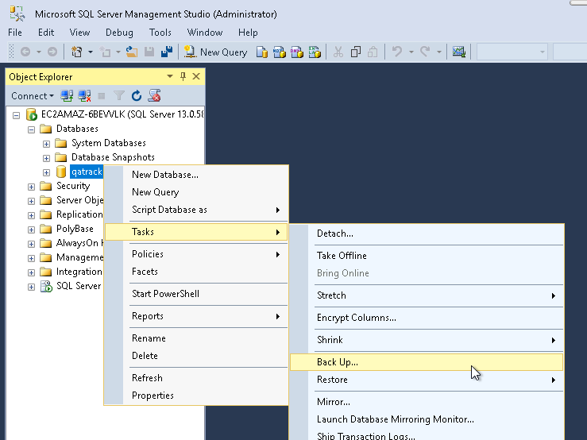
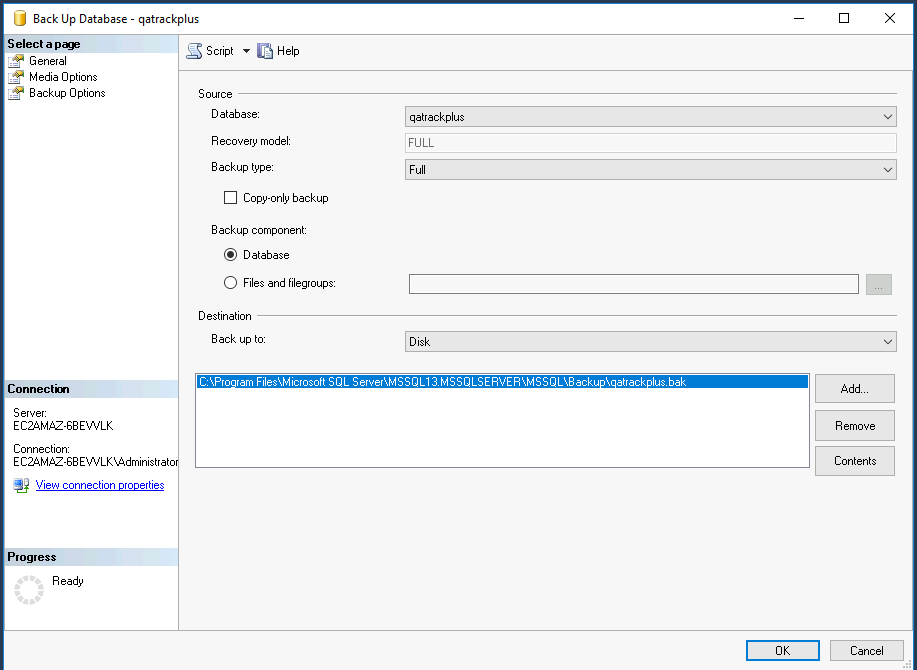

.. _win_upgrading_3_to_4:

Upgrading an existing Windows v3.X.Y installation to v4.0.0
=============================================================

This guide will walk you through upgrading your existing v3.X.Y installation to
v4.0.0.

.. warning::

    This is a **major version upgrade** with several breaking changes:

    * Python must be upgraded from 3.7–3.10 to **3.12**
    * The SQL Server backend package has changed (``sql_server.pyodbc`` →
      ``mssql-django``); your ``local_settings.py`` must be updated before
      running migrations
    * Dependency management has moved from ``requirements\win.txt`` to
      ``uv`` + ``pyproject.toml``
    * All primary key columns are migrated from 32-bit to 64-bit integers —
      on a large database this can take significant time

    **Back up everything before you begin.**

.. contents::
    :local:
    :depth: 2

Take a snapshot
~~~~~~~~~~~~~~~

If your QATrack+ server exists on a virtual machine, now would be a great time
to take a snapshot of your VM in case you need to restore it later.  Consult
with your IT department on how to do this.

Backing up your database
~~~~~~~~~~~~~~~~~~~~~~~~

Open SQL Server Management Studio (SSMS), right click on your database then
select `Tasks -> Back Up..`

    Backup Menu Item

Select `Copy-only backup` and make sure the `Backup component` is set to
`Database`. Take note of where the backup is being stored and then click `OK`:

    Backup Dialog

Stop QATrack+ services
~~~~~~~~~~~~~~~~~~~~~~

Stop the CherryPy service and Django Q cluster before making any changes:

.. code-block:: console

    Stop-ScheduledTask -TaskName "QATrack+ Django Q Cluster"
    python C:\deploy\qatrackplus\QATrack31CherryPyService.py stop

Install Python 3.12
~~~~~~~~~~~~~~~~~~~~

v4.0.0 requires Python 3.12.  Go to https://www.python.org/downloads/ and
download the latest Python 3.12.X 64-bit Windows installer.

Run the installer and on the first page make sure both "Install launcher for
all users" and "Add Python 3.12 to PATH" are checked, then click "Customize
Installation".  On the third page select "Install for all users" before
clicking "Install".

Confirm the new version is on your PATH:

.. code-block:: console

    python --version
    # Python 3.12.X

Install uv
~~~~~~~~~~

v4.0.0 uses `uv <https://docs.astral.sh/uv/>`__ for dependency management.
Install it in a PowerShell terminal:

.. code-block:: console

    powershell -ExecutionPolicy ByPass -c "irm https://astral.sh/uv/install.ps1 | iex"

Restart your terminal and confirm:

.. code-block:: console

    uv --version

Check out v4.0.0
~~~~~~~~~~~~~~~~~

.. code-block:: console

    cd C:\deploy\qatrackplus
    git fetch origin
    git checkout v4.0.0

Create a new database
~~~~~~~~~~~~~~~~~~~~~

v4.0.0 uses a new database named ``qatrackplus40``.  This keeps your existing
``qatrackplus31`` database intact so you can roll back if needed.

Open SQL Server Management Studio, right click the Databases folder and select
"New Database...".  Enter ``qatrackplus40`` as the database name and click OK.

Now add the ``qatrack`` user to the new database.  In the Object Explorer frame,
expand the ``qatrackplus40`` database, right click on Security and select
New->User.  Enter ``qatrack`` as the User name and Login name and then in the
Database Role Membership region select ``db_ddladmin``, ``db_datawriter``,
``db_datareader`` and ``db_owner``.  Click OK.

Repeat for the ``qatrack_reports`` read-only user, granting only
``db_datareader``.

.. note::

    If the ``qatrack`` and ``qatrack_reports`` logins do not exist yet (e.g.
    you are on a different server), create them first under Server Security →
    Logins as described in the :ref:`fresh install guide <win_install_31>`.

Update local_settings.py
~~~~~~~~~~~~~~~~~~~~~~~~~

Open ``C:\deploy\qatrackplus\qatrack\local_settings.py`` in a text editor and
update the following:

1. Change both ``ENGINE`` values from ``sql_server.pyodbc`` to ``mssql``
2. Change both ``NAME`` values from ``qatrackplus31`` to ``qatrackplus40``
3. Ensure the ODBC driver is ``ODBC Driver 17 for SQL Server`` (or later)

The database section should look like:

.. code-block:: python

    DATABASES = {
        'default': {
            'ENGINE': 'mssql',
            'NAME': 'qatrackplus40',
            'USER': 'qatrack',
            'PASSWORD': 'qatrackpass',
            'HOST': '',
            'PORT': '',
            'OPTIONS': {
                'driver': 'ODBC Driver 17 for SQL Server'
            },
        },
        'readonly': {
            'ENGINE': 'mssql',
            'NAME': 'qatrackplus40',
            'USER': 'qatrack_reports',
            'PASSWORD': 'qatrackpass',
            'HOST': '',
            'PORT': '',
            'OPTIONS': {
                'driver': 'ODBC Driver 17 for SQL Server'
            },
        }
    }

.. note::

    If you had an ODBC Driver 13 entry, you must upgrade to ODBC Driver 17 or
    later.  Download it from
    https://www.microsoft.com/en-us/download/details.aspx?id=56567

Install dependencies
~~~~~~~~~~~~~~~~~~~~

Install all required packages using ``uv``:

.. code-block:: console

    cd C:\deploy\qatrackplus
    uv sync --extra win --extra mssql

Migrate data from the old database
~~~~~~~~~~~~~~~~~~~~~~~~~~~~~~~~~~~~

Rather than running a fresh migration, you should restore your v3.x data into
the new ``qatrackplus40`` database and then migrate it forward.

In SQL Server Management Studio, right click ``qatrackplus40`` and select
``Tasks → Restore → Database``.  Under Source, choose ``Device`` and browse to
the backup file you created earlier.  Click OK to restore.

After the restore completes, confirm you can connect:

.. code-block:: console

    cd C:\deploy\qatrackplus
    uv run python manage.py showmigrations accounts

Run migrations
~~~~~~~~~~~~~~

.. warning::

    The migration converts all primary key columns from 32-bit to 64-bit
    integers.  On a large database this requires rebuilding every table and
    **may take a long time**.  Plan for downtime accordingly.

.. code-block:: console

    uv run python manage.py migrate

Update static files:

.. code-block:: console

    uv run python manage.py collectstatic

Update the Windows service
~~~~~~~~~~~~~~~~~~~~~~~~~~

The old ``QATrack31CherryPyService.py`` uses the ``distutils`` module which was
removed in Python 3.12.  Replace it with the updated service script:

.. code-block:: console

    cp deploy\win\QATrackCherryPyService.py C:\deploy\qatrackplus\QATrackCherryPyService.py

Uninstall the old service (run PowerShell as Administrator):

.. code-block:: console

    cd C:\deploy\qatrackplus
    python QATrack31CherryPyService.py stop
    python QATrack31CherryPyService.py remove

Install and start the new service:

.. code-block:: console

    uv run python C:\deploy\qatrackplus\.venv\Scripts\pywin32_postinstall.py -install
    uv run python QATrackCherryPyService.py --startup=auto install
    uv run python QATrackCherryPyService.py start

Open the Windows Services dialog and confirm `QATrack CherryPy Service` is
running.  Navigate to http://localhost:8080/ to verify the application loads.

Update the Django Q scheduled task
~~~~~~~~~~~~~~~~~~~~~~~~~~~~~~~~~~~~

Open Windows Task Scheduler, right click the ``QATrack+ Django Q Cluster`` task
and select Properties.  On the Actions tab, edit the existing action:

* **Program/script**: ``C:\deploy\qatrackplus\.venv\Scripts\python.exe``
* **Add arguments**: ``manage.py qcluster``
* **Start in**: ``C:\deploy\qatrackplus``

Click OK, then right click the task and select Run.  Confirm the cluster is
running:

.. code-block:: console

    uv run python manage.py qmonitor

What Next
---------

* Check the :ref:`settings page <qatrack-config>` for any new configuration
  options introduced in v4.0.0.

* Automate the :ref:`backup of your QATrack+ installation <qatrack_backup>`.

* Read the :ref:`release notes <release_notes>` for a full list of changes
  in v4.0.0.
