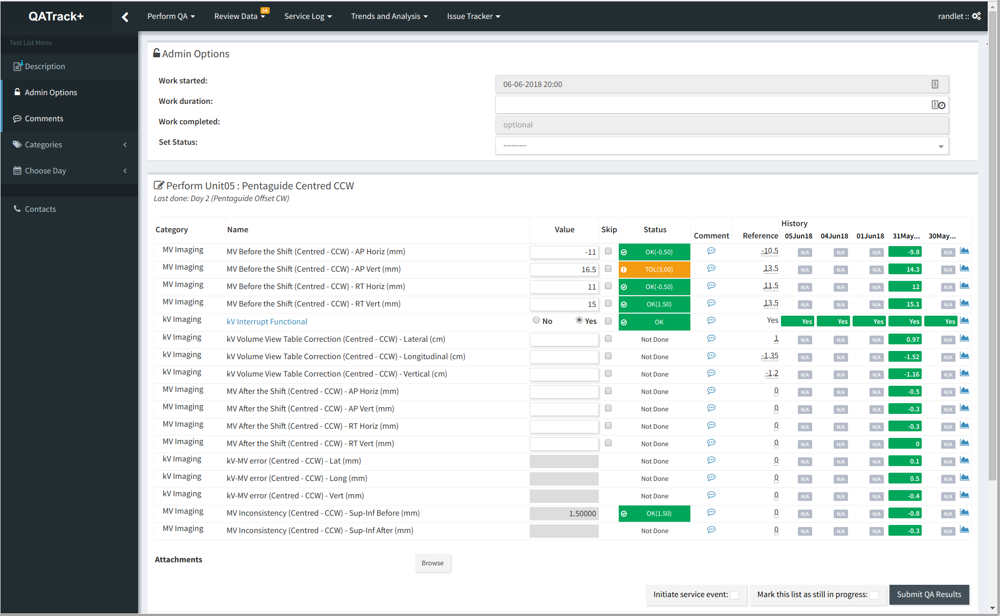
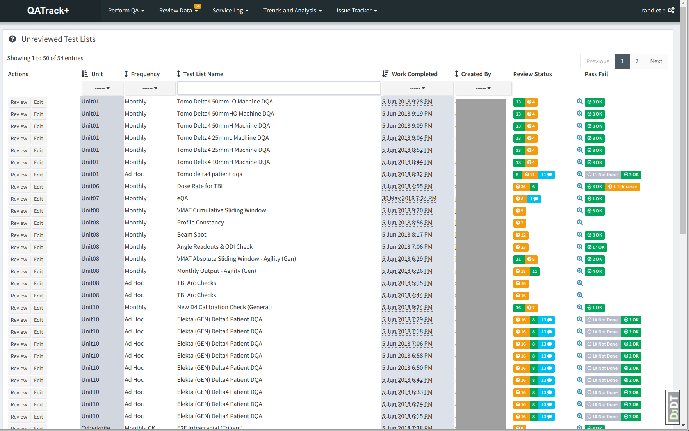
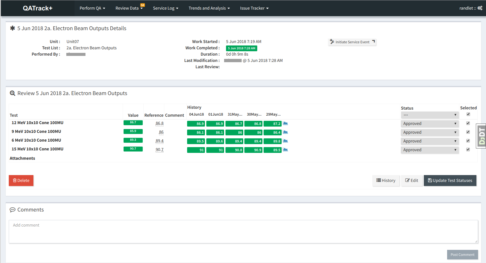
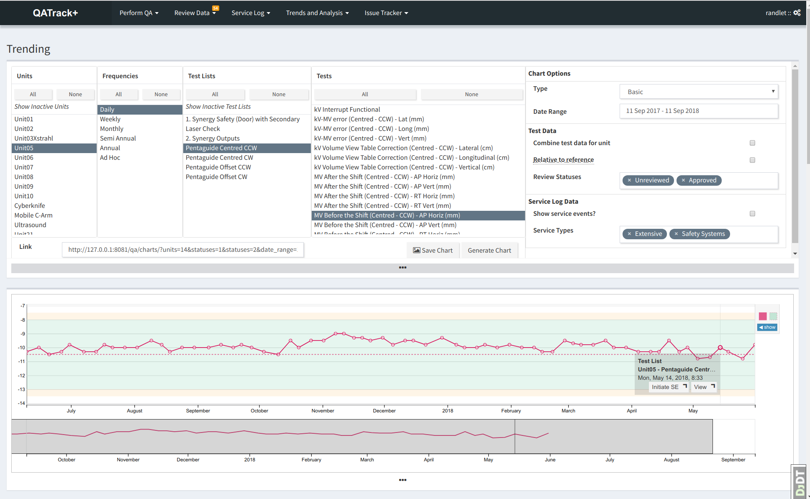
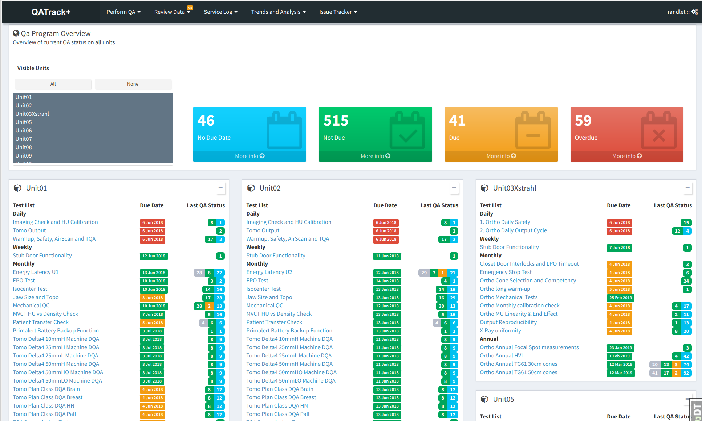
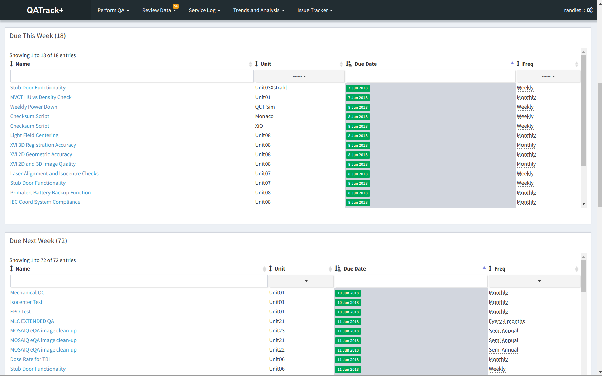
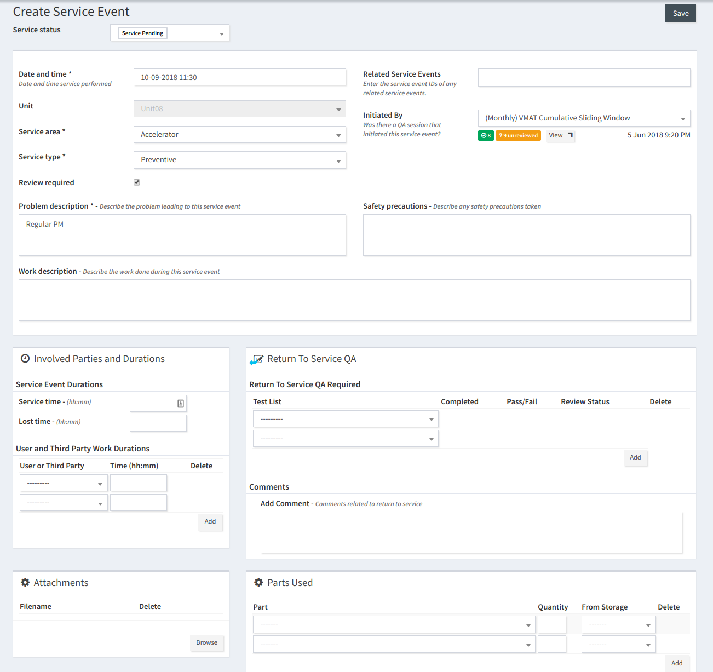
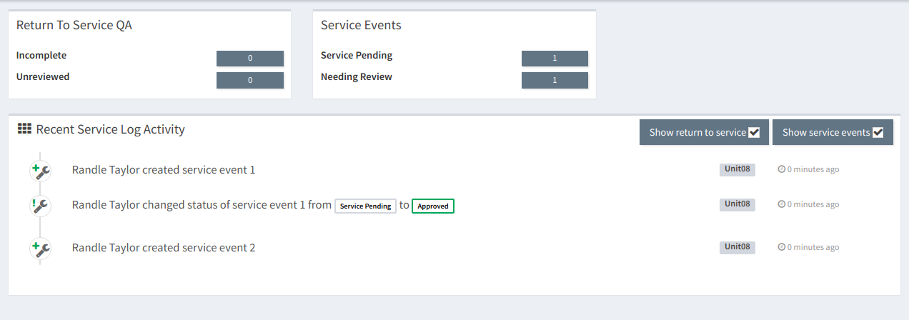
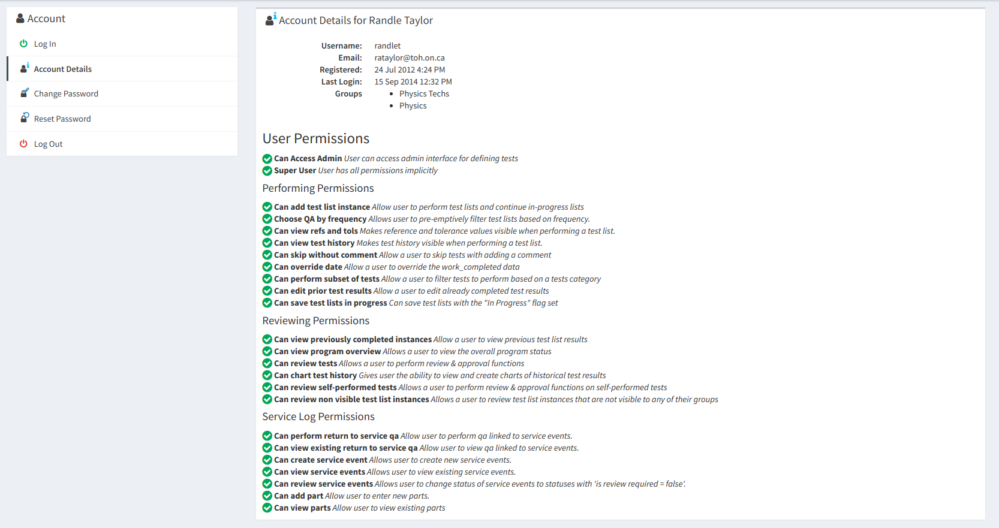
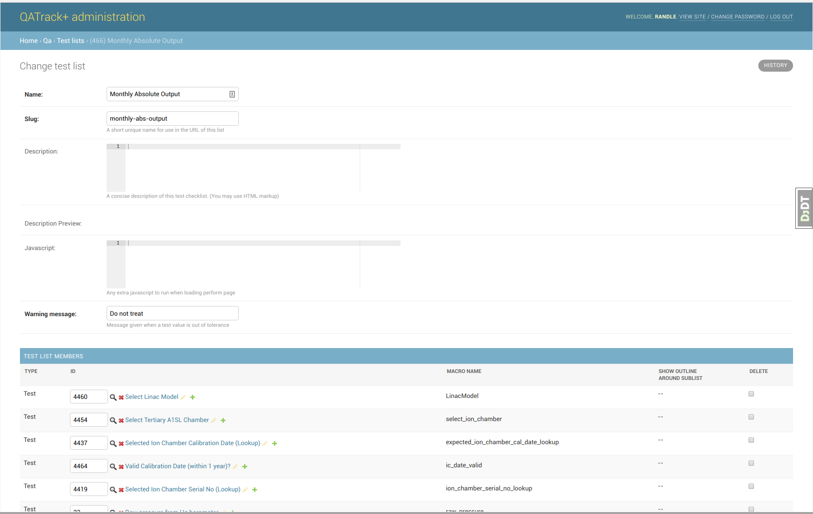

Screenshots
===========

   Example interface for performing QA. Shown are numerical tests, boolean
   tests, and composite tests.

   A listing of all the test lists awaiting review

   A test list instance being reviewed

   Demonstration of QATrack+'s plotting capabilities.

   Screenshot of the QA Program Overview

   Screenshot of the QA Program Overview by Due Status
   

   Entering a new Service Event in QATrack+
   

   The Service Log Dashboard

   Overview of a users permissions

   Admin interface for defining a test list
