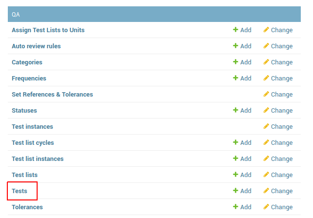
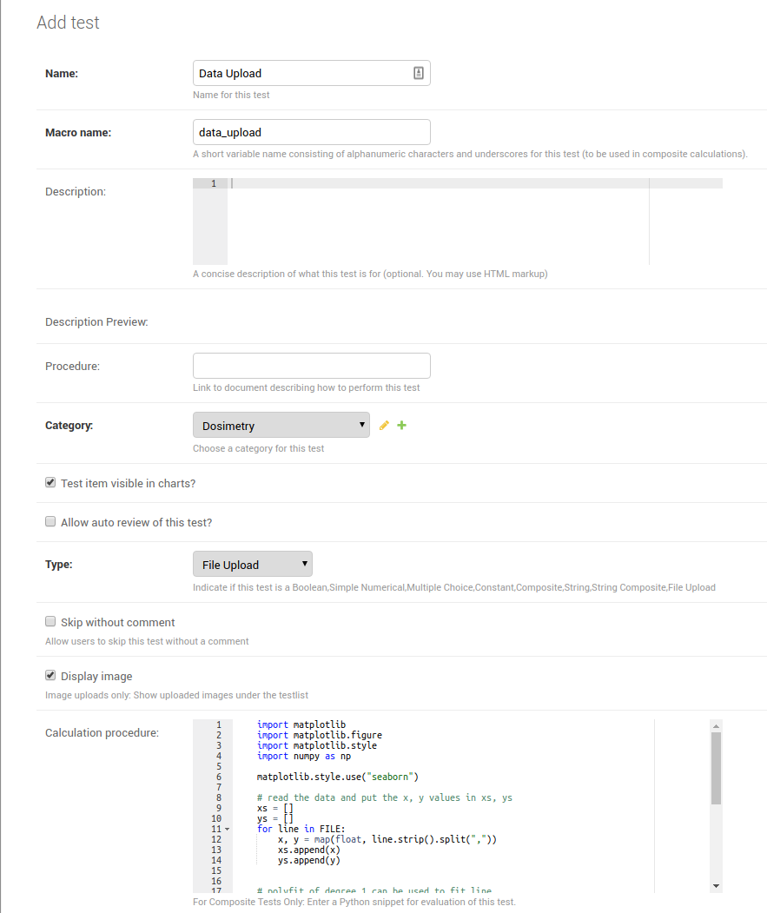
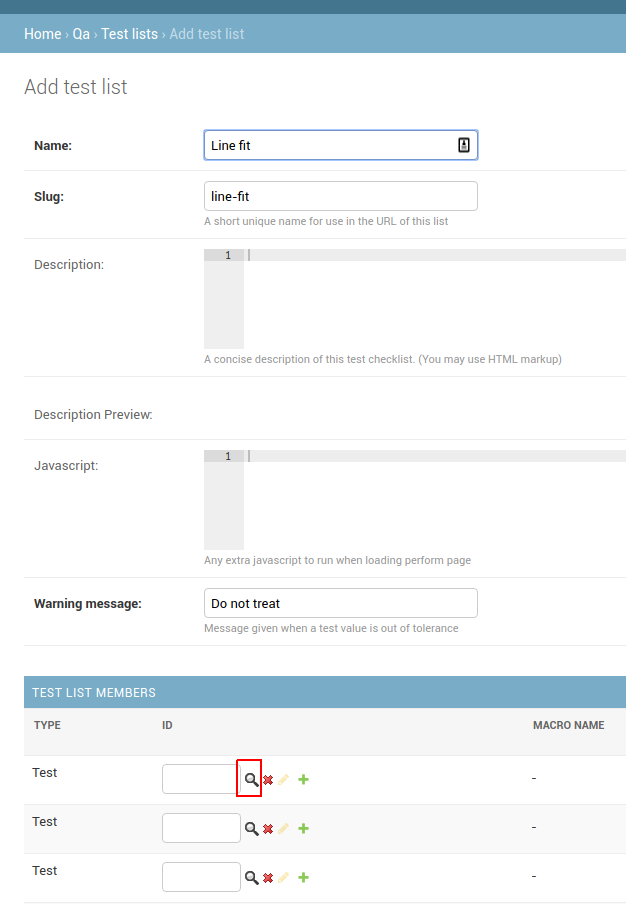
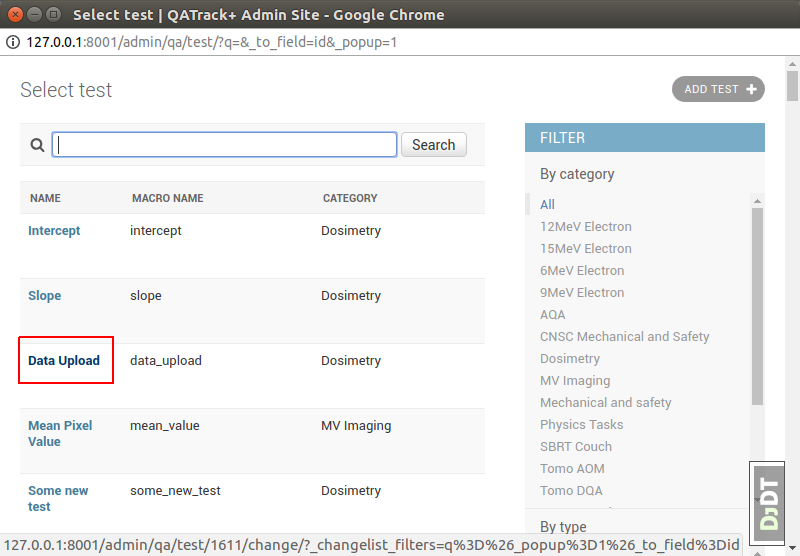
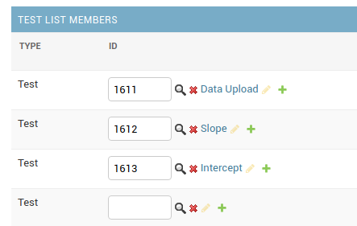
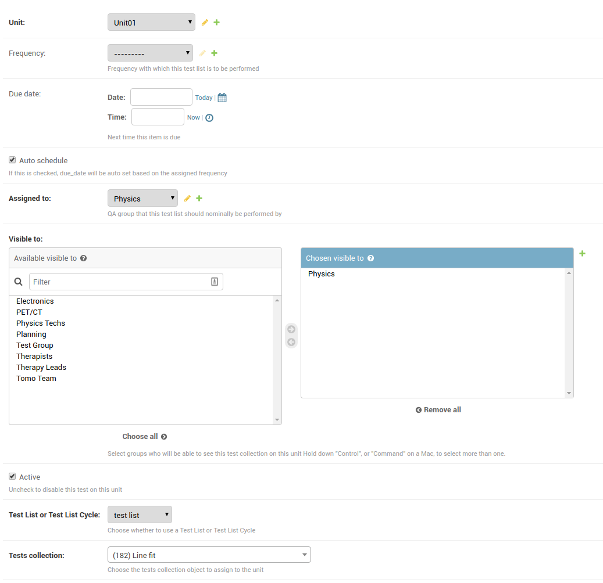
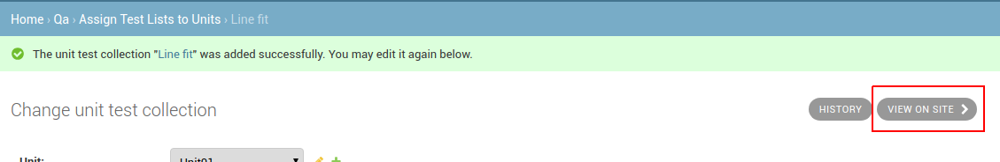
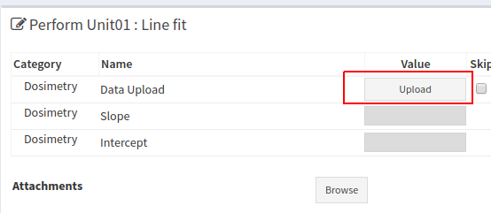
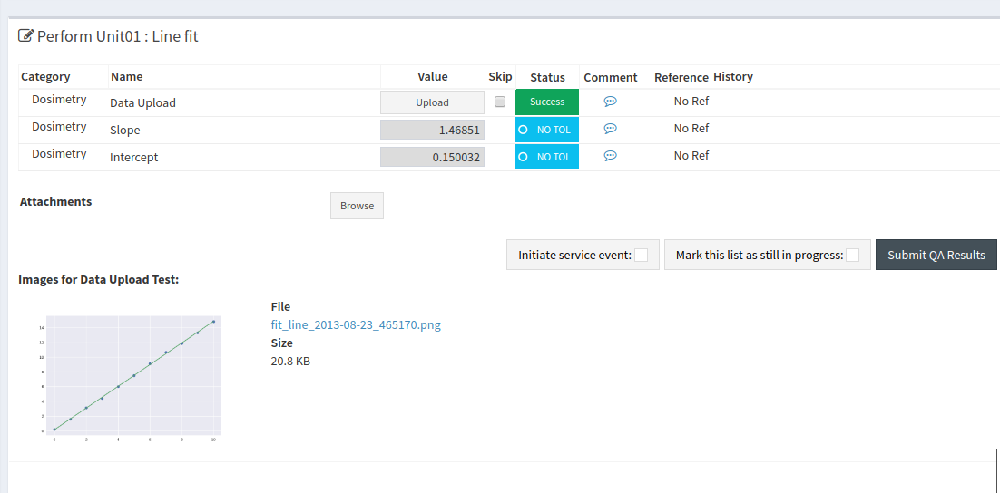

Visualizing Data with Composite Tests
=====================================

In this tutorial we'll set up a test list that uses an uploaded text file to
fit a line to some data, and plot the data as well as the best fit line.

The csv `file we'll be using <test_data.csv>`__ looks like this:

::

    0.0000,0.1821
    1.0000,1.5899
    2.0000,3.1447
    3.0000,4.3780
    4.0000,6.0144
    5.0000,7.4758
    6.0000,9.0759
    7.0000,10.6360
    8.0000,11.8331
    9.0000,13.2787
    10.0000,14.8097

and our goal is to upload this file, fit a line, and record the slope and
intercept of the line. Save the data `file <test_data.csv>`__ for later.

To accomplish this, we need to set up a test list with three tests:

#. An Upload test that will parse the data from the file, fit the line, and
   generate the plot using matplotlib.

#. A Composite test to record the slope of the line.

#. A Composite test to record the intercept of the line.

Configuring the Tests
~~~~~~~~~~~~~~~~~~~~~

:ref:`Navigate to the admin section <access_admin_site>` of the site and click
on the `Tests` item in the `QA` section.

   Tests admin link

Now click on the `Add Test` button at the top right of the next page:

.. figure:: add_test.png
   :alt: Add test button

   Add test button

Then fill out the Test fields as follows:

* Name: Data upload
* Macro name: data_upload
* Category: (pick any available category, or add a new one)
* Type: File Upload
* Display image: Make sure this is checked so that our plot will be visible
* Calculation procedure:

  ::

    import matplotlib
    import matplotlib.figure
    import matplotlib.style
    import numpy as np

    matplotlib.style.use("seaborn")

    # read the data and put the x, y values in xs, ys
    xs = []
    ys = []
    for line in FILE:
        x, y = map(float, line.strip().split(","))
        xs.append(x)
        ys.append(y)

    # polyfit of degree 1 can be used to fit line
    slope, intercept = np.polyfit(xs, ys, 1)

    # calculate some datapoints of the line of best fit for display
    fit_ys = [slope*x + intercept for x in xs]

    # plot the data
    fig = UTILS.get_figure()
    axes = fig.gca() # gca == get_current_axes
    axes.plot(xs, ys, 'o', label="Raw data")
    axes.plot(xs, fit_ys, label="Best fit line")

    # use QATrack+ UTILS to save the plot as an image
    UTILS.write_file("fit_line.png", axes)

    # set the final result which can be used by other composite tests
    data_upload = {'slope': slope, 'intercept': intercept}

This should look similar to:

   Upload data test config

Once you have that complete click `Save and add another` and create another Test:

* Name: Slope
* Macro name: slope
* Category: (pick any available category, or add a new one)
* Type: Composite
* Calculation procedure:

  ::

    slope = data_upload['slope']

And again click `Save and add another` and create the final Test:

* Name: Intercept
* Macro name: intercept
* Category: (pick any available category, or add a new one)
* Type: Composite
* Calculation procedure:

  ::

    intercept = data_upload['intercept']

Then click `Save`

Settting up the Test List
~~~~~~~~~~~~~~~~~~~~~~~~~

Navigate back to the `Home` or `QA` page of the Admin area and then create a
new Test List by clicking the `Test List` link in the `QA` section and then
clicking the `Add Test List` button.

Give your test list the name `Line fit example` or similar, then in the `Test
List Members` section, click on the magnifying class next to the first `Test`
box:

   Find a Test for your Test List

and then select the `Upload Data` test:

   Select a Test for your Test List

Do the same for the Slope and Intercept tests:

   All tests selected

Then click `Save`.

Assigning the Test List to a Unit
~~~~~~~~~~~~~~~~~~~~~~~~~~~~~~~~~

Navigate back to the `Home` or `QA` page of the Admin area and then assign the
Test List by clicking the `Assign Test Lists to Units` link in the `QA` section
and then click the `Add Unit Test Collection` button at the top right.

Fill out the required fields:

* Select a Unit from the `Unit` drop down
* Select a Group from the `Assigned To` drop down
* Choose one or more Groups (your user must be part of one of the groups) in
  the `Visible to` control
* Select `test list` in the `Test List or Test List Cycle` drop down
* Finally select the `Line fit` (or whatever you called it!) Test List in the
  `Tests collection` field.

   Assign Test List to Unit

Now click `Save and Continue Editing` which will bring you back to the same
page. You can then click `View on site` to perform the Test List

   View on Site

Performing the Test List
~~~~~~~~~~~~~~~~~~~~~~~~

Click the `Upload` button in the `Data Upload` column and select the `file
<test_data.csv>`__ you saved earlier.

   Upload button

If everything was set up correctly you should see the following:

   Performed Test List

You can now submit your results!
