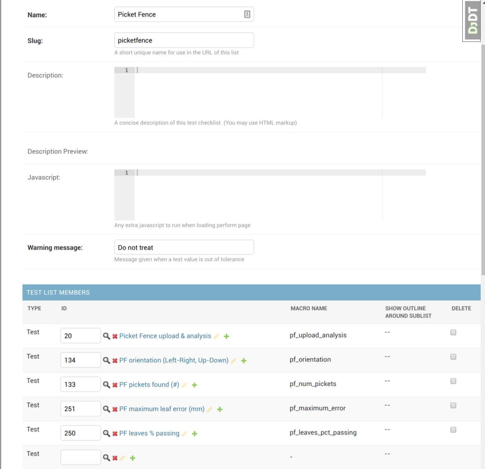
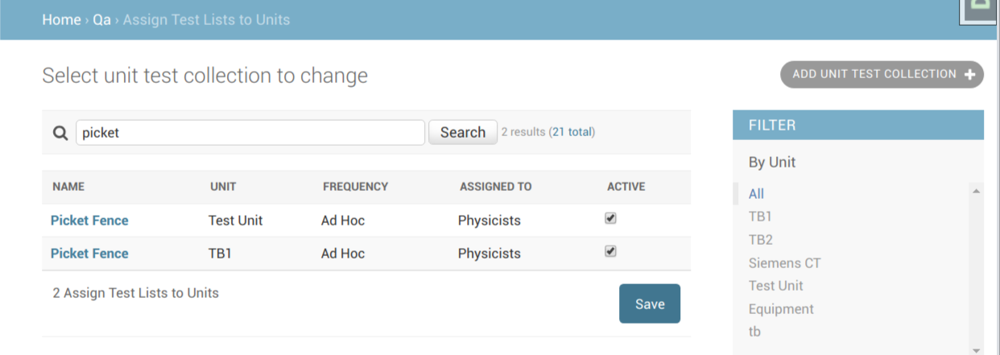
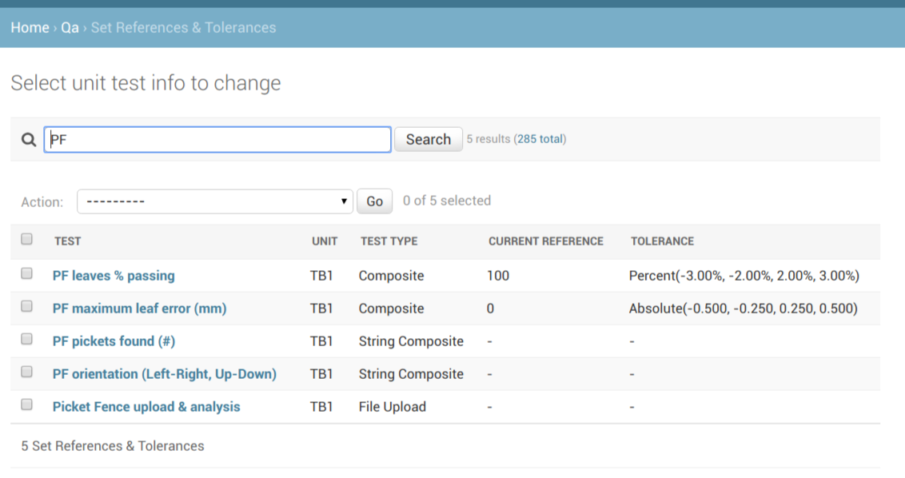
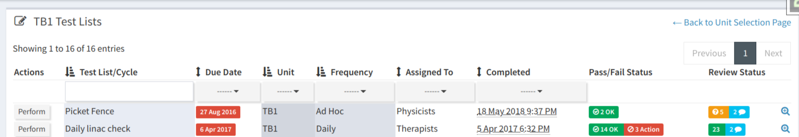
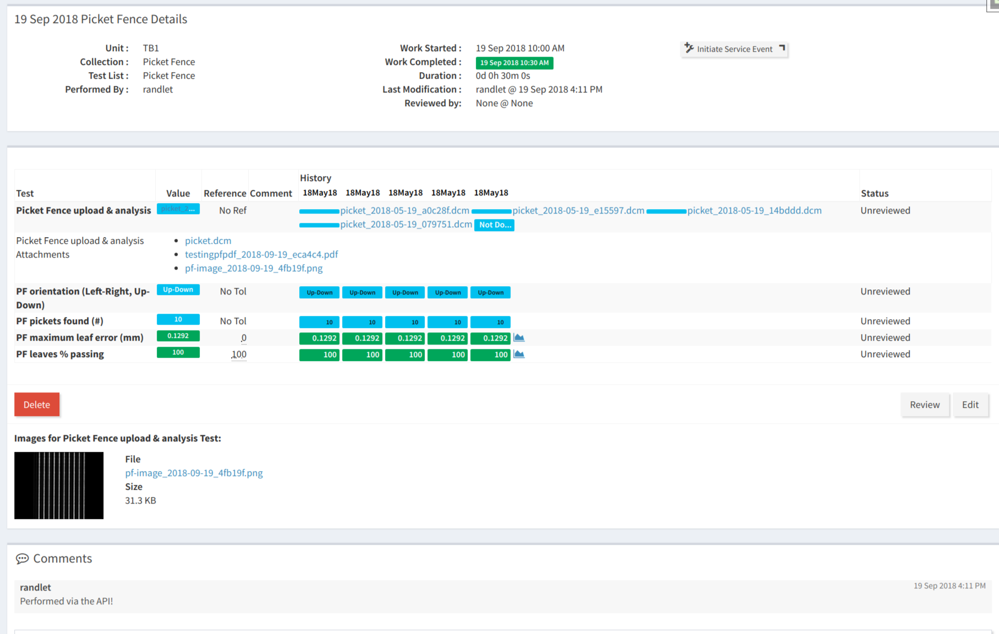

.. _tutorial_pylinac_api:

Image Analysis Using pylinac and the QATrack+ API
=================================================

As of version 0.3.0, QATrack+ includes `pylinac
<https://pylinac.readthedocs.io/en/latest/>`__ which for image and log file
analysis. This tutorial will cover setting up a **Picket Fence** imaging test
and then performing the test both via the web interface and the QATrack+ API.

Setting up the Test List
------------------------

Log into QATrack+ and :ref:`navigate to the admin section <access_admin_site>`.
Create the following tests (if you haven't created a Test List before, go
through the :ref:`step-by-step test list tutorial <tutorial_step_by_step>`
before attempting this tutorial):

#.  Name:
        Picket Fence upload & analysis

    Macro name:
        pf_upload_analysis

    Category:
        Choose existing Category or :ref:`create an Image Analysis category <qa_categories>`.

    Type:
        File Upload

    Display image:
        Ensure this field is checked off

    Calculation procedure:

        .. code-block:: python

            import io
            import pylinac

            # run the picket fence analysis using pylinac
            # note the use of `BIN_FILE` rather than `FILE` since we are dealing with an image
            pf = pylinac.PicketFence(BIN_FILE.path)
            pf.analyze()

            # our dictionary of results to return
            pf_upload_analysis = {
                'percent passing': pf.percent_passing,
                'max error': pf.max_error,
                'number of pickets': pf.num_pickets,
                'orientation': pf.orientation,

            }

            # create a pylinac PDF and create an attachment with it
            data = io.BytesIO()
            pf.publish_pdf(data)
            UTILS.write_file('testingpfpdf.pdf', data)

            # convert the image to a png file so it can be displayed when performing the test list
            UTILS.write_file('pf-image.png', pf.image)

#.  Name:
        PF orientation (Left-Right, Up-down)

    Macro name:
        pf_orientation

    Category:
        Choose existing Category

    Type:
        String Composite

    Calculation procedure:

        .. code-block:: python

            pf_orientation = pf_upload_analysis['orientation']

#.  Name:
        PF pickets found (#)

    Macro name:
        pf_num_pickets

    Category:
        Choose existing Category

    Type:
        Composite

    Calculation procedure:

        .. code-block:: python

            pf_num_pickets = pf_upload_analysis['number of pickets']

#.  Name:
        PF maximum leaf error (mm)

    Macro name:
        pf_maximum_error

    Category:
        Choose existing Category

    Type:
        Composite

    Calculation procedure:

        .. code-block:: python

            pf_maximum_error = pf_upload_analysis['max error']

#.  Name:
        PF leaves % passing

    Macro name:
        pf_leaves_pct_passing

    Category:
        Choose existing Category

    Type:
        Composite

    Calculation procedure:

        .. code-block:: python

            pf_leaves_pct_passing = pf_upload_analysis['percent passing']

After you have created the Tests, create a Test List called `Picket Fence` that
consists of the 5 Tests we just created:

    The Picket Fence Test List Definition

Next :ref:`assign this test list to one or more Units <qa_assign_to_unit>`:

    Assigning Picket Fence Test List to Unit

and :ref:`set References and Tolerances <qa_ref_tols>` on the `Maximum Leaf
Error (mm)` and `PF leaves % passing` as shown below:

    References and Tolerances for Picket Fence test

The Test List is now ready to perform!

Performing the Test List via the web UI
---------------------------------------

Navigate to the Test List selection for this Unit and click `Perform` next to
the `Picket Fence` Test List:

    Selecting the Picket Fence Test List

on the Test List page, click the Upload button and select your picket fence
dicom (or other image format file). After the file is uploaded you will see
your other test values automatically populated as well as the image shown:

.. figure:: images/uploaded.png
    :alt: Test list values after file upload

    Test list values after file upload

Click *Submit QC Results* and you are done!

Performing the Test List via the API
------------------------------------

As of version 0.3.0, :ref:`QATrack+ includes an API <qatrack_api>` which
can be used for automating the entry of Test List data.  An example of
using the API via a Python script is shown here, although the process should
be similar in most other programming languages!

Obtain an API token
~~~~~~~~~~~~~~~~~~~

Before you can access the API, you need to have an API token which can either be
created through the Admin section or retrieved programmaticaly:

.. code-block:: python

    import requests

    root = "http://yourservernamehere/api"
    token_url = root + "/get-token/"
    resp = requests.post(token_url, {'username': 'user', 'password': 'password'})
    token = resp.json()['token']

This token must be included with every request to the API.

Find the Unit Test Collection we want to perform
~~~~~~~~~~~~~~~~~~~~~~~~~~~~~~~~~~~~~~~~~~~~~~~~

First we will use the API to retrieve the URL of the :term:`Unit Test Collection`
we want to perform:

.. code-block:: python

    import base64
    import requests

    # the request headers must include the API token
    api_token = "YOUR API TOKEN HERE"
    headers = {"Authorization": "Token %s" % api_token}

    root = "http://yourservernamehere/api"

    unit_name = "TB1"
    test_list_name = "Picket Fence"
    url = root + '/qa/unittestcollections/?unit__name=%s&test_list__name=%s' % (unit_name, test_list_name)

    # find the UnitTestCollection we want to perform
    resp = requests.get(url, headers=headers)
    utc_url = resp.json()['results'][0]['url']

    # prepare the data to submit to the API. Binary files need to be base64 encoded before posting!
    data = {
        'unit_test_collection': utc_url,
        'work_started': "2018-09-19 10:00",
        'work_completed': "2018-09-19 10:30",
        'comment': "Performed via the API!",  # optional
        'tests': {
            'pf_upload_analysis': {  # pf_upload_analysis is the name of our upload test
                'filename': 'picket.dcm', # path to file
                'value': base64.b64encode(open("/home/randlet/Downloads/picket.dcm", 'rb').read()).decode(),
                'encoding': 'base64'
            },
        },
        'attachments': []  # optional
    }

    # send our data to the server
    resp = requests.post(root + "/qa/testlistinstances/", json=data, headers=headers)

    if resp.status_code == requests.codes.CREATED: # http code 201
        completed_url = resp.json()['site_url']
        print("Test List performed successfully! View your Test List Instance at %s" % completed_url)
    else:
        print("Your request failed with error %s (%s)" (resp.status_code, resp.reason))

Running the script should show:

.. code-block:: shell

    Test List performed successfully! View your Test List Instance at http://yourservername/qa/session/details/60/

and then viewing that link your browser:

    Viewing Test List Details after posting image via API

Acknowledgements
----------------

This Test List was originally created with assistance from James Kerns, author
of pylinac.
