.. _tutorial_service_log:

A Complete Service Log Example
==============================

In this tutorial we will walk through a complete example of using Service Log
to record an output adjustment that is made after morning QC revealed that the
output was too high.

Scenario
--------

The output on a unit has been trending upwards for a little while and one
morning the morning output check indicates that the machine output is outside
of action levels and treatment can not begin:

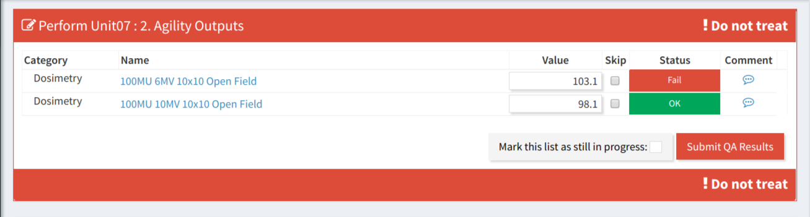

    Output is outside of action levels

The therapist measuring output uses the QATrack+ contacts information to call the
on on-call physcist and informs them of the issue:

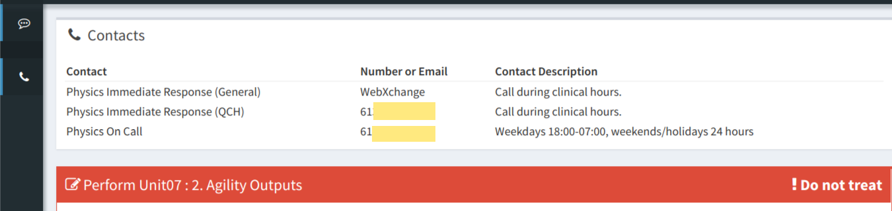

    Contacts displayed while performing QC

The physicist must now restrict the machine and perform an output adjustment
working alongside the field service engineer (FSE).

Resolution
----------

The physicist opens QATrack+ and visits the `Enter new Service Event` page:

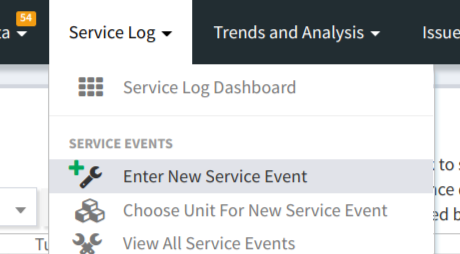

    The New Service Event Menu

The physicist then enters the basic information about this service event:

.. figure:: images/service_event_basic_fields.png
    :alt: Basic information about the Service Event

    Basic information about the Service Event

and then, since this SE was related to a specific :term:`Test List Instance`,
they choose the related Test List, and specific Test List Instance from the
`Initiated By` drop down menu and popup:

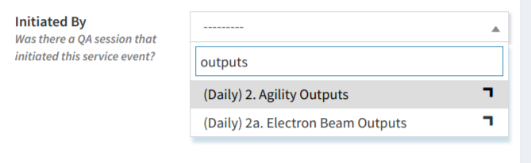

    Selecting Initiated By Test List

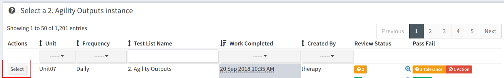

    Selecting Initiated By Test List Instance

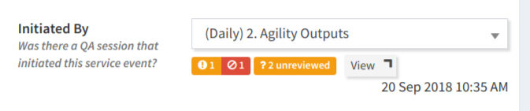

    Selected Initiated By Test List Instance

Since the service will be performed, now, the physicist changes the Service
Status to  `Service In Progress`:

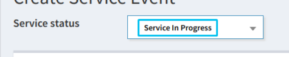

    Service In Progress status

Next the physicist selects the Return To Service QC that will be required before
the Unit can be released for clinical duty:

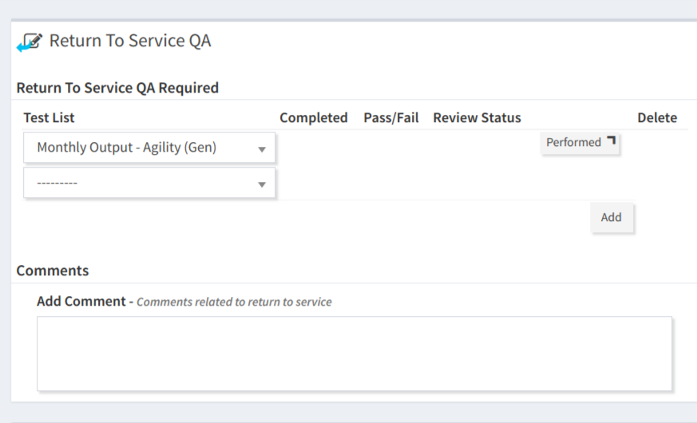

    Return To Service QC Selected

The physicist now clicks `Save` and the are ready to make the output
adjustment. Note that the Service Log Dashboard will now show 1 incomplete
:term:`Return to Service QC` and 1 Service Event needing review.

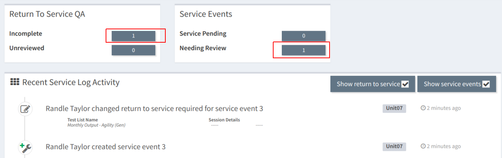

    Service log dashboard

After The Adjustment
--------------------

The physicist and FSE have now made the adjustment and will now, perform the
Return to Service QC. The physicist clicks the  `Incomplete Return To Service QC` button (shown above)
and then clicks `Perform` next to the RTS QC list item:

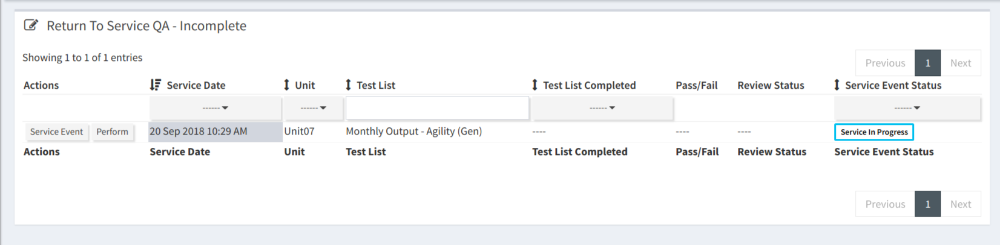

    Return To Service QC Listing

After the RTSQC is performed the physicist returns to Edit the Service Event so
they can complete the entry of how much time it took and who was involved:

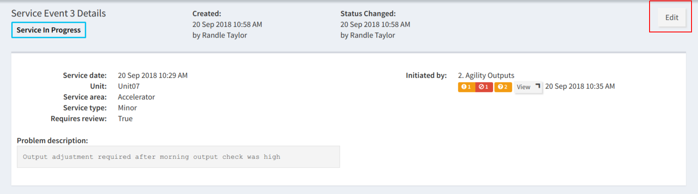

    Edit Service Event Button

The `Work description`, `Service Event Durations`, `Group Members Involved` and
`User and Third Party Work Durations` fields can now all be filled out (If any
parts were used in the Service Event, this would also be the time to enter
them):

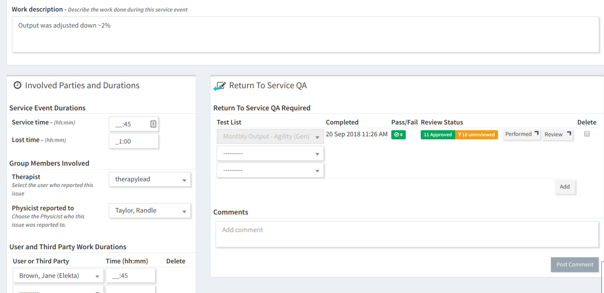

    Fields filled out after Service Event is completed

The `Service Event Status` can now be set to `Service Complete`:

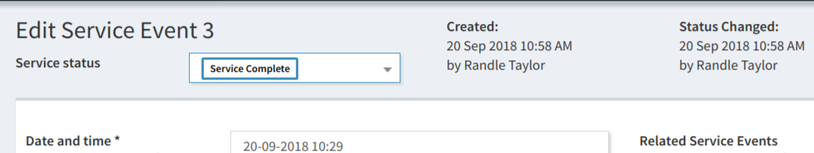

    Service completed status

and `Save`'d again.

The Dashboard will now show that there is one Return To Service QC, and 1
Service Event awaiting review:

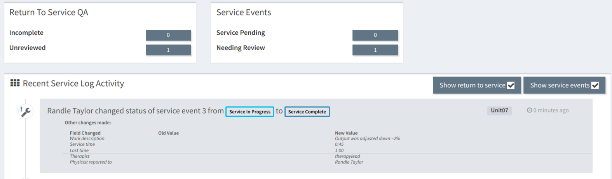

    Dashboard after Return To Service QC

Reviewing The RTSQC and Service Event
~~~~~~~~~~~~~~~~~~~~~~~~~~~~~~~~~~~~~

The physicist now goes back to the `Edit` page for the Service Event. Note that
an attempt to save the Service Event with the Service Event Status to
`Approved` before the RTSQC has been approved will result in an error!

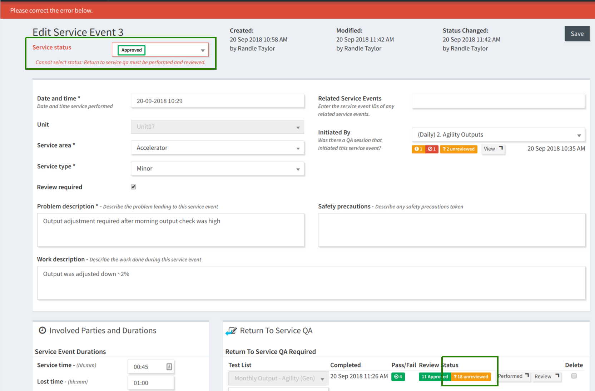

    Can't approve a Service Event without reviewing the RTS QC first

Instead, the physicist first clicks through the `Review` link for the RTSQC and
:ref:`reviews <qa_review>` the QC:

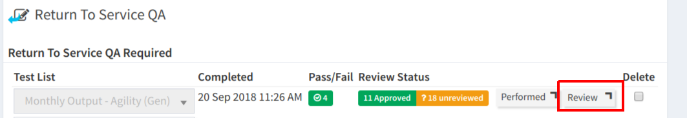

    Review RTSQC Link

after the RTSQC Test List Instance is reviewed, the physicist is directed back
to the `Edit` page for the Service Event where you can see the updated `Review
Status` of the RTSQC:

.. figure:: images/all_reviewed.png
    :alt: All RTS QC reviewed

    All RTS QC reviewed

The Service Event Status can now be set to `Approved` and this Service Event is
now complete!

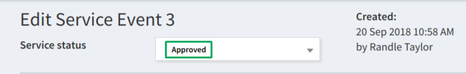

    Service Event Approved

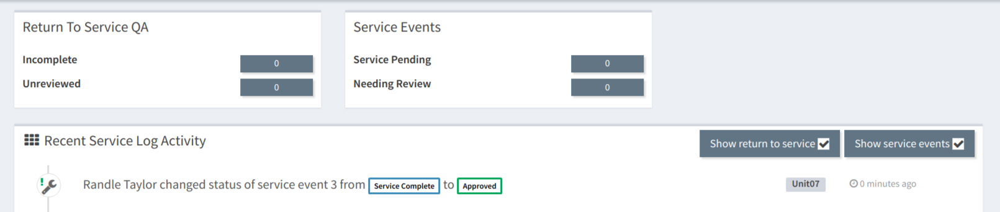

    Dashboard after Service Event reviewed and approved

