.. _tutorial_step_by_step:

Setting up, performing, and reviewing your first test list step-by-step
=======================================================================

This guide will take you through:

#. Logging in and accessing the admin interface

#. :ref:`Changing the name <qa_admin_site_name>` displayed at the top of your QATrack+ website

#. Creating a new :ref:`Unit <units_admin>`

#. Creating different :ref:`user groups <qa_auth>`

#. Configuring :ref:`test statuses <qa_statuses>`

#. Setting up a :ref:`test list <qa_test_lists>` for performing a linac output measurement,

#. :ref:`Assigning the test list to a unit <qa_assign_to_unit>`

#. :ref:`Setting references and tolerances <qa_ref_tols>` for your tests.

#. :ref:`Setting references and tolerances <qa_ref_tols>` for your tests.

#. :ref:`Performing the Test List <qa_perform>`

#. :ref:`Reviewing the Test List Instance <qa_review>`

This tutorial assumes your website administrator has QATrack+ configured and
running on a server somewhere and has assigned you a username/password with
:ref:`superuser <auth_users>` status.

Logging in and accessing the admin interface
--------------------------------------------

Access the url for QATrack+ (your website adminstrator should have provided you
with a URL) in your favourite web browser.  QATrack+ looks and works best with
`Chrome <https://www.google.com/chrome/>`__ or `Firefox
<http://www.mozilla.org/en-US/firefox/new/>`__ but Internet Explorer versions
11 and up are also supported.

If you are not already logged in, you will be taken to the login page:

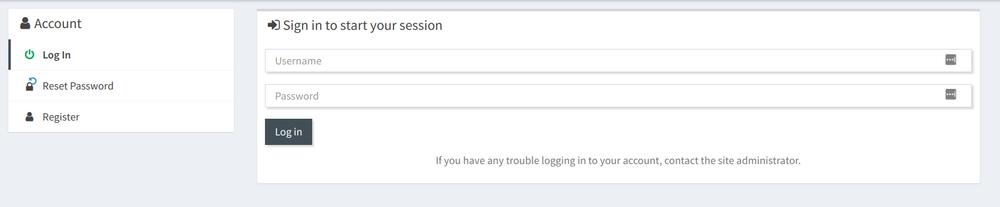

    The QATrack+ login screen

enter your username and password and click the **Log In** button.

After logging in, you should see a screen similar to the one below:

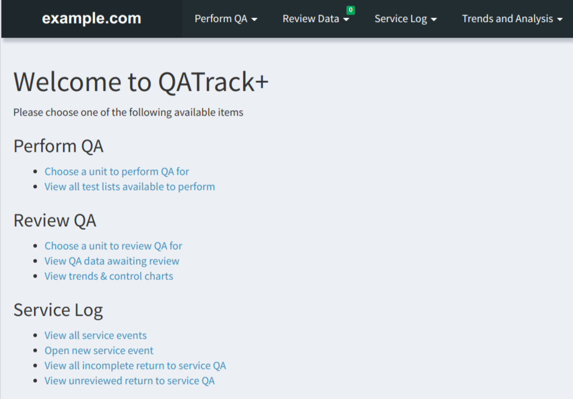

    QATrack+ home screen

Click the little dropdown arrow next to your name in the top right hand corner,
and then select the **Admin** option from the dropdown menu.

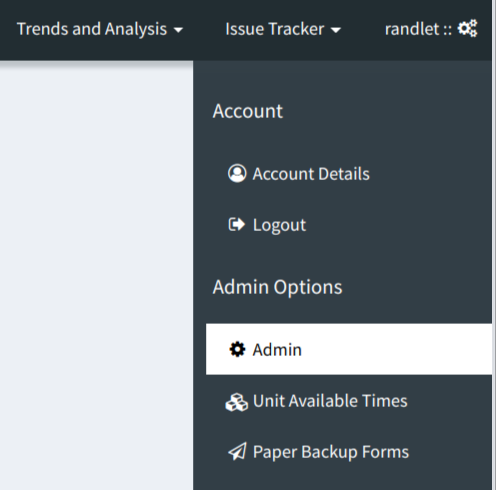

    Accessing the QATrack+ admin section

This wll take you to the main admin page where you will be doing all of your
QATrack+ configuration.

Setting up the name of your QATrack+ website
~~~~~~~~~~~~~~~~~~~~~~~~~~~~~~~~~~~~~~~~~~~~

As you may have noticed in earlier screen shots, the words "example.com" are
displayed at the top of your website.  Let's change that to "Your Hospital Name".

From the main admin page find the **Websites** section and click on the
**Websites** link.

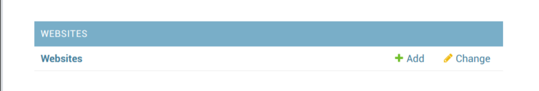

    Sites section of the admin

Click on the `example.com` entry under the **Domain name** column header.

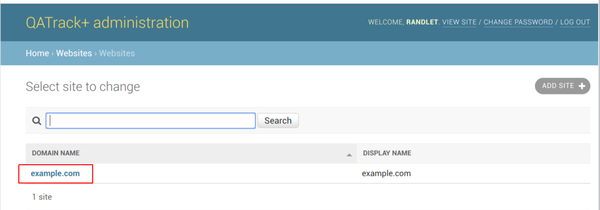

    The example.com site object

and then set the relevant fields (ask your admin if you're not sure of
the domain name to use) and click **Save** when you're finished.

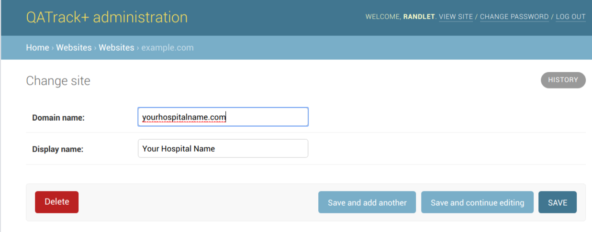

    Setting the website name

If you now return to the main site (at any time you can click the **QATrack+
administration** header at the top of the admin pages to return to the main
QATrack+ site) you should see your site now says **Your Hospital Name+** at the
top rather than **example.com**.

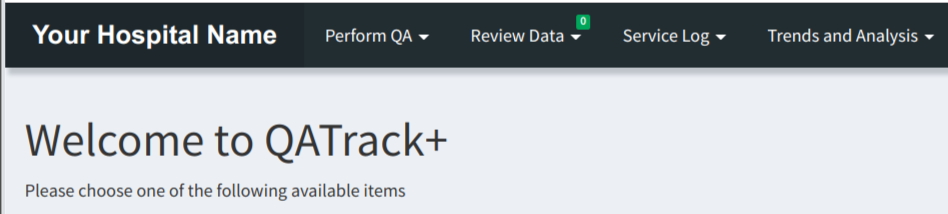

    Changed site name

In the next step of this tutorial we will configure a new Unit.

Creating a new Unit
-------------------

In order to prevent duplicating information here, please follow the
instructions in the :ref:`Units administration docs <units_admin>` to create a
new Unit before continuing.

Creating a New User Group
-------------------------

After you've created your Unit, return to the main admin page and click on the
**Groups** link under the **Auth** section and then click the **Add group**
button in the top right.

Set the **Name** field to `Physics` and choose the following set of permissions:

* **attachments | attachment | Can add attachment**
* **qa | frequency | Choose QC by Frequency**
* **qa | test instance | Can review &amp; approve tests**
* **qa | test instance | Can review &amp; approve self-performed tests**
* **qa | test instance | Can skip tests without comment**
* **qa | test instance | Can view charts of test history**
* **qa | test instance | Can see test history when performing QC**
* **qa | test list instance | Can add test list instance**
* **qa | test list instance | Can override date**
* **qa | test list instance | Can perform subset of tests**
* **qa | test list instance | Can save test lists as 'In Progress'**
* **qa | test list instance | Can view previously completed instances**
* **qa | test list instance | Can change test list instance**
* **qa | unit test collection | Can view tli and utc not visible to user's groups**
* **qa | unit test collection | Can view program overview**
* **qa | unit test info | Can view Refs and Tols**
* **service_log | return to service qa | Can add return to service qa**
* **service_log | return to service qa | Can perform return to service qa**
* **service_log | return to service qa | Can view return to service qa**
* **service_log | service event | Can add service event**
* **service_log | service event | Can review service event**
* **service_log | service event | Can view service event**
* **units | unit available time | Can change unit available time**
* **units | unit available time edit | Can add unit available time edit**
* **units | unit available time edit | Can change unit available time edit**

Your group should look like the following:

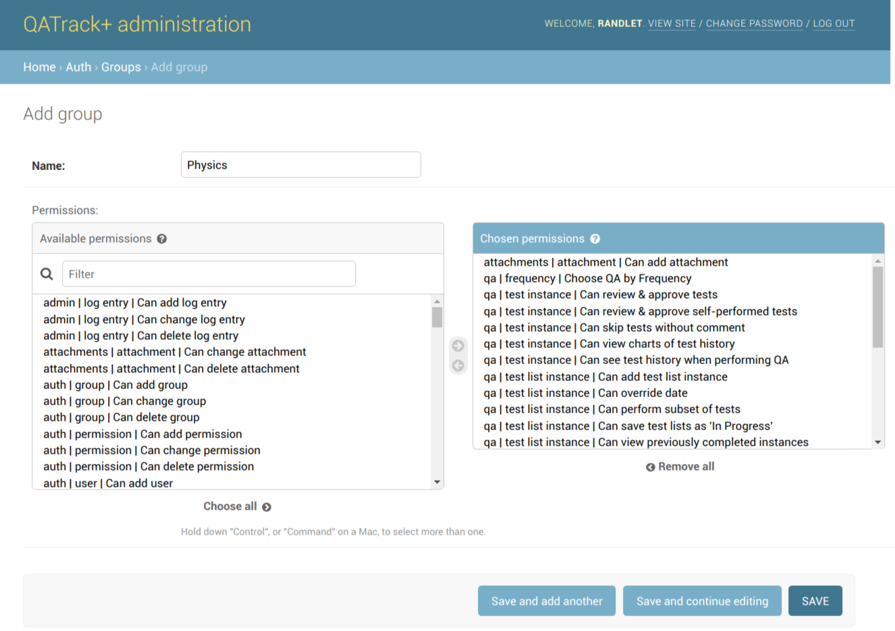

    Defining a physics group

Click **Save** and you will now see your new group in the listings page.

.. figure:: images/group_listing.png
    :alt: Group listings

    Group listings

The last step for this section is to add yourself to the `Physics` group.
Visit your user profile by going to the **Users** section under the **Auth**
section and clicking on your username.

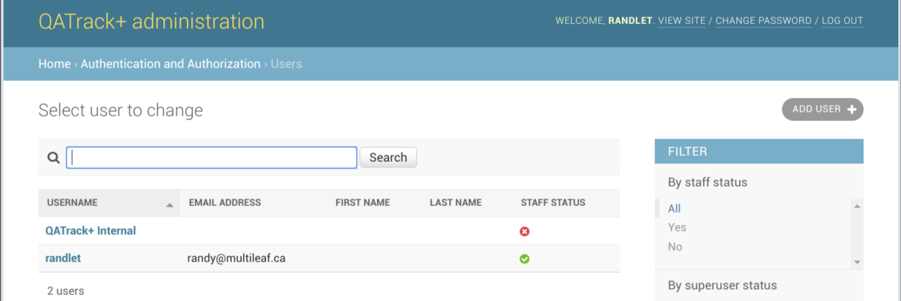

    Choose a user to edit

On the next page find the **Groups** field and add *Physics* to the `Chosen
Groups` list.

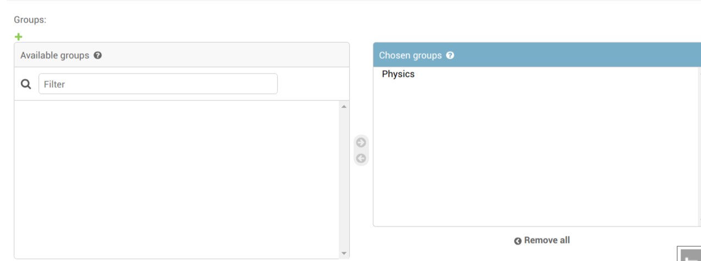

    selecting a group

Click on **Save** to finalize the addition of yourself to the *Physics* group.

Creating Test Statuses
----------------------

We are next going to create two test statuses; first an `Unreviewed` status
which will be the default :term:`Test Instance Status` given to test data when
they are performed and second an `Approved` status that can be applied to the
tests after they have been reviewed.

From the main admin page click on the **Statuses** link under the **QC**
section and click the **Add test instance status** button in the top right.

Give the status a **Name** of `Unreviewed`, a **Slug** of `unreviewed` and a
description of `Default status for tests which have just been completed.`.
Next, check off the **Is default** checkbox and then click **Save and add
another**.

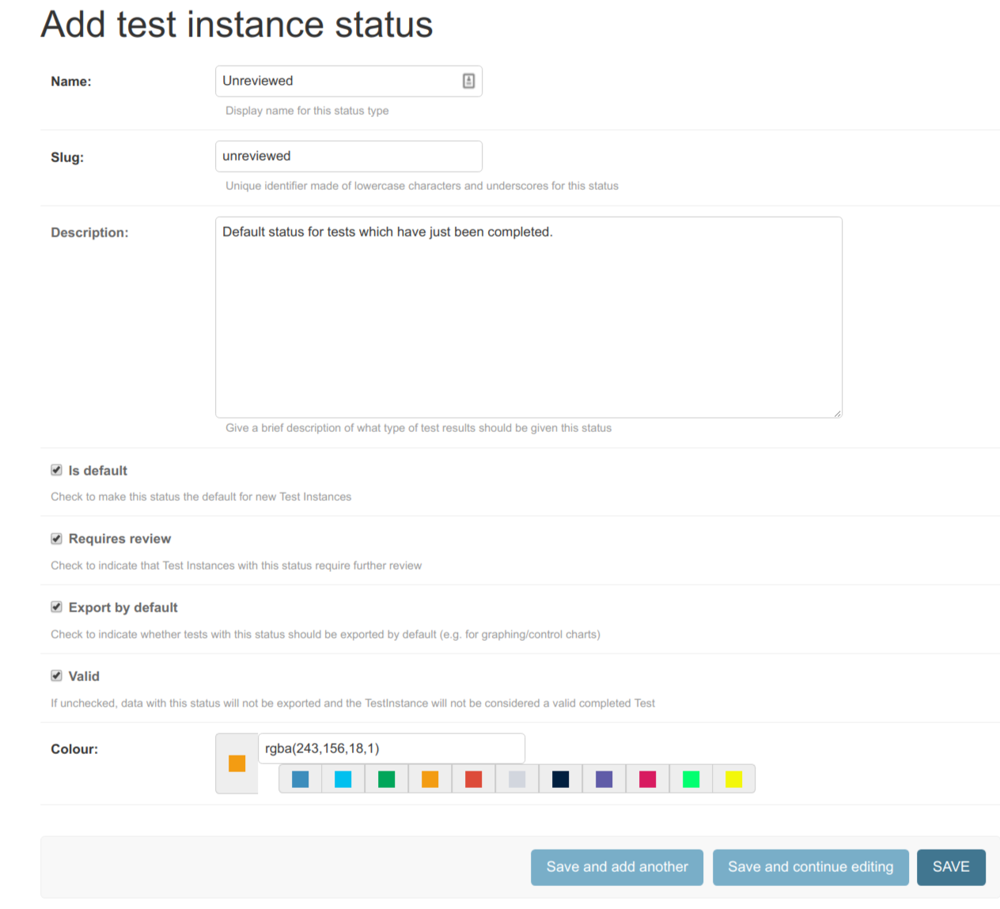

    Unreviewed status

Create an `Approved` status similar to the `Unreviewed` status but this time
leave the **Is default** box unchecked and also uncheck the **Requires review**
checkbox. You should also select a new colour for the status (e.g. green for
Approved). Click **Save** when you're finished.

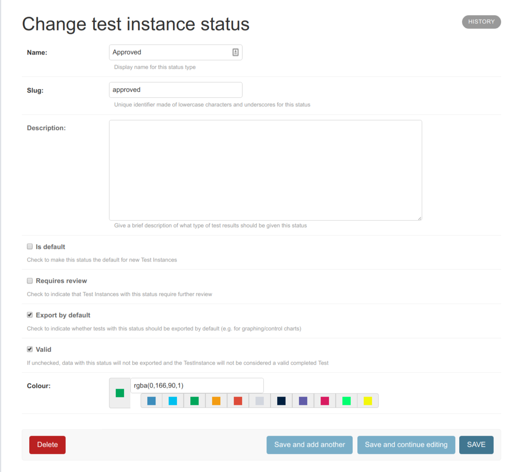

    Approved status

And finally create a `Rejected` status similar to the `Unreviewed` status but
this time leave the **Is default** box unchecked and also uncheck the
**Requires review** and **Is Valid** checkboxex. You should also select a new
colour for the status (e.g. red for Rejected). Click **Save** when you're
finished.

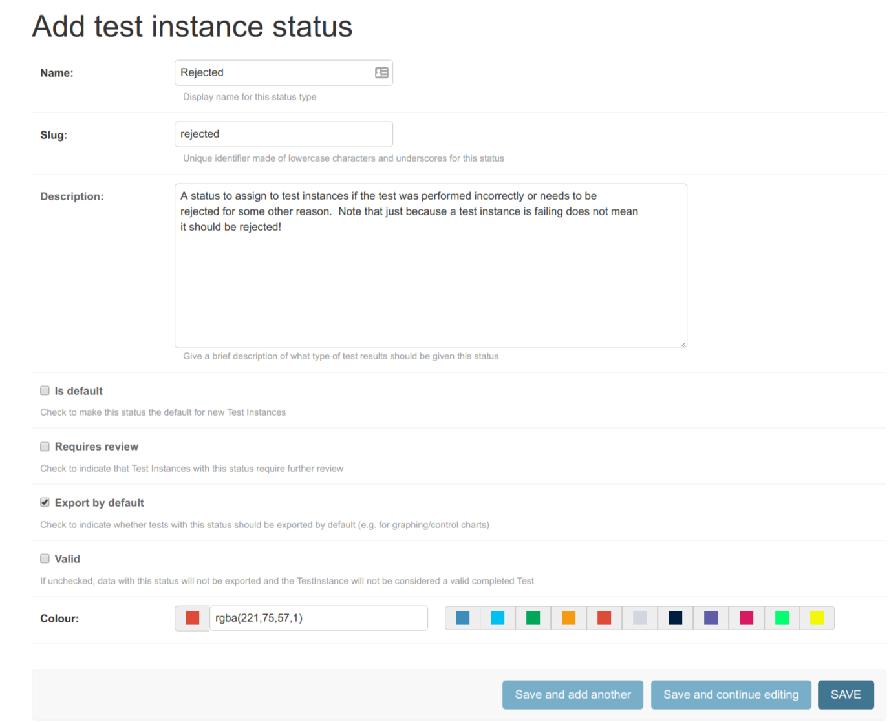

    Rejected status

You should now see your three statuses in the listing.

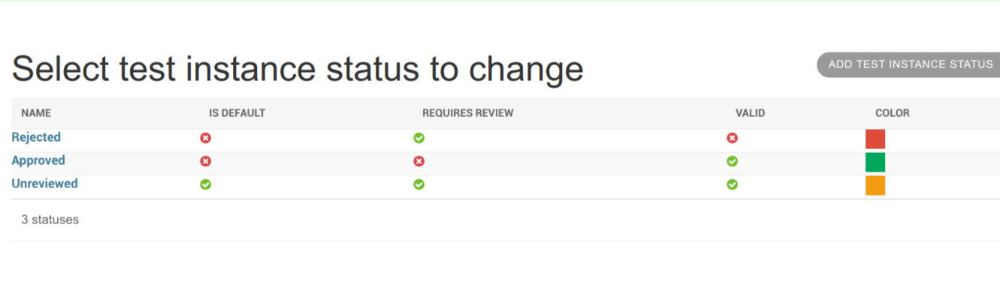

    Test status listings

Now that we have done the initial configuration we can begin to cover test and
test list configuration.

Creating a new Test List
------------------------

Creating the required Tests
~~~~~~~~~~~~~~~~~~~~~~~~~~~

In this part of the tutorial we will create the tests required to calculate a
dose.  This will demonstrate a number of different test types including
composite calculations.

In order to calculate dose we need to create 6 tests (k\_Q and Other
corrections such as P\_pol, P\_ion etc are ignored for simplicity):

* Temperature (numerical test)
* Pressure (numerical test)
* Temperature-pressure correction (Ftp - a composite calculation)
* Ion chamber reading (numerical test)
* Ndw for converting our ion chamber reading to dose (constant value)
* Dose (the final result we are interested in - a composite calculation)

To create the tests, visit the **Tests** link under the **QC** section from the
main admin page and then click on **Add test** in the top right hand corner.

Give our first test the name *Temperature °C* and the macro name of
*temperature*.  We will leave the description blank for now.

Since we haven't created any [categories](../categories.md) yet we will do so
now.  Click the green cross next to the **Category:** drop down and create a
*Dosimetry* category.

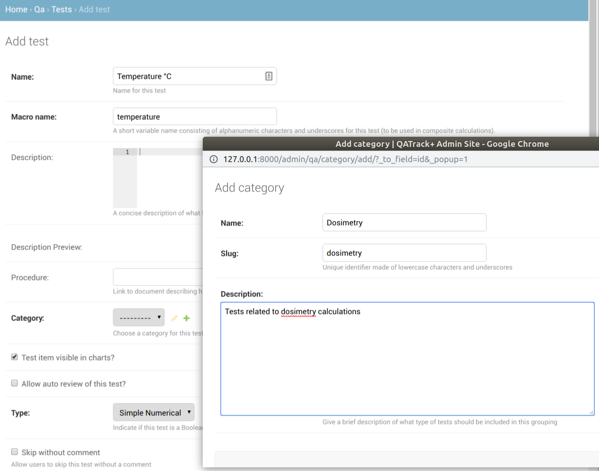

    creating a dosimetry category

For the **Type** field choose *Simple Numerical*, indicating that this test
will require the user to enter a number. You may also check the `Allow auto
review of this test?` checkbox if you intend to use :ref:`auto review
<qa_auto_review>`.

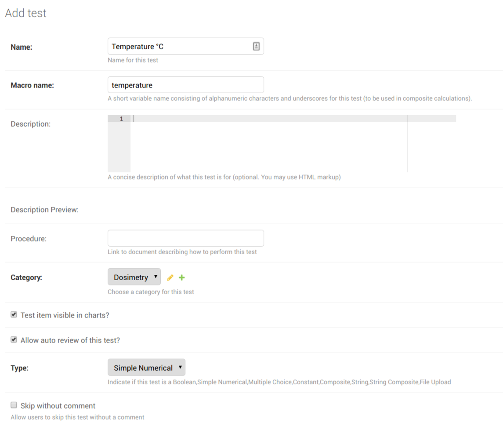

    Full temperature test

Click **Save and add another** when you are done.

Follow the same procedure define 1) a *Pressure (mmHg)* test ensuring that you
use the macro name *pressure* (You can use the *Dosimetry* category we created
earlier for the pressure and all of the remaining tests), and 2) an *Ion
Chamber Reading (nC)* test using the macro name *reading*.

Next we will create our first composite test for our temperature pressure
correction. Give this test a name of *Temperature-Pressure Correction* and a
macro name of *p_tp*.  From the **Type:** dropdown select *Composite* and you
will notice that a new **Calculation Procedure** text box will appear below.
In that text box enter the following Python snippet:

    p_tp = (temperature + 273.15)/295.15*760/pressure

Note here that we used the macro names *temperature* and *pressure*
from our previously defined tests to define how our *Temperature
Pressure Correction* test result will be calculated.

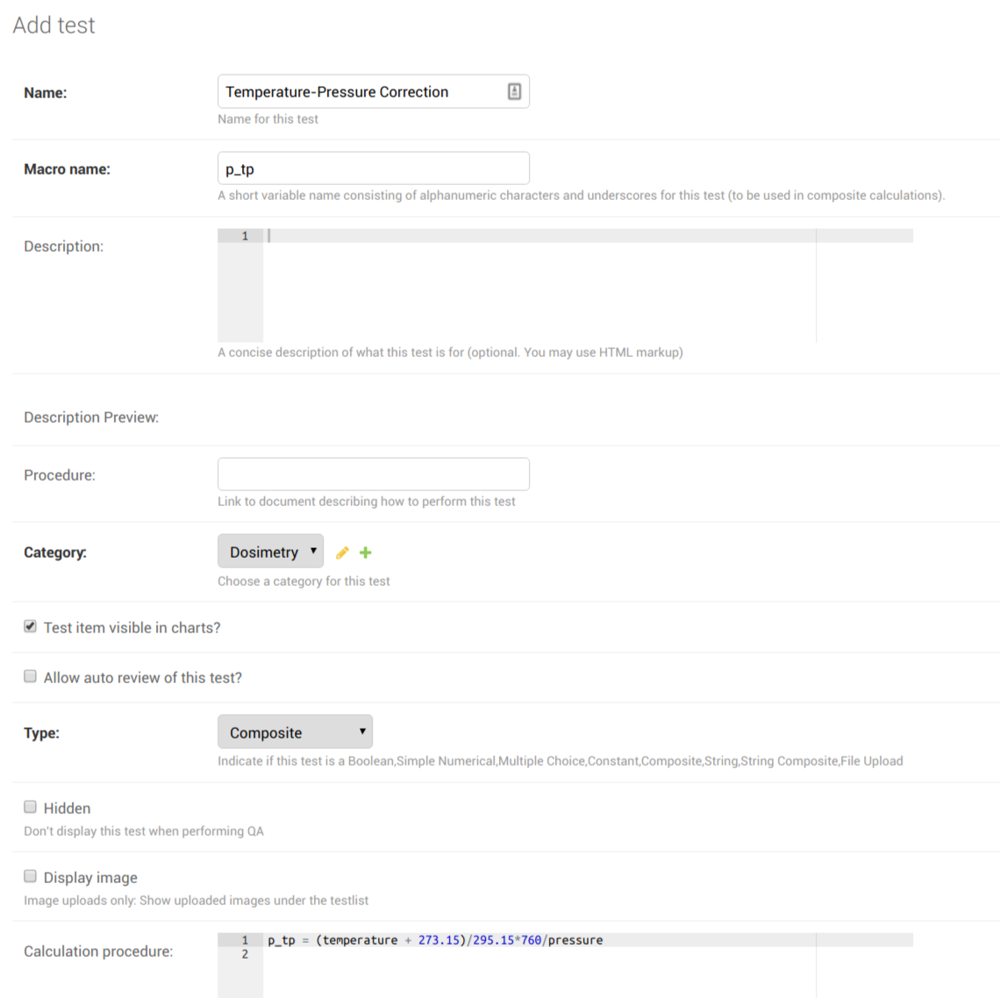

    P_TP calculation

When you are finished, click **Save and add another**.  Define a test
called *N_DW* with the macro name *n_dw*.  This time choose a **Type**
of *Constant* and enter a value of *0.05* in the **Constant value**
field that appears.

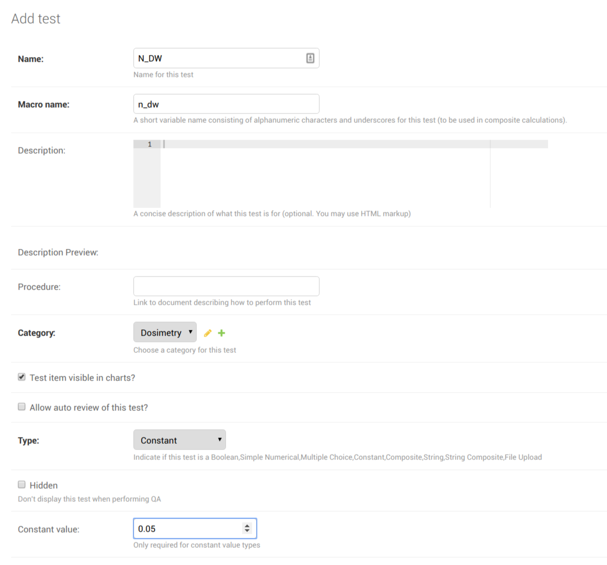

    N_DW

Once that is finished we will add our final test for calculating dose. Create a
composite test with the name *Dose*, the macro name *dose* and a calculation
procedure defined as:

    corrected_reading = reading*p_tp
    dose = n_dw*corrected_reading

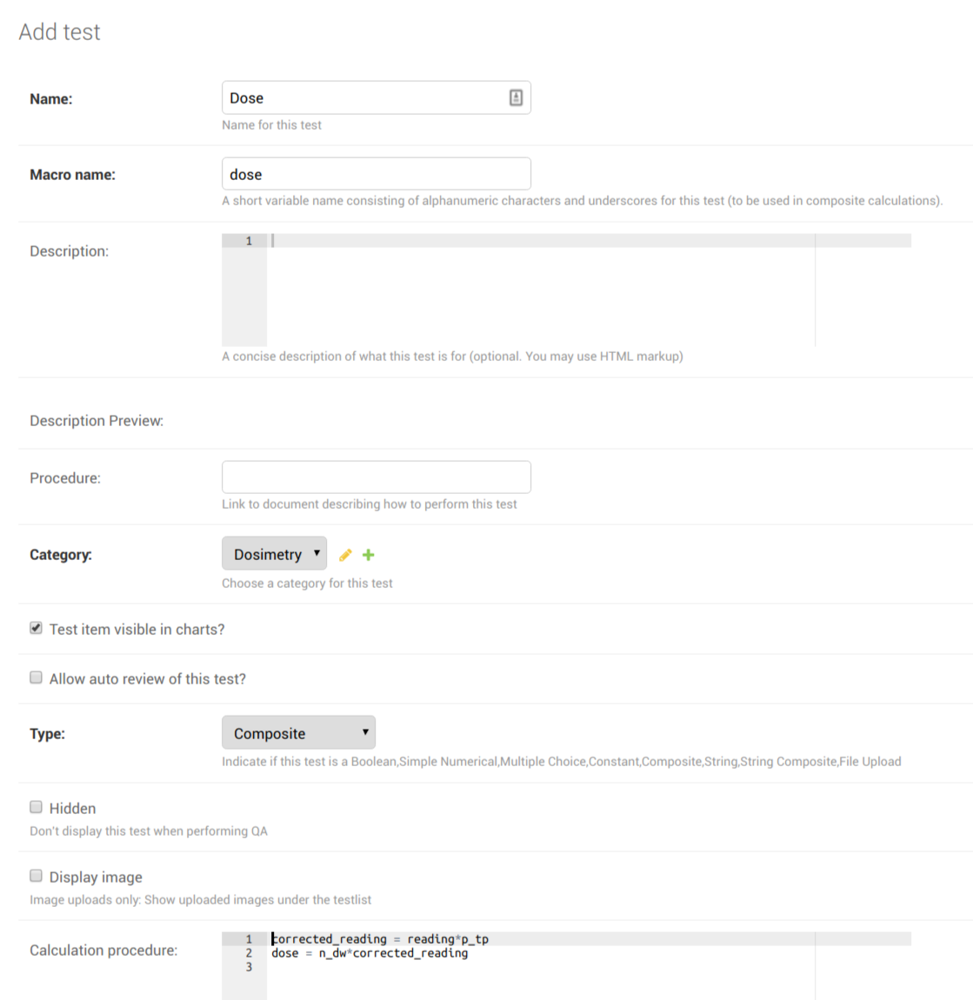

    dose test

.. note::

    Note that the dose calculation is a composite test based on a previous
    composite result (p_tp).  QATrack+ has a :ref:`dependency resolution system
    <dependency_resolution>` to allow this sort of composite-of-composite type
    calculations.

Once that is complete click on **Save** which will take you back to the test
listings. If all the steps have been completed correctly you should see 6 tests
listed:

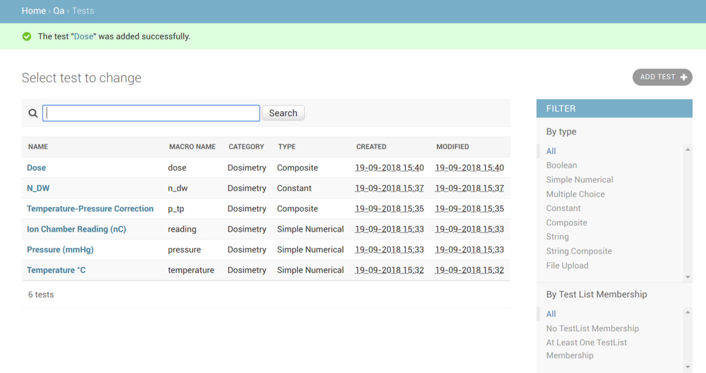

    Test listings for dose calculations

In the next step of the tutorial we will group these tests into a test list.

Creating the Test List
~~~~~~~~~~~~~~~~~~~~~~

To create the test list, visit the **Test Lists** link under the **QC** section
from the main admin page and then click on **Add test list** in the top right
hand corner.

Give the test list the name *Machine Output* and slug *machine-output*.  We
will ignore the description fields for now.

Under the **Test List Members** section click on green cross / *Add another
Test list membership* link at the bottom to make a 6th Test text box appear
(you can ignore the :ref:`Sublist <qa_sublists>` text box, it allows you to
include other Test Lists within a parent Test List). Now click the first
magnifying glass and click on the *Temperature* test in the window that pops
up:

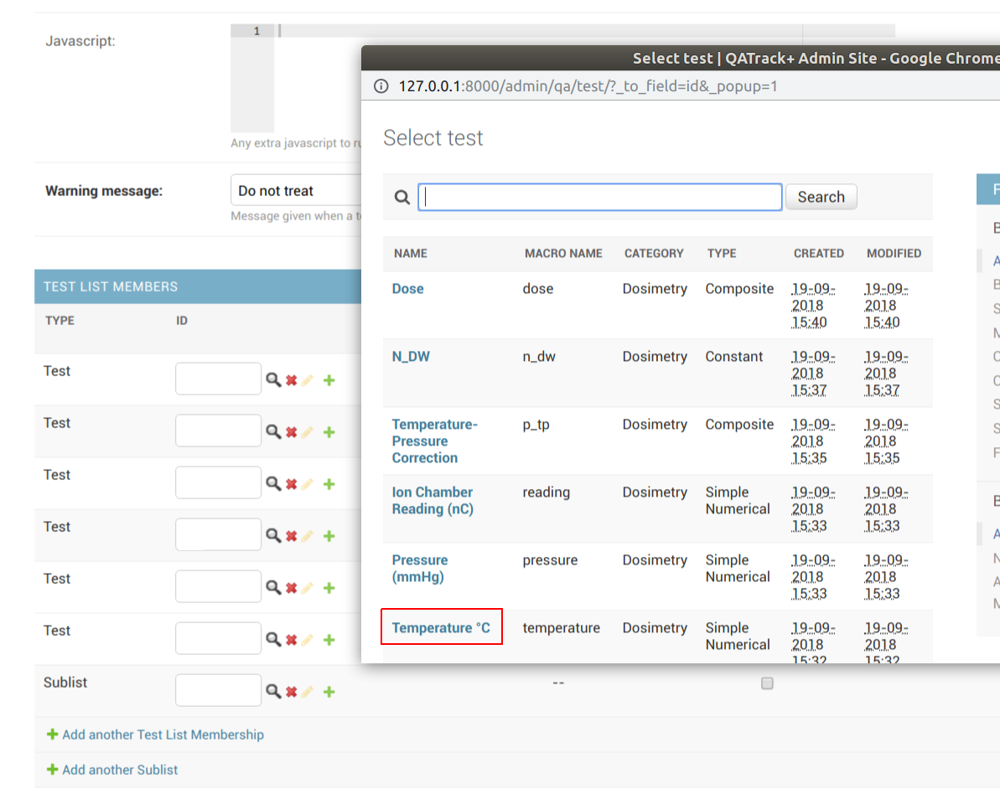

    Selecting a test

Repeat this step for the other 5 tests we defined at which point the *Test list
memberships* section should look like:

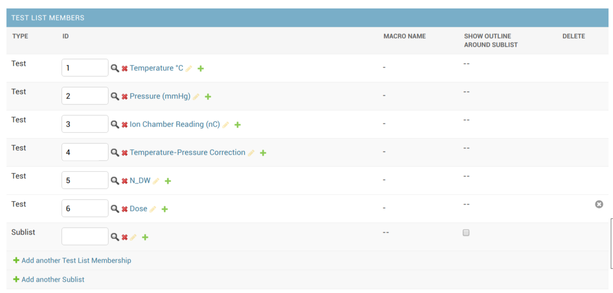

    Test list memberships

Now click `Save` and that's it!  Now that we've created our tests and test list
we can assign it to the unit we created earlier.  This is covered in the next
step of this tutorial.

Assigning the test list
-----------------------

In this part of the tutorial we will assign our test list to a unit and ensure
that it is functioning correctly on the main site.

To assign the test list to a unit, visit the **Assign Test Lists to Units**
link under the **QC** section from the main admin page and then click on **Add
unit test collection** in the top right hand corner.

Select the *Test Unit* from the **Unit:** dropdown, and then create a new
[frequency](../frequencies) by clicking on the green cross next to the
**Frequency** dropdown.  Give the frequency the name *Monthly*, slug *monthly*
and enter *28*, *28*, *35* for **Nominal interval**, **Due Interval** and for
**Overdue interval**, respectively.

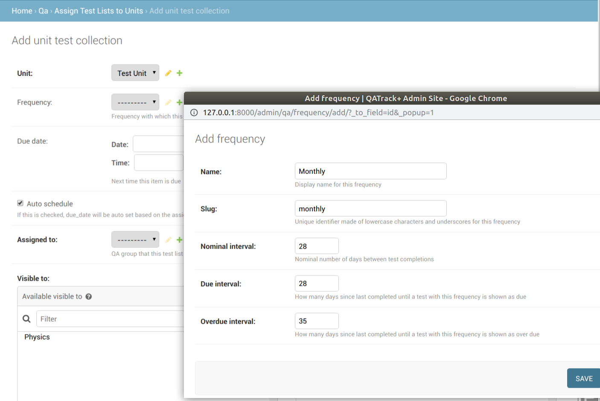

    creating a new frequency

Select the *Physics* option from the **Assigned to:** dropdown and add the *Physics* group
to the *Visible to* section.

Next select *test list* from the **Test List or Test List Cycle** dropdown.
After selecting *test list* you will be able to select *Machine Output* from
the *Tests collection* dropdown.

.. figure:: images/assign_to_unit.png
    :alt: Assigning to a unit

    Assigning to a unit

When you're finished click **Save**.  We can now set a reference and tolerance value
for the dose calculated by our Test List.

To assign the test list to a unit, visit the **Set References and Tolerances**
link under the **QC** section from the main admin page and then click on the
**Dose** link for the `Test Unit`.

Create a new Tolerance by clicking the green cross beside the Tolerance field.
Select *Percentage* for the Type and set `Action Low = -3`, `Tolerance Low =
-2`, `Tolerance High = 2`, and `Action High = 3` and then click *Save*. This
will create a :term:`Tolerance` which signals the user if a test is outside of
tolerance (2%) or action (3%) levels relative to the reference value.

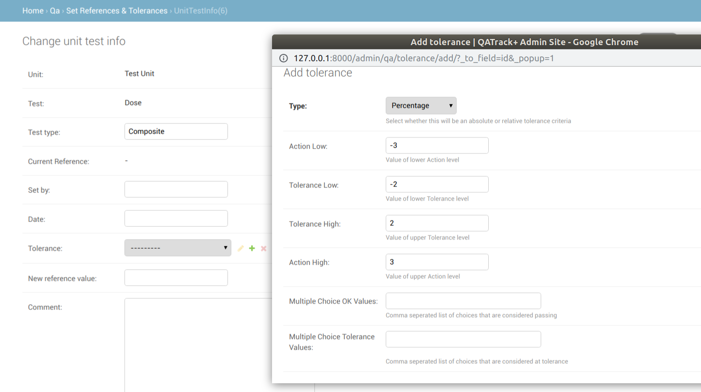

    Creating a new tolerance

Set the *New reference value* to 1 and then click *Save*. We are now ready to
perform the test list.

Performing the Test List
------------------------

Visit the main site (you can click the *QATrack+ administration* header at the
top of the admin page) and select the *Choose Unit* link from the *Perform QC*
dropdown at the top of the page.  On the next page choose the *Monthly* option
from the *Test Unit* drop down.

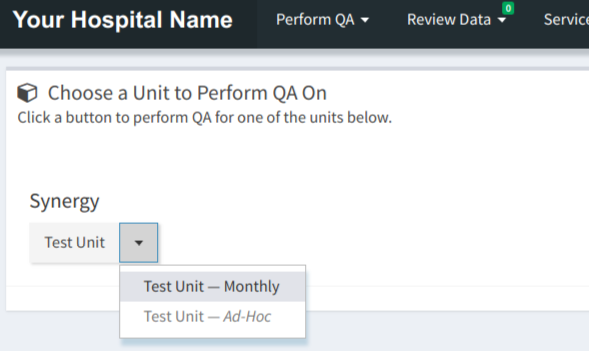

    Choosing Monthly

On the next page click **Perform** beside the *Machine Output* test list.

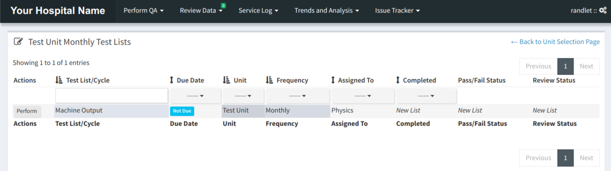

    Monthly test listings

You should now see the test list you defined:

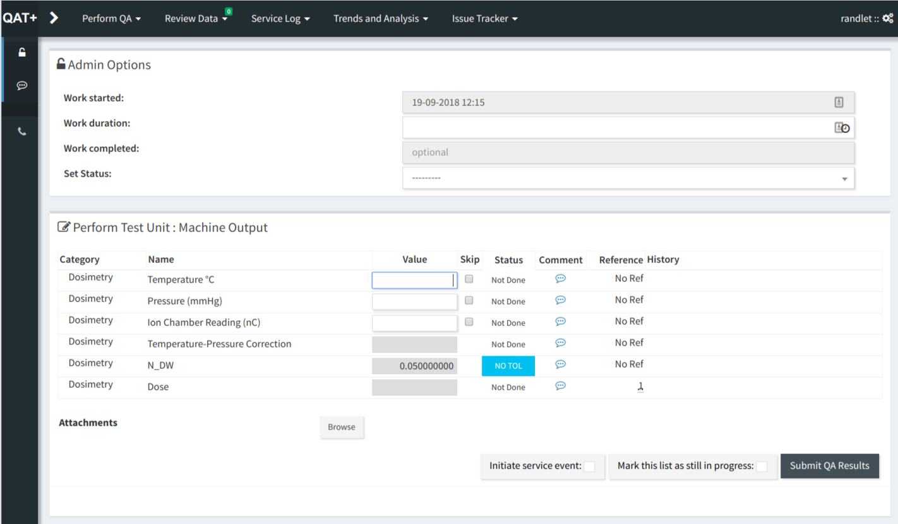

    Final test list

Fill in sample values of :

* Temperature = 24
* Pressure = 760
* Ion Chamber Reading =  20.2

And you should see the *Temperature-Pressure Correction* and *Dose* values
calculated as 1.007 and 1.017 respectively. The `Status` column next to **Dose**
should indicate the Test is within tolerance.

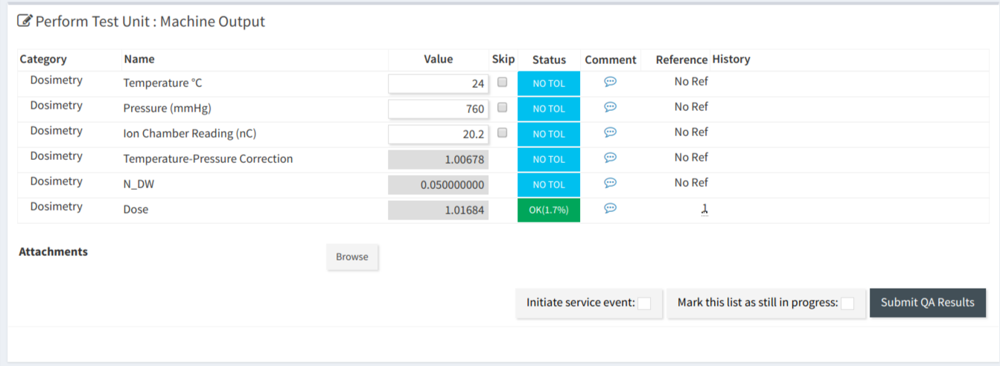

    Calculated results

Notice that the **Status** for all the other tests all show *No Tol Set*.  This
is because we haven't set reference values and tolerance/action levels for
these tests. For more information on Reference & Tolerance values see
:ref:`here <qa_ref_tols>`.

You may now click `Submit QC Results` and you will be returned to the previous
page.  You should notice at the top of the page that there is now an indication
that there is 1 unreviewed Test List Instance:

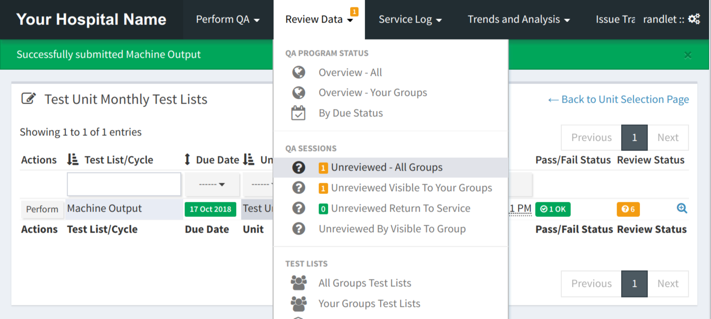

    Visual indicators of review queue

Reviewing the Data
------------------

Periodically whoever is responsible for ensuring QC has been completed
satisfactorily should go through all unreviewed Test List Instances and update
their status to either **Approved** or **Rejected** (note rejected is to be
used if a Test was performed incorrectly, not if it was performed correctly but
failing).

Select the `Unreviewed - All Groups` menu item from the `Review Data` menu and
then click `Review` beside the Test List Instance we just performed:

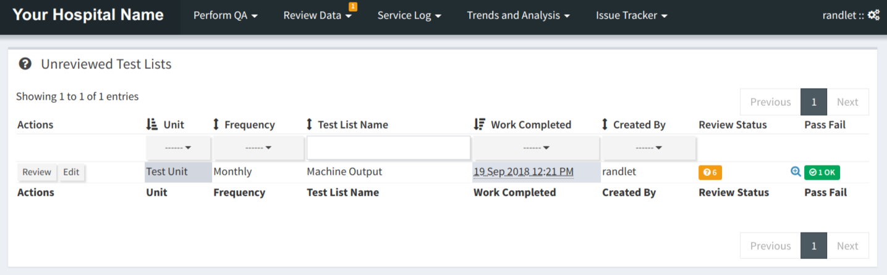

   Unreviewed Test Lists

On the next page you will see details of the Test List Instance.  Select the `Approved` status
from the `Status` drop down to change the status from `Unreviewed`.  Add a comment at the bottom of the page if desired
and then click `Update Test Statuses`.

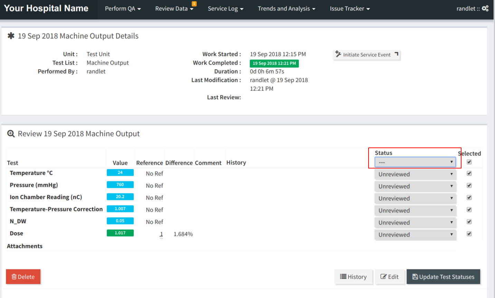

    Reviewing a test list

That Test List instance will now be removed from the Unreviewed queue. Note
that it is also possible to :ref:`automate review and approval
<qa_auto_review>`.

Wrapping Up
-----------

We have now gone through the basics of taking QATrack+ from a blank
installation all the way to performing and reviewing our first Test List!
Check out the :ref:`admin guide <admin_guide>` (for configuration) and
:ref:`users guide <users_guide>` (for end user instructions) for more
information.
