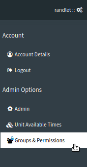
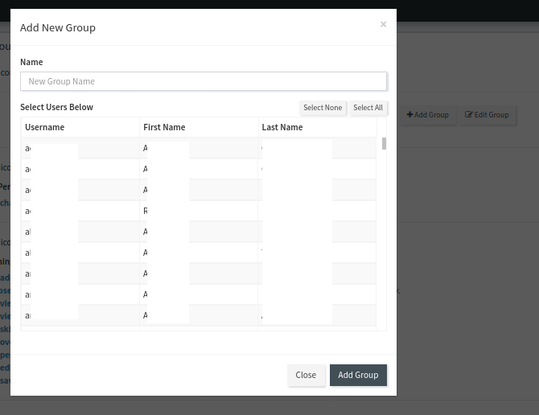
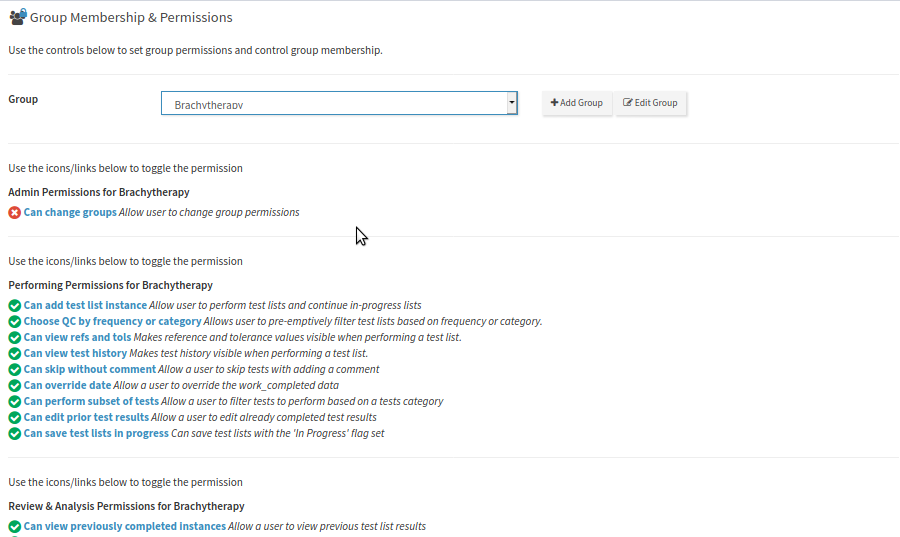

.. _auth_users_groups_app:

Managing Users and Groups
=========================

For the most common tasks of creating new groups, updating group members, and
managing group permissions, you may find the Groups & Permissions page more
convenient than the :ref:`admin area for managing users, groups, and
permissions <qa_auth>`.  This feature requires you have the "Change Group"
permission.

Accessing the Groups & Permissions Page
---------------------------------------

To access the Groups & Permissions page, hover over your username in the top
right hand corner and select the **Groups & Permissions** link.

   Accessing the Groups & Permissions page

Adding a new group
------------------

To add a new group first click the **Add Group** button, enter a new group
name, then select the users you want included in your group.

   Adding a new group

Once you're finished click **Close**.

Editing Group Name and Members
------------------------------

To edit an existing group, select the group you want to edit in the **Group**
select box, then click the **Edit Group** button. Update the members or group
name as required in the modal dialogue that opens. Click **Save Group** when
you are done or **Close** to cancel.

Changing Group Permissions
--------------------------

When you select a group using the **Group** select, the group permissions will
be shown on the page below, with a green checkmark indicating the group *has* a
permission, and a red x indicating that the group *does not have* that
permission.  In order to toggle any permission for that group, click on the
relevant checkmark or x.  Changes will take place immediately upon toggling.

   Editing a groups permissions

Please note this page only covers the most common permissions required for
groups in QATrack+.  If you need finer grained controls, you will need to use
:ref:`the admin authorization area <qa_auth>`.
