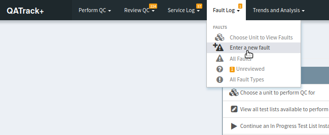
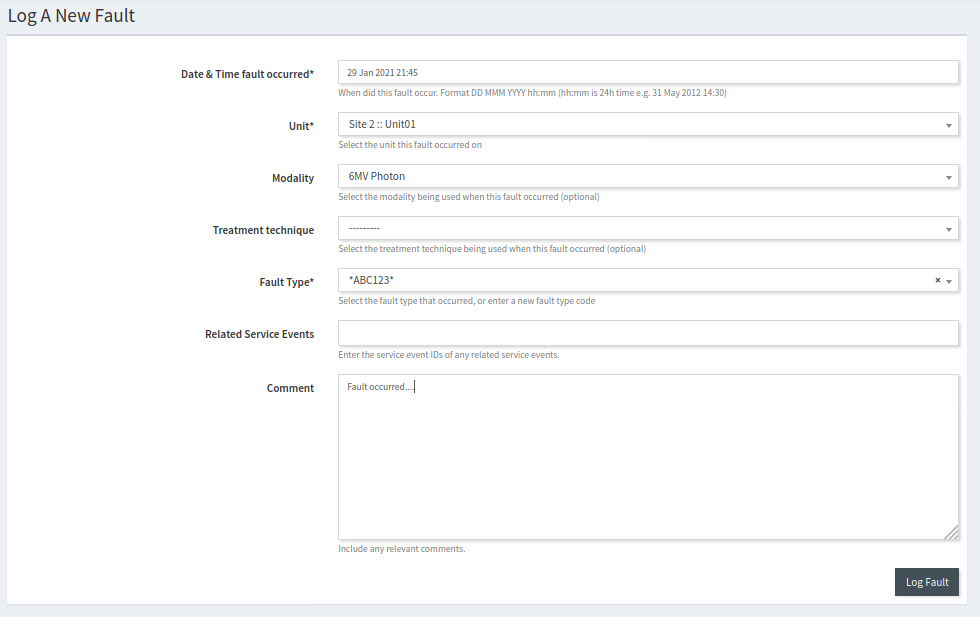
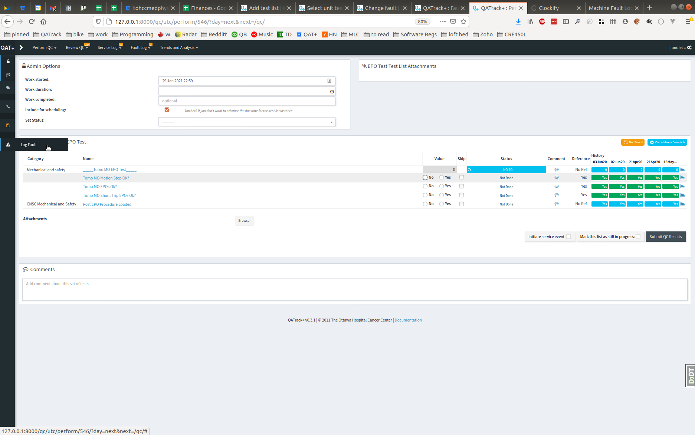
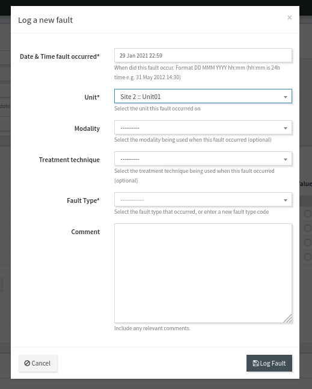
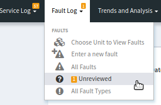
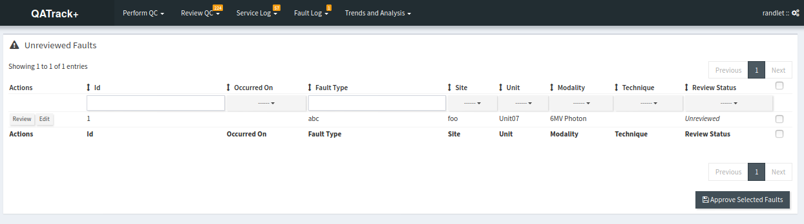
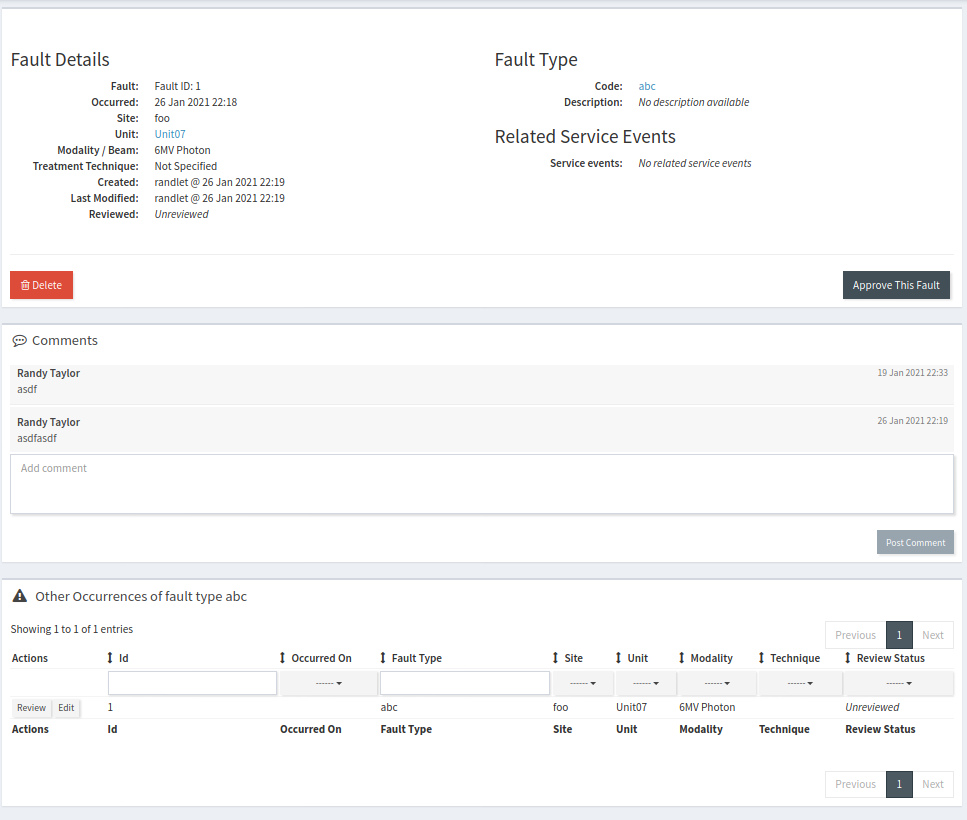

.. _fault_log:

Machine Fault Log
=================

In order to help you keep track of any machine issues, QATrack+ allows you to
record machine faults using the fault log introduced in version 3.1.0. Faults
can either be logged directly on the page when performing QC work, or using the
standalone page for entering faults.

.. _fault_log_new_fault:

Entering a new fault
--------------------

In order to enter a new machine fault, select the **Enter a new fault** option
from the **Fault Log** menu at the top of the page.

   Location of the faults menu

Next, fill out the form on the New Fault Page:

   Entering a new fault

* **Date & Time fault occurred** Enter approximately when the fault took place
* **Unit, Modality, & Treatment Technique*** When you select the Unit the fault
  occurred on, the **Modality** & **Treatment Technique** drop downs will be
  populated with any Modality & Treatment options :ref:`configured for your
  unit <units_admin>`.  The **Modality** and **Treatment Technique** fields
  are optional.
* **Fault Type** After typing the first two characters of the **Fault type**,
  the drop down will be populated with any matching Fault Type codes already in
  the Fault type database.  If the fault code does not already exist in the
  database, you should enter (and select) the full fault code.  This
  :ref:`Fault Type <fault_type>` will be added to the database when you submit
  your fault.
* **Related Service Events** In this field you may optionally select one or
  more related service events by entering their service event IDs.

* **Comment** Add any comments you think might be useful for anyone reviewing
  the fault.

Click **Log Fault** once you've finished entering the data.

.. _fault_log_new_fault_qc:

Entering a new fault while performing QC
----------------------------------------

In addition to the above method of logging a new fault, you can log a new fault
directly on the page when performing QC.  In order to do this click the **Log
Fault** item from the left sidebar. 

   Location of Log Fault link when performing QC

This will bring up a modal dialogue that allows you to enter the fault details.
The unit, date, and time will already be populated for you.

   Dialogue for logging fault when performing QC

Complete the other details then click **Log Fault**.  The dialogue will
automatically close after the fault is logged successfully.

Reviewing Faults
----------------

After submitting a fault, it will be in an unreviewed state.  In order to mark
faults as reviewed select the **Unreviewed** menu item from the **Faults**
menu.

   Location of the unreviewed faults menu

On the next page you can click the  **Review** button (if you don't have fault
review permissions this button will say **Details**) for the fault you want to
review.

   Select the fault you want to review

On the details page you can click the **Approve This Fault** button to mark
this fault as reviewed, click the **Edit** button to edit the fault, click
the **Delete** button to delete the fault, or view other occurrences of the
same type of fault at the bottom of the page.

   Reviewing fault details

