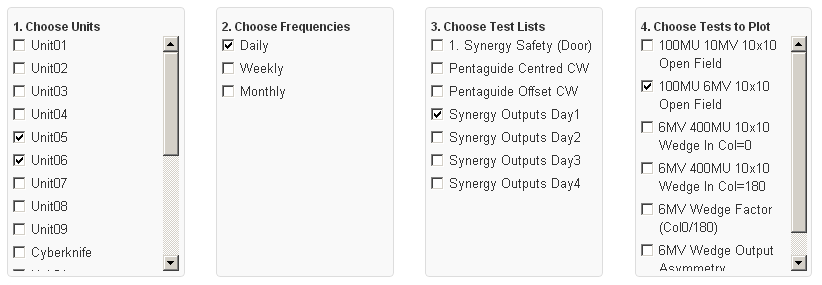
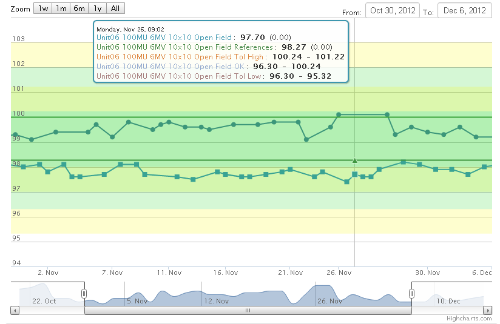

Plotting your data
==================

There are currently two ways of plotting your data 1) basic time series
plots and 2) statistical process control charts (SPC) (see `Statistical
process control for radiotherapy quality
assurance <http://online.medphys.org/resource/1/mphya6/v32/i9/p2777_s1?isAuthorized=no>`__).

*Note: Anywhere you see a little chart icon (|quick chart|) next to a
test you can click on it to automatically be taken to a chart of that
data*

To access the chart interface choose the **Charts** menu item from the
**Review Data** dropdown menu at the top of any page.

The basic functionality of the charts page should be fairly self
explanatory. First select the units you are interested in, and then
select the test lists/tests you would like to plot data for.

   Choose tests to plot

There are a number of chart options which you can change:

-  Lines: *Controls whether series have lines displayed or just the
   points*
-  Refs/Tols: *Control whether reference & tolerance data is shown*
-  Legend: *Toggle display of legend*
-  Combine test data for unit: *Combine results for the same test from
   different test lists into a single series*
-  Plot relative to reference values: *If selected, the absolute
   difference is plotted for tests with absolute tolerances set or with
   reference values of zero, otherwise the percent difference is
   plotted.*

You can leave the **Chart Options** with their default settings or
add/remove the legend, data lines, reference & tolerances etc. To create
an SPC choose the **Control Chart** option from the **Chart Options -
Type:** dropdown.

Once you are happy with the options, click the **Generate Chart**
button.

   Time Series Plot

The time series plots are interactive and you can pan/zoom the data
using the sliders at the bottom of the chart. At this point it is not
possible to directly save a time series plot to an image file and you
will need to create a screen capture if you want to send someone the
image. You can however send someone the URL located in the link text box
under the chart options.

.. figure:: control_chart.png
   :alt: Control Chart

   Control Chart

To save a control chart, right click and select *Save Image As*.

Notes on Control Charts
-----------------------

To specify where your baseline data comes from you can use the **Date
Filters** under the **Generate Chart** button. For example if there was
a reference change on 5 Nov 2012 then you would set the **From:** date
filter to 5 Nov 2012 and the baseline points will be taken starting on
that date.

