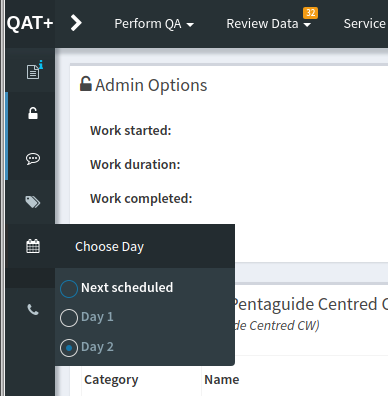

Test List Cycles
================

QATrack+ allows you to set up groups of Test Lists, called Test List Cycles,
which are performed in a cycle.  For example, you may perform different safety
tests on different days of the week.  When a user chooses to perform a Test
List Cycle the next Test List scheduled to be performed is automatically loaded
for the user.

Manually Choosing A Test List From A Test List Cycle
----------------------------------------------------

Occasionally you may want to perform a specific day from a Test List Cycle out
of order. This is easily accomplished on the test list page by selecting the
desired day from the dropdown list in the left hand drawer menu.

   Overriding the default test list cycle day

.. note:: You could also change the requested day in the url from *next* to the day of
        your choosing. For example you could change the url from
        ``http://qatrack/qa/utc/perform/27/?day=next`` to
        ``http://qatrack/qa/utc/perform/27/?day=3`` but this method is not guaranteed
        to work in the future.
