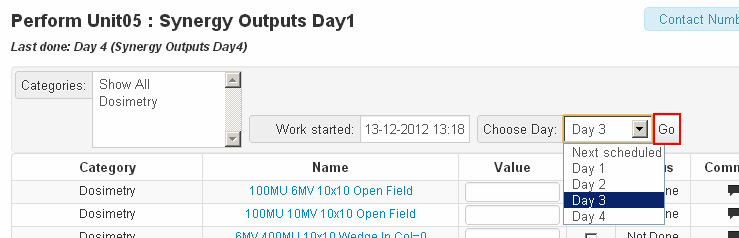

Manually Choosing A Test List From A Test List Cycle
====================================================

Occasionally you may want to perform a specific day from a test list
cycle out of order. This is easily accomplished on the test list page by
selecting the desired day from the dropdown list at the top of the page
and clicking go.

   Overriding the default test list cycle day

You could also change the requested day in the url from *next* to the
day of your choosing. For example you could change the url from
``http://qatrack/qa/utc/perform/27/?day=next`` to
``http://qatrack/qa/utc/perform/27/?day=3`` but this method is not
guaranteed to work in the future.
