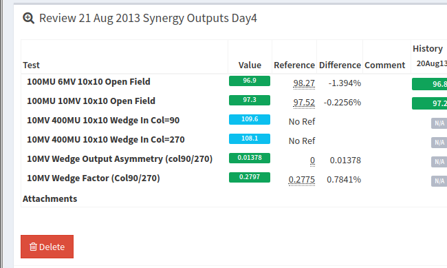
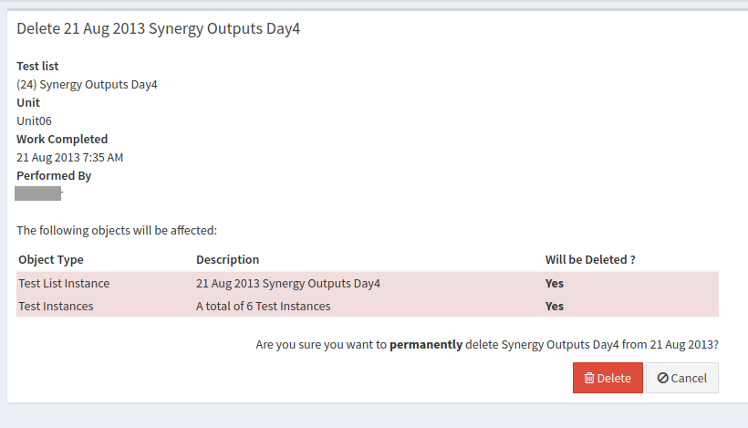

Deleting A QA Session (Test List Instance)
==========================================

**Warning** *Deleted items are irretrievable! If you are unsure of what
you are doing please ask someone for assistance.*

Navigate to the review page of the QA session you would like to delete and at
the bottom left of the page click the red **Delete** button (if the button is
deactivated, you don't have the required permissions to delete items).

   Delete button location

Clicking that button will take you to an admin page where you will be
presented with a list of all objects in the database that will be
deleted as a result of this action.

   List of things to be deleted

Carefully review this list! Once you click **Delete** the items
listed will be deleted permanently. You should see details (test
list/date/time/user) of the session you are about to delete, along with
all of its associated test results.

If you are sure you want to permanently delete these items click **Delete**.
