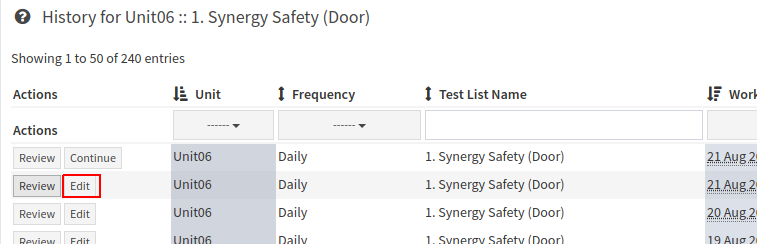

Editing Previously Entered Data
===============================

If your user group has the `required permissions <../../admin/qa/auth.html>`__,
you may edit previously completed data. To edit a specific test list instance,
first navigate to the `history of the test list <view_history.html>`__ of the
test list and click on the **Edit** button of the session that you want to
revise.

   Test list history page

You can then edit the previous results and save as usual. Note that when you
edit a Test List Instance, the default behaviour is to reset the status for all
the tests to the default test status. For example, if a qa session had already
been reviewed but was later edited and saved, it will show up in your
**Unreviewed** list again (assuming your default status is one which requires
review).
