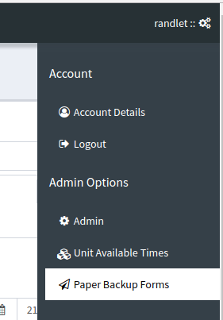
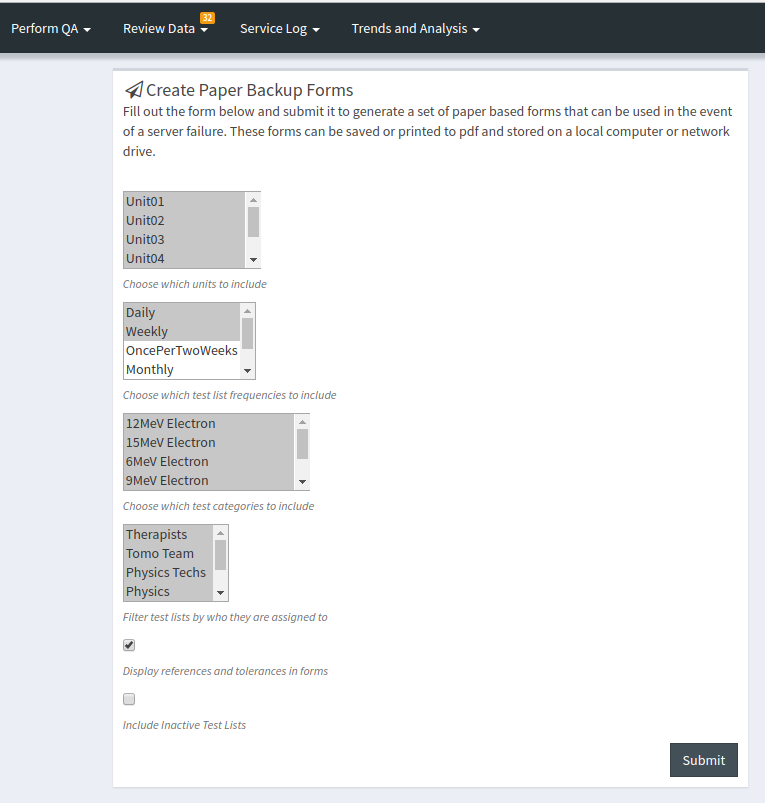
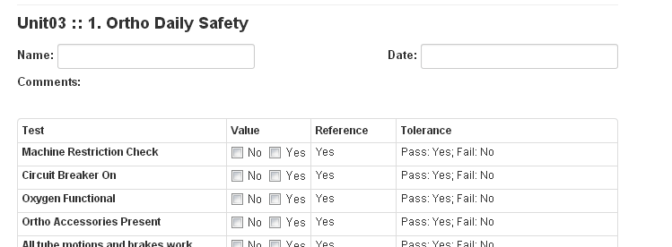

Paper Backup QC Forms
=====================

As of version 0.2.7 QATrack+ has a tool for generating (primitive) paper
based forms to be used as backup in the event that your QATrack+ server
is unavailable for some reason.

Currently, to access this tool a user must have the :ref:`"staff" or
"superuser" <qa_auth>` flags set on their account.

To access the tool, select the **Paper Backup Forms** option from the
admin menu.

   Paper backup form menu

This will take you to a page with a form allowing you to
filter which test lists and tests to print by unit, frequency test
category, and assigned groups.

Optionally you may include the reference and tolerance values for all
the tests as well.

   Paper based backup form filters

Once you have set your filters accordingly click the **Submit** button.
This will redirect you to a page with forms similar to the one below.
Hit Ctrl-P to print the forms (you can use Adobe or CutePDF to print to
PDF). A page break is inserted for every new unit/test list combination.

   Sample backup form
