Performing a Test List
======================

Selecting a test list
---------------------

To perform a test list, first login to QATrack+ and then select the
**Choose Unit** option from the **Perform QA** dropdown menu.

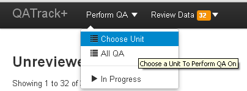

   Choose Unit Menu Option

On the following page, clicking on the main button for a unit will take
you to a page that lists all the test lists assigned to that unit.

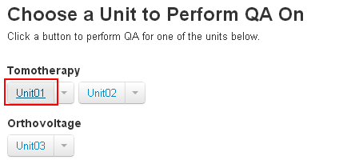

   Select unit button

You can pre-filter the list by its assigned frequency by using the
dropdown menu attached to the select unit button.

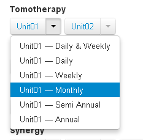

   Select unit dropdown button

On the next page, all the test lists with the chosen frequency will be
displayed along with relevant information about the last time that test
list was performed and when the test list is next due on this unit.

Click on the **Perform QA** button next to the list that you would like
to complete.

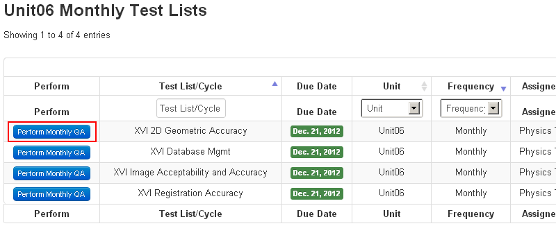

   Choose a test list to perform

Performing a test list
----------------------

An example test list is shown below. Details about all the features will
given below but briefly, you can see all the tests completed and ready
to be submitted. The shaded input boxes for the last two tests indicate
that they are `composite tests <../admin/tests.md>`__ i.e. they are test
values calculated based on the other 4 input values. Passing, tolerance
and failing tests are displayed with a green, yellow or red status,
respectively. Tests which have no reference or tolerance set for them
are shown in blue.

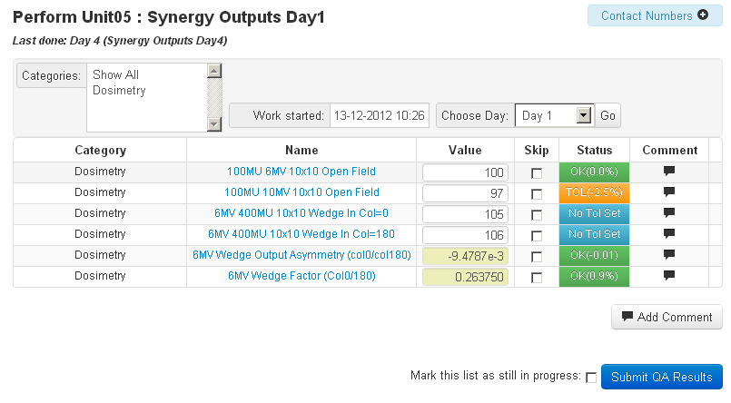

   Example test list

Viewing test procedures
~~~~~~~~~~~~~~~~~~~~~~~

Clicking on the test name will display instructions or information about
performing the test.

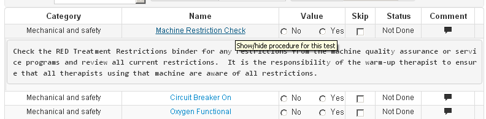

   Embedded test procedure

Adding comments
~~~~~~~~~~~~~~~

You may add either test specific comments by clicking on the speech
bubble beside the test or you can add a general comment for the whole
test list by clicking on the **Add Comment** button at the bottom of the
test list.

`Adding comments to a test list <add_comment.png>`__

Skipping a test
~~~~~~~~~~~~~~~

Occasionally it may be required to skip a test when performing a test
list. To accomplish this, check off the **skip** checkbox next to the
test and add a comment (required) explaining why you are skipping the
test.

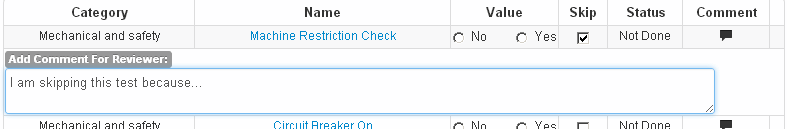

   Skipping a single test

Performing a subset of a test list
~~~~~~~~~~~~~~~~~~~~~~~~~~~~~~~~~~

Some test lists may have tests from more than one `category
type <../admin/categories.md>`__. To selectively perform the tests from
one or more categories, use the select box at the top of the list to
choose the test categories you want to perform. Tests from categories
that are not selected, will be hidden and marked as skipped with a
comment explaining why.

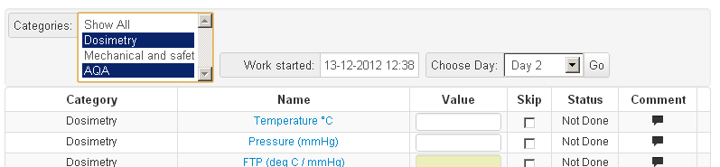
   list

   Performing a subset (Dosimetry & AQA) of tests within a test list

Saving a test list to complete it later
~~~~~~~~~~~~~~~~~~~~~~~~~~~~~~~~~~~~~~~

If for some reason you need to finish a test list at a later time, you
can click the **Mark this list as still in progress** checkbox next to
the **Submit QA Results** button. When this box is checked, the test
list will not be considered complete and will not be marked for review.

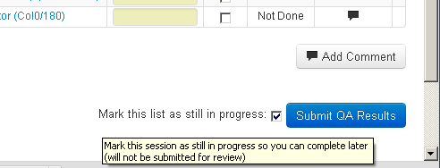

   Save a test list to complete later

When you are ready to complete the test list, you can find it by
selecting the **In Progress** menu option

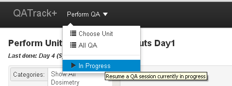

   In progress menu

and then clicking **Continue** on your saved result.

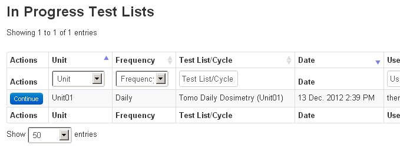

   Continue an in progress test list
