.. _qa_perform:

Performing a Test List
======================

Selecting a test list
---------------------

To perform a test list, first login to QATrack+ and then select the
**Choose Unit** option from the **Perform QC** dropdown menu.

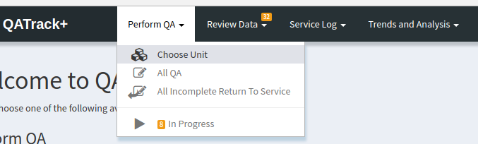

   Choose Unit Menu Option

On the following page, clicking on the main button for a unit will take
you to a page that lists all the test lists assigned to that unit.

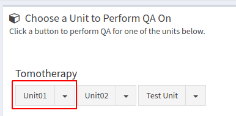

   Select unit button

You can pre-filter the list by its assigned frequency by using the
dropdown menu attached to the select unit button.

.. figure:: images/select_unit_dropdown.png
   :alt: Select unit dropdown button

   Select unit dropdown button

On the next page, all the test lists with the chosen frequency will be
displayed along with relevant information about the last time that test
list was performed and when the test list is next due on this unit.

Click on the **Perform QC** button next to the list that you would like
to complete.

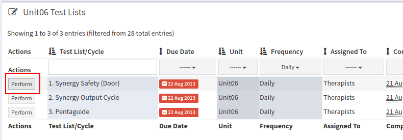

   Choose a test list to perform

.. _qa_tree_views:

Tree Views
..........

In addition to the `Choose Unit` method for selecting a test list, QATrack+ has
two "Tree Views" that present the QC available to perform in a tree structure grouped
either by Unit & Frequency, or by Unit, Frequency, and Category.  These views
are found in the `Perform QC` menu:

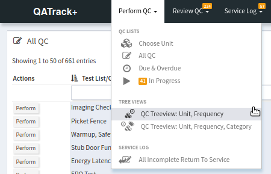

   The menu options for selecting a tree view

An example of the Unit, Frequency, and Category view is shown here:

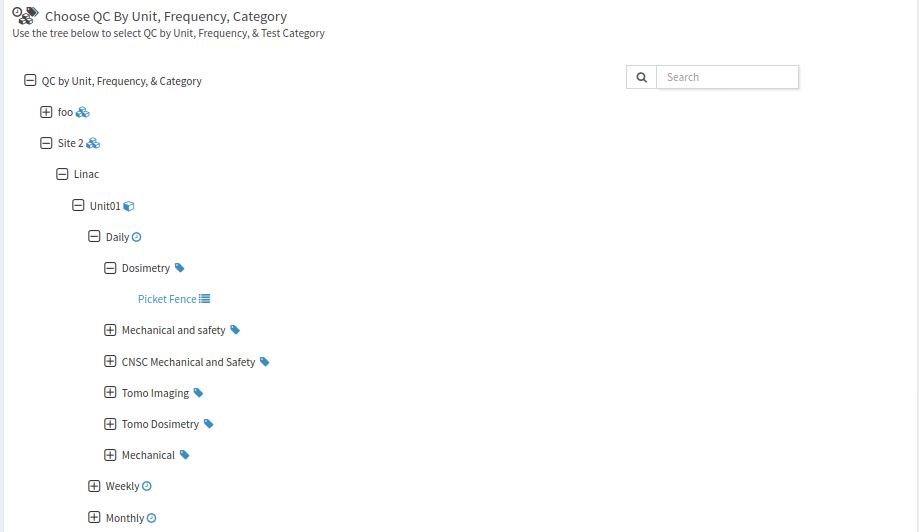

   An example of a Unit, Frequency, Category tree view

Performing a test list
----------------------

An example test list is shown below. Details about all the features will
given below but briefly, you can see all the tests completed and ready
to be submitted. The shaded input boxes for the last two tests indicate
that they are `composite tests <../../admin/qa/tests.html>`__ i.e. they are test
values calculated based on the other 4 input values. Passing, tolerance
and failing tests are displayed with a green, yellow or red status,
respectively. Tests which have no reference or tolerance set for them
are shown in blue.

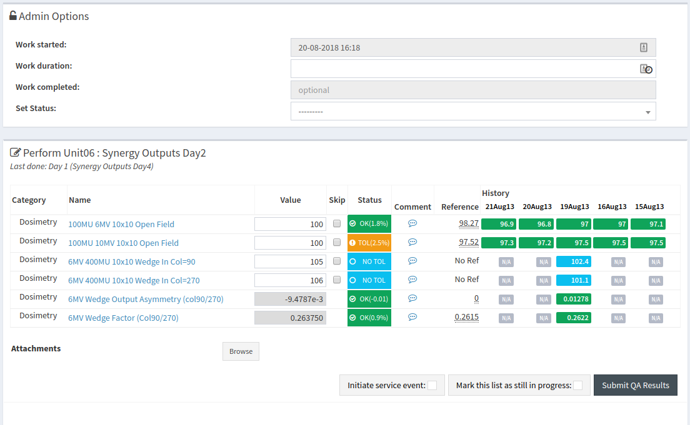

   Example test list

Viewing test procedures
~~~~~~~~~~~~~~~~~~~~~~~

Clicking on the test name will display instructions or information about
performing the test.

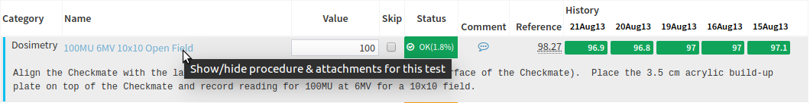

   Embedded test procedure

Adding comments
~~~~~~~~~~~~~~~

You may add either test specific comments by clicking on the speech
bubble beside the test or you can add a general comment for the whole
test list by entering the comment in the text box below the `Submit QC Results` button.

`Adding comments to a test list <add_comment.png>`__

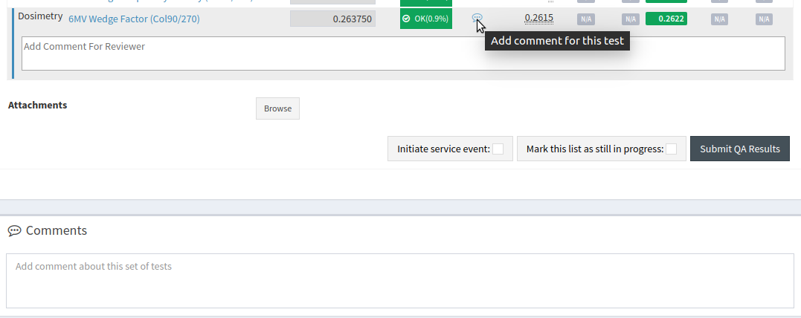

   Adding comments to test lists

Skipping a test
~~~~~~~~~~~~~~~

Occasionally it may be required to skip a test when performing a test list. To
accomplish this, check off the **skip** checkbox next to the test and add a
comment (required unless the user has the `Can skip without comment
<../../admin/qa/auth.rst>`__ permission) explaining why you are skipping the test.

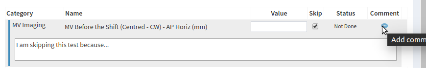

   Skipping a single test

.. _qa_perform_subset:

Performing a subset of a test list
~~~~~~~~~~~~~~~~~~~~~~~~~~~~~~~~~~

Some test lists may have tests from more than one `category type
<../admin/qa/categories>`__. To selectively perform the tests from one or
more categories, use the select box from the left hand drawer menu to choose
the test categories you want to perform. Tests from categories that are not
selected, will be hidden and marked as skipped with a comment explaining why.

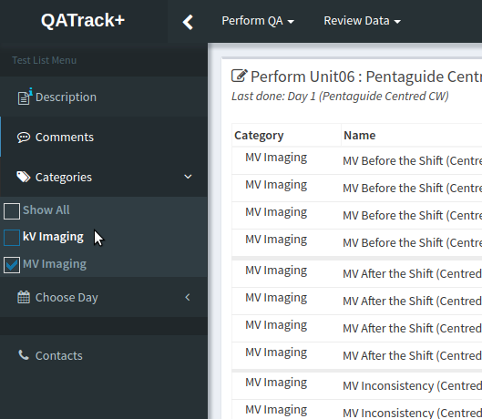

   Performing a subset (Dosimetry & AQA) of tests within a test list

Attaching Files to your session
~~~~~~~~~~~~~~~~~~~~~~~~~~~~~~~

.. _attaching_files:

When performing QC, you may attach arbitrary documents to the test list before
submitting (e.g.  a PDF report from some external software).

In order to do this, simply click the `Browse` button and select the files you
want to attach.

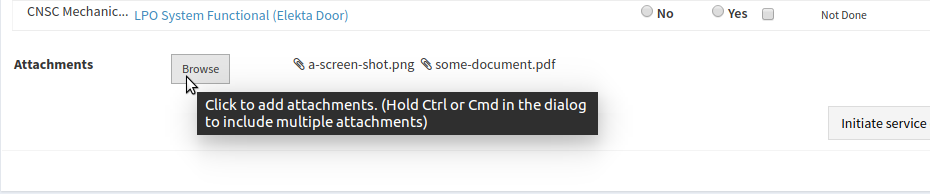

   Attaching files to a test list instance

These files will be saved and available for review later.

Keyboard Shortcuts
~~~~~~~~~~~~~~~~~~

There are currently a limited number of keyboard shortcuts available when
performing a test list:

* Use the up/down arrow keys to navigate between test input fields
* Hit Enter or Tab to cycle through the test input fields

More keyboard shortcuts will be made available in the future.

Saving a test list to complete it later
~~~~~~~~~~~~~~~~~~~~~~~~~~~~~~~~~~~~~~~

If for some reason you need to finish a test list at a later time, you
can click the **Mark this list as still in progress** checkbox next to
the **Submit QC Results** button. When this box is checked, the test
list will not be considered complete and will not be marked for review.

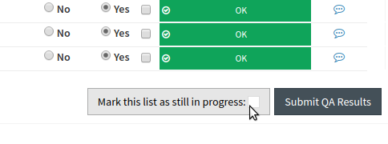

   Save a test list to complete later

When you are ready to complete the test list, you can find it by
selecting the **In Progress** menu option

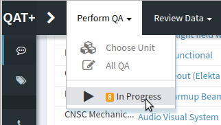

   In progress menu

and then clicking **Continue** on your saved result.

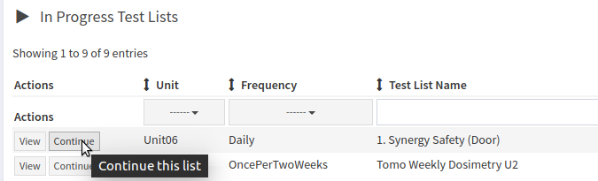

   Continue an in progress test list

When performing a test list, the left hand drawer menu will also show any In
Progress QC sessions for the current test list.

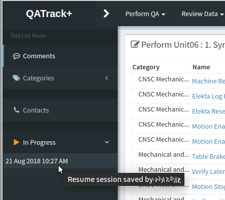

   Continue an in progress test list from the sidebar

.. _auto_save:

Auto Save
~~~~~~~~~

As of version 3.1.0, QATrack+ now auto-saves your data in the background 
every time you enter a new test result.  This helps prevent data loss
in the case that a user mistakenly navigates away from a test list page without
submiting the data, or due to a browser crash, power failure, etc.

You can see the last auto-save time in the top right hand portion of the 
form for entering QC data.

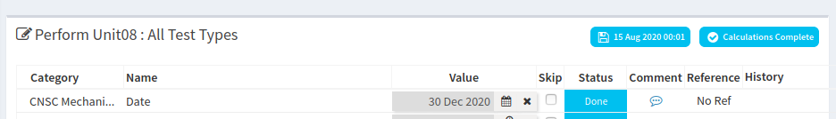

   Autosave status showing last saved time

When performing a test list with autosaved data available, the left hand drawer menu
will also show any autosaved sessions which you can click to load and continue.

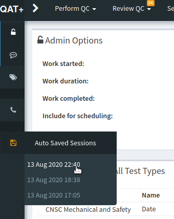

   Continue an autosaved test list instance

Autosaved sessions will be automatically deleted either:

a) When the QC session is submitted succesfully -or-
b) After 30 days has passed since the auto-saved session was last modified. (To
   change the 30 day interval, you may change the :ref:`AUTOSAVE_DAYS_TO_KEEP
   <autosave_days_to_keep>` setting).

