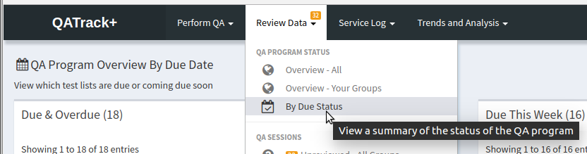
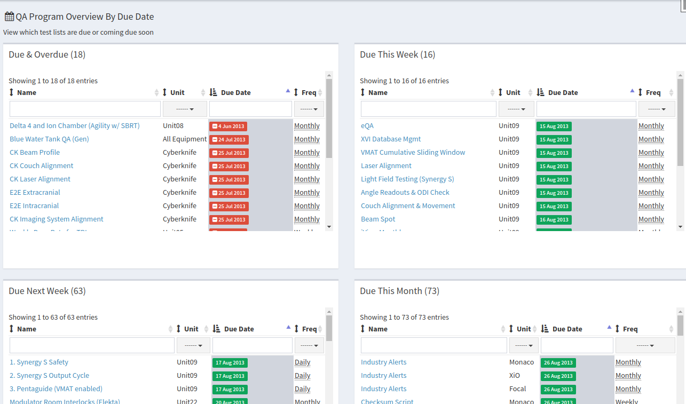
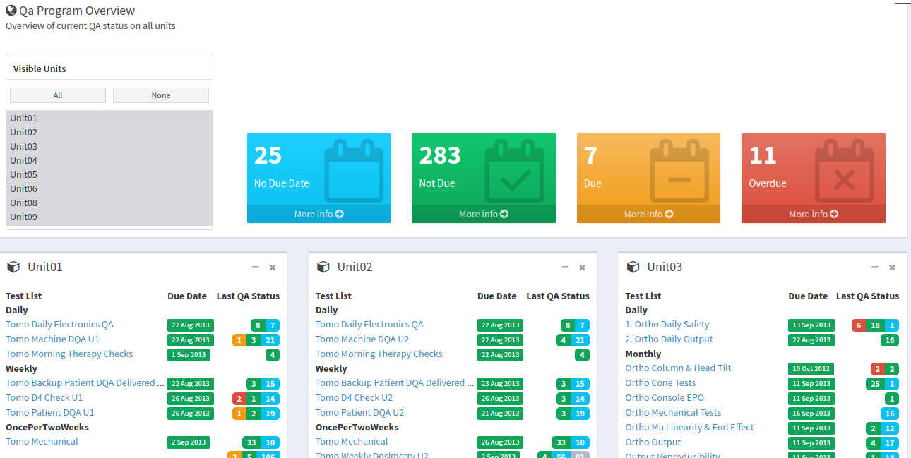

Overseeing The State Of Your QC Program
=======================================

There are currently two main ways of viewing the overall status of your
QC program. You can see which tests lists are overdue or coming due soon
on the **Review By Due Status** page, or you can view a snapshot of your
whole QC program on the **Overview** page.

   Review Test Lists By Due Status

Viewing Test Lists Which are Coming Due Soon
--------------------------------------------

From the **Review Data** dropdown menu at the top chose the **By Due
Status** option. This will take you to page that summarizes any test
lists that are coming due soon.

   Summary of upcoming QC required

Overview of All Units
---------------------

From the **Review Data** dropdown menu at the top chose the **Overview - All Units**
option. This will take you to page that lists all the defined :term:`Unit` s and
their respective Test Lists, grouped by frequency. This allows you to get a
quick overview of what the current status of QC is on all of your units.

   Overview snapshot

Clicking on the names of any of the test lists will take you directly to
the history of that test list.
