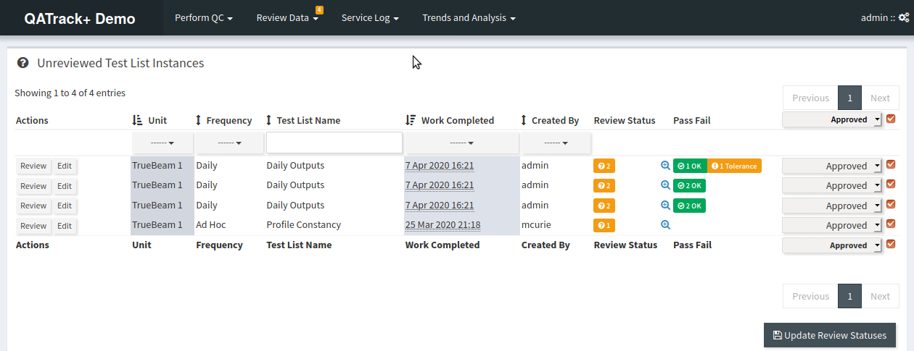
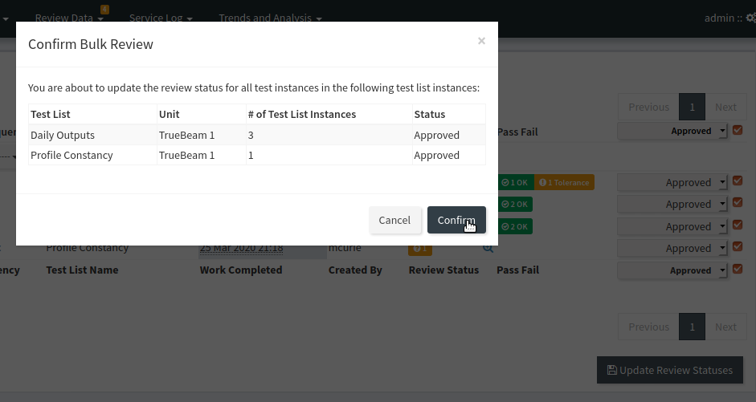

.. _qa_review:

Review and Approval of Test List Instances
==========================================

After a Test List is submitted, every :term:`Test List Instance` in QATrack+ is
assigned a `Status <../../admin/qa/statuses.html>`__ that indicates 
whether or not it requires further review. If any Test
List Instance is assigned a Status which
requires review, then the Test List Instance is placed in an :term:`Unreviewed
Queue` so that periodically a physicist may manually review and approve the QC
data being generated. (It is also possible to skip the Unreviewed Queue and
manual review step using `Auto Review Rules
<../../admin/qa/auto_review.html>`__).

Details on how to review QC data and/or update the status of a set of tests are
given below.

Reviewing QC Data
-----------------

The number of test lists with unreviewed tests is displayed at the top
of every QATrack+ page (provided you have the permissions required to
review data).

.. figure:: images/unreviewed_count.png
   :alt: Unreviewed count is displayed at the top of every page

   Unreviewed count is displayed at the top of every page

To review data, choose the **Unreviewed** option from the **Review
Data** dropdown menu at the top of the page.

.. figure:: images/unreviewed_menu.png
   :alt: Unreviewed menu option

   Unreviewed menu option

You will then be presented with a list of QC sessions awaiting review.
This list can be filtered/sorted by unit, frequency, date or user.

Click on the **Review** button of the QC session that you want to review and
you can then change the status of the test list instance as described below.

.. figure:: images/unreviewed_listing.png
   :alt: Unreviewed listing

   Unreviewed listing

Repeat those steps for all the QC sessions that you would like to
review.

Changing the status of test list instance data
----------------------------------------------

On the following page select the status you would like to apply to the
tests from the dropdown menu at the bottom of the page.
Click the **Update Test Statuses** to save your changes to the database.

.. figure:: images/reviewing_test_list.png
   :alt: Updating test list instance statuses

   Updating test list instance statuses

If the Test List Instance was assigned a Status that does not require
review, then the Test List Instance will be removed from the Unreviewed Queue.

.. _qa_perform_bulk_review:

Bulk Review of Test List Instances
----------------------------------

If your administrator has enabled the :ref:`REVIEW_BULK <review_bulk>` setting,
your `Unreviewed Test List Instances` queue will have an extra column on the
right hand side that behaves similar to the Review page described above.  This
page allows you to set the review and approval status for any test list
instances which have a Review & Approval status selected.

First set the Review Status of all Test List Instances you want to update, and then
click `Update Review Statuses` and then review and confirm before submitting.

   Updating test list instance review statuses in bulk

   Confirm that you want to update the test list instance review statuses in bulk
