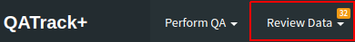
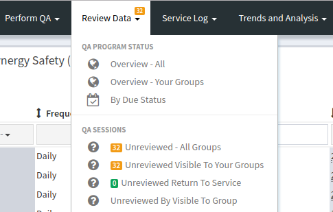
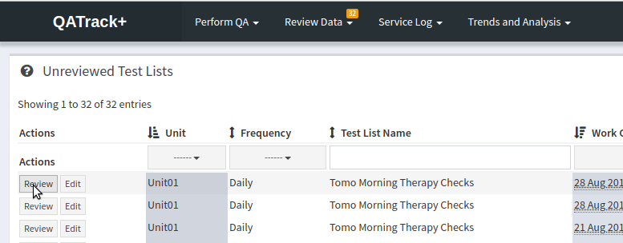

Review and Approval of Test List Instances
==========================================

After a Test List is submitted, every :term:`Test Instance` in QATrack+ is
assigned a `Status <../../admin/qa/statuses.html>`__ that indicates what type
of data the test is and whether or not it requires further review. If any Test
Instance within a :term:`Test List Instance` is assigned a Status which
requires review, then the Test List Instance is placed in an :term:`Unreviewed
Queue` so that periodically a physicist may manually review and approve the QA
data being generated. (It is also possible to skip the Unreviewed Queue and
manual review step using `Auto Review Rules
<../../admin/qa/auto_review.html>`__).

Details on how to review QA data and/or update the status of a set of tests are
given below.

Reviewing QA Data
-----------------

The number of test lists with unreviewed tests is displayed at the top
of every QATrack+ page (provided you have the permissions required to
review data).

   Unreviewed count is displayed at the top of every page

To review data, choose the **Unreviewed** option from the **Review
Data** dropdown menu at the top of the page.

   Unreviewed menu option

You will then be presented with a list of QA sessions awaiting review.
This list can be filtered/sorted by unit, frequency, date or user.

Click on the **Review** button of the QA session that you want to review
and you can then change the status of the tests as described below.

   Unreviewed listing

Repeat those steps for all the QA sessions that you would like to
review.

Changing the status of test data
--------------------------------

On the following page select the status you would like to apply to the
tests from the dropdown menu at the top. Click the checkmark next to the
dropdown to apply that status to all the tests in the list (Test
statuses can also be set individually.) Click the **Update Test
Statuses** to save your changes to the database.

.. figure:: images/reviewing_test_list.png
   :alt: Updating test statuses

   Updating test statuses

If all the Test Instances were assigned a Status that does not require
review, than the Test List Instance will be removed from the Unreviewed Queue.
